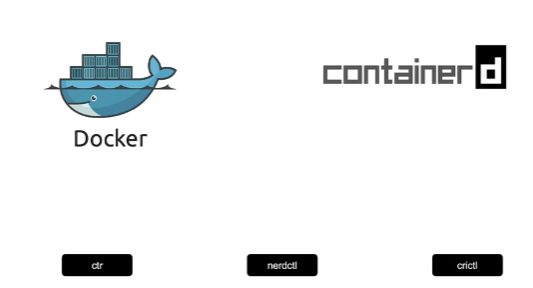
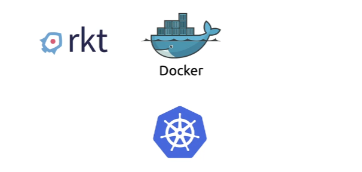
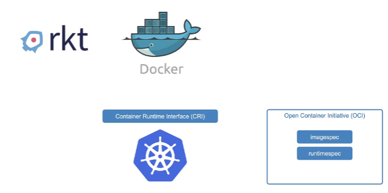
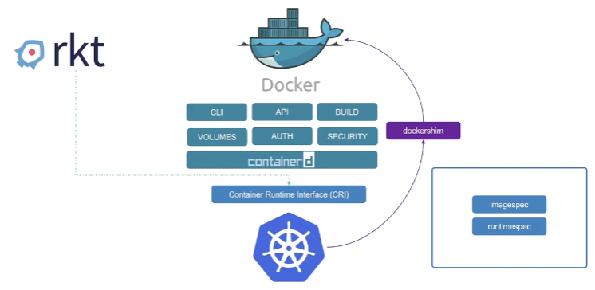
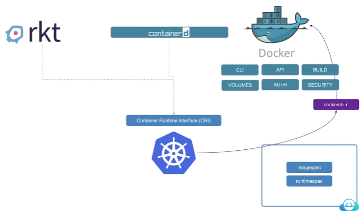
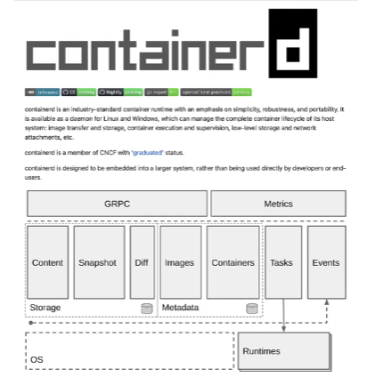
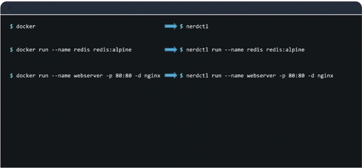
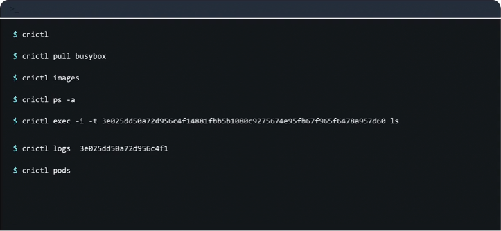
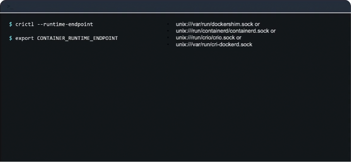
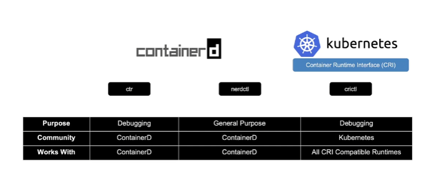

# Docker vs. ContainerD

In this section we will look at the differences between Docker and ContainerD


So you’re going to come across Docker and `containerd` many times. Going forward, when you read older blogs or documentation pages , you’ll see Docker mentioned along with Kubernetes and when you read newer blogs you’ll see `containerd` and you’ll wonder what the difference is between the two. And there are a few CLI tools like `ctr`, `crictl` or `nerdctl` and you’ll wonder what are these CLI tools and which one should you be using, so that’s what I’m going to explain.



Let’s go back in time to the beginning of the container era. In the beginning, there was just Docker. There were a few other tools like Rocket ([rkt](https://www.redhat.com/en/topics/containers/what-is-rkt)), but Docker’s user experience made working with containers super simple and hence Docker became the most dominant container tool. And then came Kubernetes to orchestrate Docker so Kubernetes was built to orchestrate Docker specifically in the beginning so Docker and Kubernetes were tightly coupled and back then Kubernetes only worked with Docker and didn't support any other container solutions.



And then Kubernetes grew in popularity as a container orchestrator and now other container runtimes like `rkt` wanted in so Kubernetes users needed it to work with container runtimes that are other than just Docker, and so Kubernetes introduced an interface called container runtime interface or CRI, so CRI allowed any vendor to work as a container runtime for Kubernetes as long as they adhere to the OCI standards.
So OCI stands for Open Container Initiative and it consists of an image spec and a runtime spec. Image spec means the specifications on how an image should be built. It defines the specifications on how an image should be built and the runtime spec defines the standards on how any container runtime should be developed so keeping these standards in mind, anyone can build a container runtime that can be used by anybody to work with Kubernetes, so that was the idea.



So `rkt` and other container runtimes that adhere to the OCI standards were now supported as container runtimes for Kubernetes via the CRI, however Docker wasn’t built to support  the CRI standards, remember Docker was built way before CRI was introduced and Docker still was the dominant container tool used by most, so Kubernetes had to continue to support Docker as well and so Kubernetes introduced what is known as `dockershim` which was a hacky but temporary way to support Docker outside of the CRI.



So while most other container runtimes worked to the CRI, Docker continued to work without it, so now you see Docker isn’t just a container runtime alone. Docker consists of multiple tools that are put together, for example the Docker CLI, the Docker API, the build tools that help in building images. There was support for volumes, security, and finally the container runtime called `runc`, and the daemon that managed `runc`, that was called `containerd`. So containerd is CRI compatible and can work directly with Kubernetes as all other runtimes, so containerd can be used as a runtime on its own separate from Docker.



So now you have containerd as a separate runtime and Docker separately, so Kubernetes continued to maintain support for Docker engine directly however having to maintain the dockershim was an unnecessary effort and added complications so it was decided in v1.24 release of Kubernetes to remove dockershim completely and so support for Docker was removed. But you see all the images that were built before Docker was removed so all the Docker images continued to work because Docker followed the image spec from the OCI standards so all the images built by Docker follow the standard so they continued to work with containerd but Docker itself was removed as a supported runtime from Kubernetes. So that’s kind of the whole story, now let’s look into containerd more specifically.



So containerd although is part of Docker, is a separate project on its own now and is a member of [CNCF](https://www.cncf.io/) with the [graduated](https://www.cncf.io/projects/) status, so you can now install containerd on its own without having to install Docker itself so if you don’t really need Docker’s other features you could ideally just install containerd alone. So typically we ran containers using the `docker run` command when we had Docker and if Docker isn’t installed then how do you run containers with just containerd? Now, once you install containerd it comes with a command line tool called [ctr](https://github.com/projectatomic/containerd/blob/master/docs/cli.md#client-cli), and this tool is solely made for debugging containerd and is not very user friendly as it only supports a limited set of features and this is all you can see in the documentation pages for this particular tool. So for the other than limited set of features that require any other way you want to interact with containerd you have to rely on making API calls directly which is not the most user friendly way for us to operate.

So just to give you an idea, the `ctr` command can be used to perform basic container-related activities such as pull images, for example to pull redis image you would run

```
ctr images pull docker.io/library/redis:alpine
```

To run a container we use the `ctr` run command

```
ctr run docker.io/library/redis:alpine redis
```

But as I mentioned, this tool is solely for debugging containerd and is not very user friendly and is not to be used for managing containers on a production environment.
So a better alternative recommended is the [nerdctl](https://github.com/containerd/nerdctl#nerdctl-docker-compatible-cli-for-container) tool. So the `nerdctl` tool is a command line tool that’s very similar to Docker, so it’s a Docker-like CLI for containerd. It supports most of the CLI options that Docker supports and apart from that it has the added benefit that it can give us access to the newest features implemented in containerd, so for example we can work with encrypted container images or other new features that will eventually be implemented into the regular Docker command in the future. It also supports lazy pulling of images, P2P image distribution, image signing and verifying and namespaces in Kubernetes which are not available in Docker. So the `nerdctl` tool works very similar to Docker cli, so instead of Docker you would simply have to replace it with `nerdctl` so it can run almost all Docker commands that interact with containers like this



So that’s pretty easy and straightforward so now that we have talked about `ctr` and the `nerdctl` tool, it’s important to talk about another command like tool known as [crictl](https://github.com/kubernetes-sigs/cri-tools/blob/master/docs/crictl.md#container-runtime-interface-cri-cli). So earlier we talked about the CRI which is a single interface used to connect CRI compatible container runtimes, containerd, `rkt` and others. So the `crictl` is a command line utility that is used to interact with the CRI compatible container runtime, so this is kind of interaction from the Kubernetes perspective. So this tool is developed and maintained by the Kubernetes community and this tool works across all the different container runtimes and because earlier you had the `ctr` and `nerdctl` utility that was built by the containerd community specifically for containerd, but this particular tool is from the Kubernetes perspective that works across different container runtimes.

So it must be installed separately and is used to inspect and debug container runtimes so this again is not ideally used to create containers unlike the Docker or the `nerdctl` utility but is again a debugging tool. You can technically create containers with the `crictl` utility but it’s not easy. It’s only to be used for some special debugging purposes. And remember that it kind of works along with the kubelet so we know that the kubelet is responsible for ensuring that a specific number of containers or pods are available on a node at time, so if you kind of go through the `crictl` utility and try and create containers with it, then eventually kubelet is going to delete them because kubelet is unaware of some of those containers or pods that are created outside of its knowledge so anything that it sees it’s going to go and delete it, so because of those things remember that the `crictl` utility is only used for debugging purposes and getting into containers and all of that.

So let’s look at some of the command line examples so you simply run  the `crictl` command for this and this can be used to perform basic container-related activities such as pull images, or list existing images, list containers, very similar to the Docker command where you use the PS commands, so in Docker you run the `ps` command, and here you run the `crictl ps` command and to run a command in since a container docker remember we use the `exec` command and it’s the same here and along with the same options such as `-i` and `-t` and you specify the container id. The view the logs, you use the `crictl` logs command, again very similar to the docker command.



One major difference is that the `crictl` command is also aware of pods so you can list pods by running the `crictl` pods command so this wasn’t something that Docker was aware of. So while working with Kubernetes in the past, we used Docker commands a lot to troubleshoot containers and view logs especially on the worker nodes and now you’re going to use the `crictl` command to do so. So the syntax is a lot similar and so it shouldn’t be really hard.
So here’s a chart that lists the comparison between the Docker and `crictl` command line tools. So as you can see, a lot of command such as attach exec, images, info, inspect, logs, ps, stats, version etc., work exactly the same way, and some of the commands to create, remove and start and stop images work similarly too. So a full list of differences can be found in [this link](https://kubernetes.io/docs/reference/tools/map-crictl-dockercli/#retrieve-debugging-information).

| docker cli | crictl            | Description                                                          | Unsupported Features                |
|------------|-------------------|----------------------------------------------------------------------|-------------------------------------|
| attach     | attach            | Attach to a running container                                        | --detach-keys, --sig-proxy          |
| exec       | exec              | Run a command in a running container                                 | --privileged, --user, --detach-keys |
| images     | images            | List images                                                          |                                     |
| info       | info              | Display system-wide information                                      |                                     |
| inspect    | inspect, inspecti | Return low-level information on a container, image or task           |                                     |
| logs       | logs              | Fetch the logs of a container                                        | --details                           |
| ps         | ps                | List containers                                                      |                                     |
| stats      | stats             | Display a live stream of container(s) resource usage statistics      | Column: NET/BLOCK I/O, PIDs         |
| version    | version           | Show the runtime (Docker, ContainerD, or others) version information |                                     |

So, since as I mentioned, `crictl` can be used to connect to any CRI compatible runtime, remember to set the right endpoint if you have multiple container runtimes configured, or if you want `crictl` to interact with a specific runtime, for example if you haven’t configured anything by default it’s going to connect to these sockets in this particular order, so it’s going to try and connect to dockershim first, then containerd, then CRI-O, then the CRI-dockerd – that’s kind of the order that it falls. But if you want to override that and set a specific endpoint, you use the `--runtime-endpoint` option with the `crictl` command line, or you could use the `CONTAINER_RUNTIME_ENDPOINT` environment variable. Set the environment variable to the right endpoint.



So to summarize we have the `ctr` command line utility that comes with containerd and works with containerd which is used for debugging purposes only and has a very limited set of features, so ideally you wouldn’t be using this at all so you can kind of ignore this. Then we have the `nerdctl` CLI which is again from the containerd community but this is a Docker-like CLI for containerd used for general purpose to create containers and supports the same or more features than Docker CLI, so it’s something that I think we’ll be using a lot more going forward. Then we have the `crictl` utility which is from the Kubernetes community and mainly used to interact with CRI compatible runtimes, so it’s not just for containerd – this can be used for all CRI supported runtimes – again this is mainly to be used for debugging purposes.



So if we look at the comparisons here, you can see that `ctr` and `crictl` are used mainly for debugging purposes, whereas the `nerdctl` is used for general purpose. The `ctr` and `nerdctl` are from the containerd community and work with containerd, whereas `crictl` is from the Kubernetes community and works across all CRI compatible runtimes.
So our labs originally had Docker installed on all the nodes so we used the Docker commands to troubleshoot, but now it’s all containerd so remember to use the `crictl` command instead to troubleshoot.


