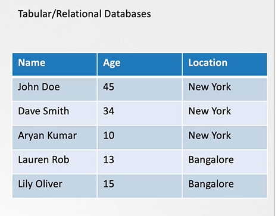
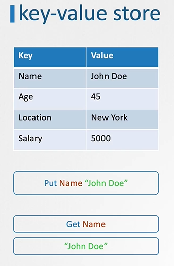
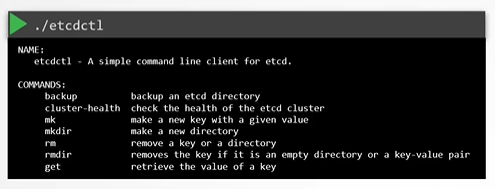

# ETCD for Beginners
  - Take me to the [Video Tutorial](https://kodekloud.com/courses/539883/lectures/9808166)

  In this section, we will take a quick look at introduction to ETCD for beginners. 
  - What is ETCD?
  - What is a Key-Value Store?
  - How to get started quickly with ETCD?
  - How to operate ETCD?
  
 ## What is a ETCD?
     - ETCD is a distributed reliable key-value store that is simple, secure & Fast.
     
## What is a Key-Value Store
   - Traditionally, databases have been in tabular format, you must have heared about SQL or Relational databases. They store data in rows and columns
       
     
     
   - A Key-Value Store stores information in a Key and Value format.
       
     
       
## Install ETCD
   - Its easy to install and get started with **`ETCD`**.
     - Download the relevant binary for your operating system from github releases page (https://github.com/etcd-io/etcd/releases)
       ```
       For Example: To download ETCD V3.3.11, run the below curl command
         
       $ https://github.com/etcd-io/etcd/releases/download/v3.3.11/etcd-v3.3.11-linux-amd64.tar.gz
       ```
     - Extract it.
       ```
       $ tar xvzf etcd-v3.3.11-linux-amd64.tar.gz 
       ```
     - Run the ETCD Service
       ```
       $ ./etcd
       ```
     - When you start **`ETCD`** it will by default listens on port **`2379`**
      - The default client that comes with **`ETCD`** is the **`etcdct`** client. You can use it to store and retrieve key-value pairs.
        ```
        Syntax: To Store a Key-Value pair
        $ ./etcdctl set key1 value1
        ```
        ```
        Syntax: To retrieve the stored data
        $ ./etcdctl get key1
        ```
        ```
        Syntax: To view more commands. Run etcdctl without any arguments
        $ ./etcdctl
        ```
        
        
        
       K8s Reference Docs:
       - https://kubernetes.io/docs/concepts/overview/components/
       - https://etcd.io/docs/
       - https://kubernetes.io/docs/tasks/administer-cluster/configure-upgrade-etcd/
       
