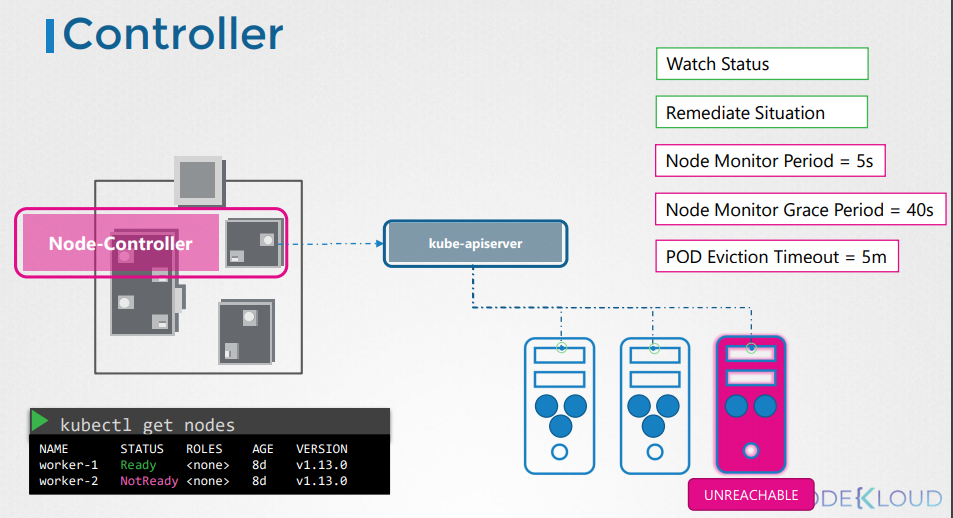

# Kube Controller Manager

  - Take me to [Video Tutorial](https://kodekloud.com/courses/539883/lectures/9808161)
  
In this section, we will take a look at kube-controller-manager.

#### Kube Controller Manager manages various controllers in kubernetes.
- In kubernetes terms, a controller is a process that continously monitors the state of the components within the system and works towards bringing the whole system to the desired functioning state.

  1.Node Controller
    - Responsible for monitoring the state of the Nodes and taking necessary actions to keep the application running. 
    - It does that with the help of kube-apiserver. Node Controller checks the status of the Nodes for every **`5 seconds`**. 
    - If a node is unreachable, Node Controller waits for **`40 seconds`** before marking it unreachable. 
    - After a node is marked as unreachable it gives it **`5 minutes`** to come backup.
  
    
    
   
     
