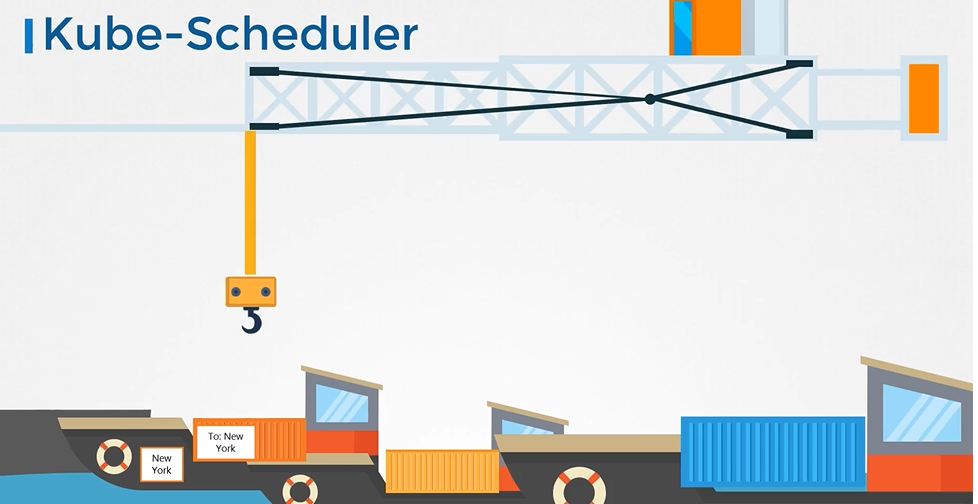
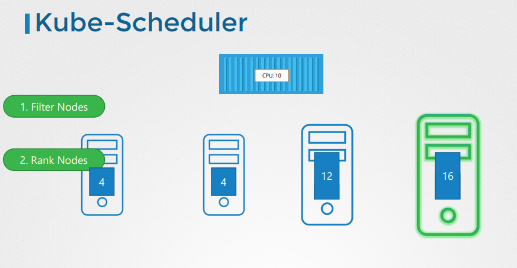
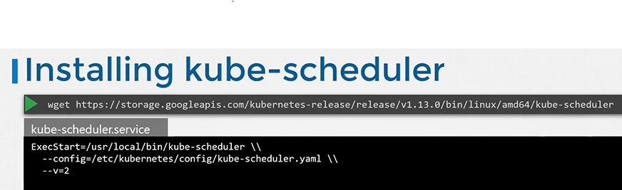
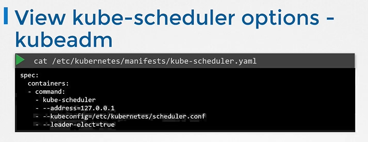
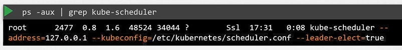

# Kube Scheduler
  - Take me to [Video Tutorial](https://kodekloud.com/courses/539883/lectures/9808162)

In this section, we will take a look at kube-scheduler.

#### kube-scheduler is responsible for scheduling pods on nodes.  
- The kube-scheduler is only responsible for deciding which pod goes on which node. It doesn't actually place the pod on the nodes, thats the job of the **`kubelet`**.

  
  
#### Why do you need a Scheduler?

  
    
## Install kube-scheduler - Manual
- Download the kubescheduler binary from the kubernetes release pages [kube-scheduler](https://storage.googleapis.com/kubernetes-release/release/v1.13.0/bin/linux/amd64/kube-scheduler). For example: To download kube-scheduler v1.13.0, Run the below command.
  ```
  $ wget https://storage.googleapis.com/kubernetes-release/release/v1.13.0/bin/linux/amd64/kube-scheduler
  ```
- Extract it
- Run it as a service

  
  
## View kube-scheduler options - kubeadm
- If you set it up with kubeadm tool, kubeadm tool will deploy the kube-scheduler as pod in kube-system namespace on master node.
  ```
  $ kubectl get pods -n kube-system
  ```
- You can see the options for kube-scheduler in pod definition file that is located at **`/etc/kubernetes/manifests/kube-scheduler.yaml`**
  ```
  $ cat /etc/kubernetes/manifests/kube-scheduler.yaml
  ```
  
  
- You can also see the running process and affective options by listing the process on master node and searching for kube-apiserver.
  ``` 
  $ ps -aux |grep kube-scheduler
  ```
  
  
  K8s Reference Docs:
  - https://kubernetes.io/docs/reference/command-line-tools-reference/kube-scheduler/
  - https://kubernetes.io/docs/concepts/scheduling-eviction/kube-scheduler/
  - https://kubernetes.io/docs/concepts/overview/components/
  - https://kubernetes.io/docs/tasks/extend-kubernetes/configure-multiple-schedulers/
    
