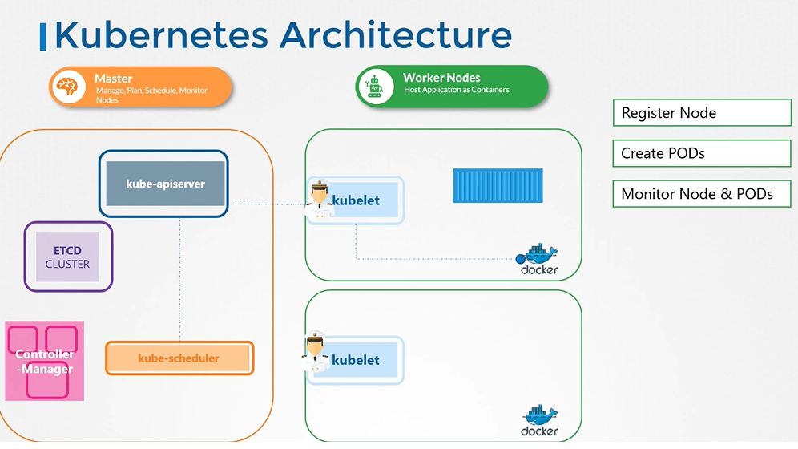
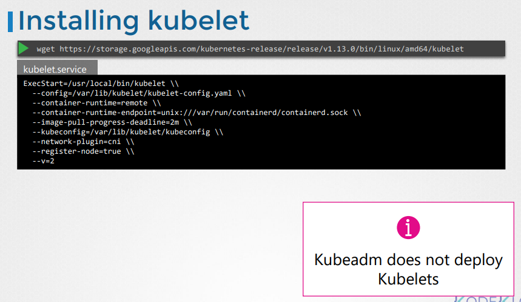
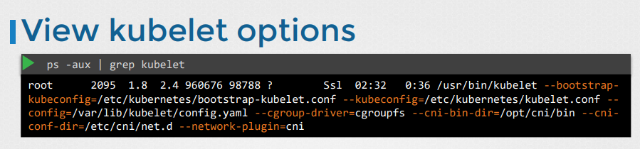

# Kubelet
  - Take me to [Video Tutorial](https://kodekloud.com/topic/kubelet/)
  
In this section we will take a look at kubelet.

#### Kubelet is the sole point of contact for the kubernetes cluster
- The **`kubelet`** will create the pods on the nodes, the scheduler only decides which pods goes where.

  
  
## Install kubelet
- Kubeadm does not deploy kubelet by default. You must manually download and install it.
- Download the kubelet binary from the kubernetes release pages [kubelet](https://storage.googleapis.com/kubernetes-release/release/v1.13.0/bin/linux/amd64/kubelet). For example: To download kubelet v1.13.0, Run the below command.
  ```
  $ wget https://storage.googleapis.com/kubernetes-release/release/v1.13.0/bin/linux/amd64/kubelet
  ```
- Extract it
- Run it as a service

  
  
## View kubelet options
- You can also see the running process and affective options by listing the process on worker node and searching for kubelet.
  ``` 
  $ ps -aux |grep kubelet
  ```
  
  

K8s Reference Docs:
- https://kubernetes.io/docs/reference/command-line-tools-reference/kubelet/
- https://kubernetes.io/docs/concepts/overview/components/
- https://kubernetes.io/docs/setup/production-environment/tools/kubeadm/kubelet-integration/
