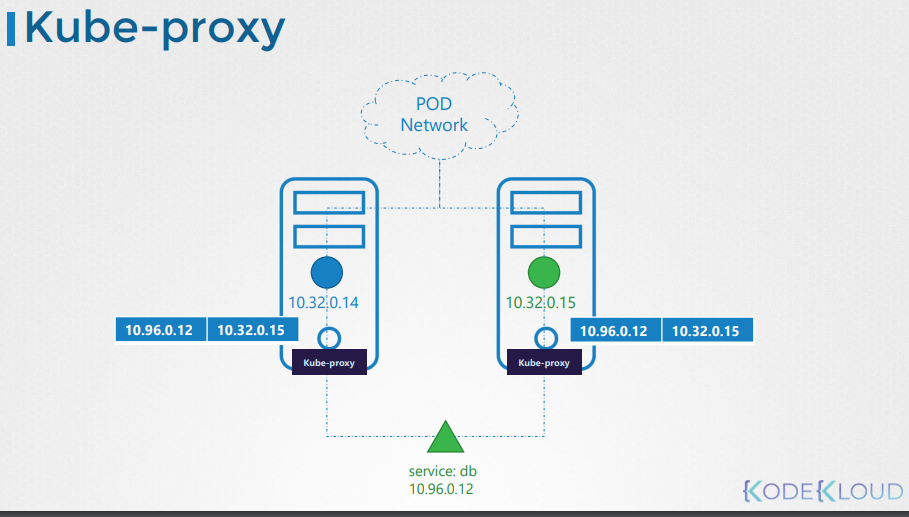
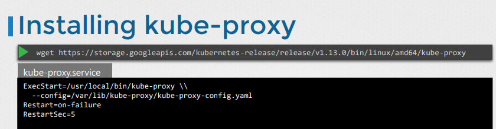
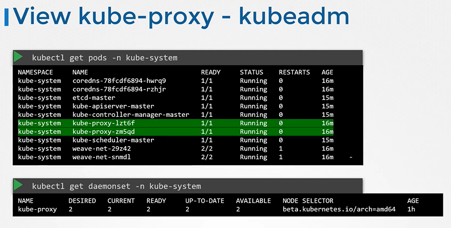

# Kube Proxy
- Take me to [Video Tutorial](https://kodekloud.com/topic/kube-proxy/)

In this section, we will take a look at kube-proxy.

Within Kubernetes Cluster, every pod can reach every other pod, this is accomplish by deploying a pod networking cluster to the cluster. 
- Kube-Proxy is a process that runs on each node in the kubernetes cluster.
  
  
  
## Install kube-proxy - Manual
- Download the kube-proxy binary from the kubernetes release pages [kube-proxy](https://storage.googleapis.com/kubernetes-release/release/v1.13.0/bin/linux/amd64/kube-proxy). For example: To download kube-proxy v1.13.0, Run the below command.
  ```
  $ wget https://storage.googleapis.com/kubernetes-release/release/v1.13.0/bin/linux/amd64/kube-proxy
  ```
- Extract it
- Run it as a service

  

## View kube-proxy options - kubeadm
- If you set it up with kubeadm tool, kubeadm tool will deploy the kube-proxy as pod in kube-system namespace. In fact it is deployed as a daemonset on master node.
  ```
  $ kubectl get pods -n kube-system
  ```
  
  
  
K8s Reference Docs:
- https://kubernetes.io/docs/reference/command-line-tools-reference/kube-proxy/
- https://kubernetes.io/docs/concepts/overview/components/
