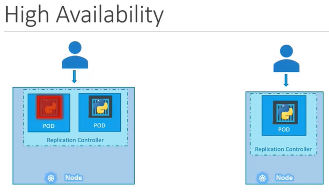
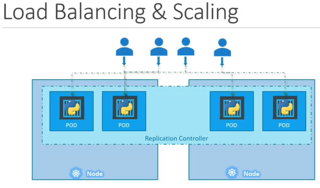
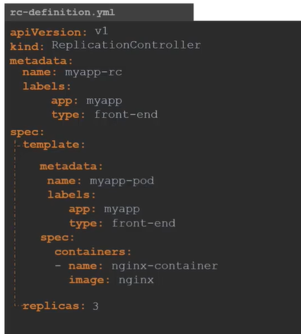
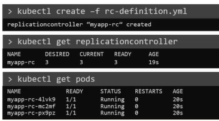
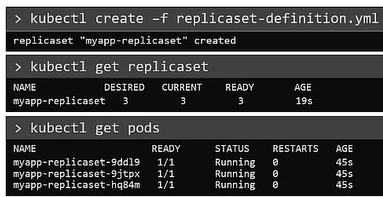
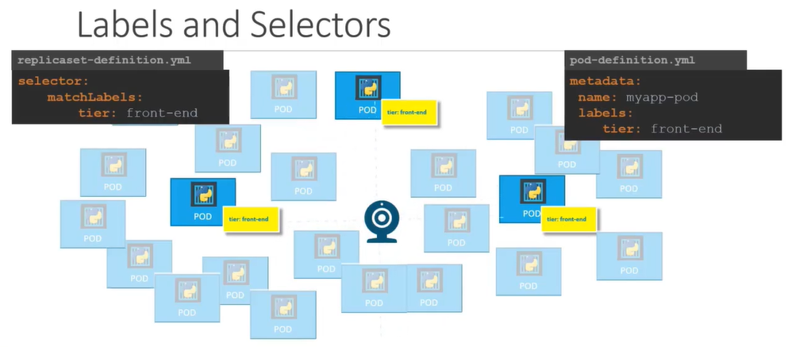
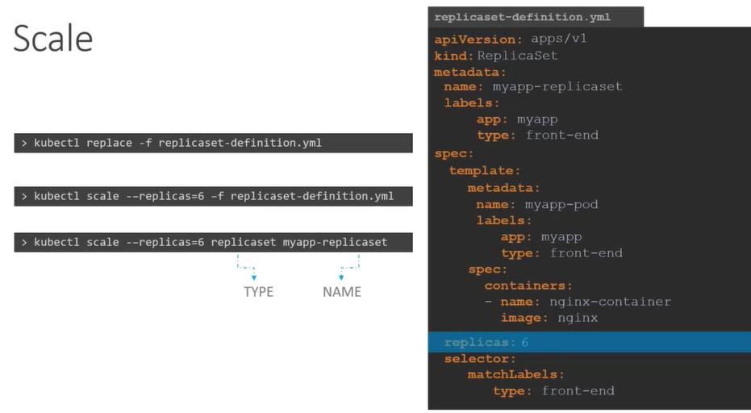

# ReplicaSets
  - Take me to [Video Tutorial](https://kodekloud.com/topic/replicasets/)

In this section, we will take a look at the below
- Replication Controller
- ReplicaSet

#### Controllers are brain behind kubernetes

## What is a Replica and Why do we need a replication controller?

  
  
  
  
## Difference between ReplicaSet and Replication Controller
- **`Replication Controller`** is the older technology that is being replaced by a **`ReplicaSet`**.
- **`ReplicaSet`** is the new way to setup replication.

## Creating a Replication Controller

## Replication Controller Definition File
  
   
  
```
    apiVersion: v1
    kind: ReplicationController
    metadata:
      name: myapp-rc
      labels:
        app: myapp
        type: front-end
    spec:
     template:
        metadata:
          name: myapp-pod
          labels:
            app: myapp
            type: front-end
        spec:
         containers:
         - name: nginx-container
           image: nginx
     replicas: 3
```
  - To Create the replication controller
    ```
    $ kubectl create -f rc-definition.yaml
    ```
  - To list all the replication controllers
    ```
    $ kubectl get replicationcontroller
    ```
  - To list pods that are launch by the replication controller
    ```
    $ kubectl get pods
    ```
    
    
## Creating a ReplicaSet
  
## ReplicaSet Definition File

   

```
    apiVersion: apps/v1
    kind: ReplicaSet
    metadata:
      name: myapp-replicaset
      labels:
        app: myapp
        type: front-end
    spec:
     template:
        metadata:
          name: myapp-pod
          labels:
            app: myapp
            type: front-end
        spec:
         containers:
         - name: nginx-container
           image: nginx
     replicas: 3
     selector:
       matchLabels:
        type: front-end
 ```
#### ReplicaSet requires a selector definition when compare to Replication Controller.
   
  - To Create the replicaset
    ```
    $ kubectl create -f replicaset-definition.yaml
    ```
  - To list all the replicaset
    ```
    $ kubectl get replicaset
    ```
  - To list pods that are launch by the replicaset
    ```
    $ kubectl get pods
    ```
   
    
    
## Labels and Selectors
#### What is the deal with Labels and Selectors? Why do we label pods and objects in kubernetes?

  
  
## How to scale replicaset
- There are multiple ways to scale replicaset
  - First way is to update the number of replicas in the replicaset-definition.yaml definition file. E.g replicas: 6 and then run 
 ```
    apiVersion: apps/v1
    kind: ReplicaSet
    metadata:
      name: myapp-replicaset
      labels:
        app: myapp
        type: front-end
    spec:
     template:
        metadata:
          name: myapp-pod
          labels:
            app: myapp
            type: front-end
        spec:
         containers:
         - name: nginx-container
           image: nginx
     replicas: 6
     selector:
       matchLabels:
        type: front-end
```

  ```
  $ kubectl apply -f replicaset-definition.yaml
  ```
  - Second way is to use **`kubectl scale`** command.
  ```
  $ kubectl scale --replicas=6 -f replicaset-definition.yaml
  ```
  - Third way is to use **`kubectl scale`** command with type and name
  ```
  $ kubectl scale --replicas=6 replicaset myapp-replicaset
  ```
  

#### K8s Reference Docs:
- https://kubernetes.io/docs/concepts/workloads/controllers/replicaset/
- https://kubernetes.io/docs/concepts/workloads/controllers/replicationcontroller/
