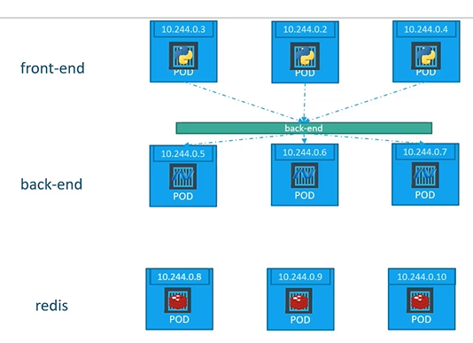
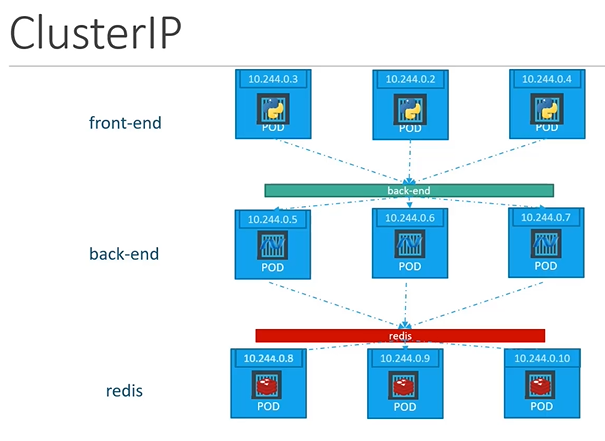
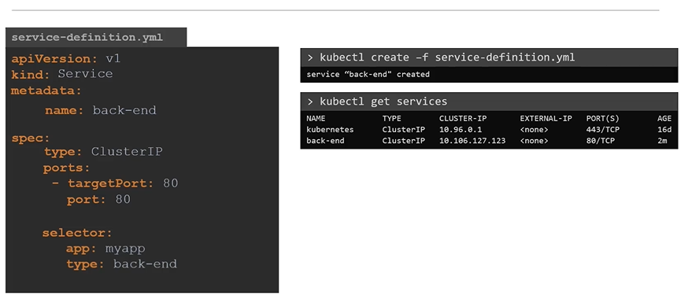

# Kubernetes Services - ClusterIP
  - Take me to [Video Tutorial](https://kodekloud.com/courses/539883/lectures/9808157)
  
In this section we will take a look at **`services - ClusterIP`** in kubernetes
         
## ClusterIP
- In this case the service creates a **`Virtual IP`** inside the cluster to enable communication between different services such as a set of frontend servers to a set of backend servers.
    
    
    
#### What is a right way to establish connectivity between these services or tiers  
- A kubernetes service can help us group the pods together and provide a single interface to access the pod in a group.

  
  
#### To create a service of type ClusterIP
```
apiVersion: v1
kind: Service
metadata:
 name: back-end
spec:
 types: ClusterIP
 ports:
 - targetPort: 80
   port: 80
 selector:
   app: myapp
   type: back-end
```
```
$ kubectl create -f service-definition.yaml
```

#### To list the services
```
$ kubectl get services
```
  
   
K8s Reference Docs:
- https://kubernetes.io/docs/concepts/services-networking/service/
- https://kubernetes.io/docs/tutorials/kubernetes-basics/expose/expose-intro/
