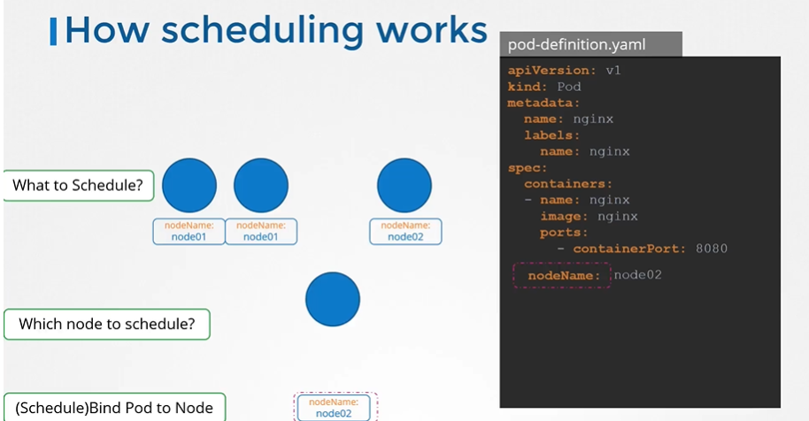
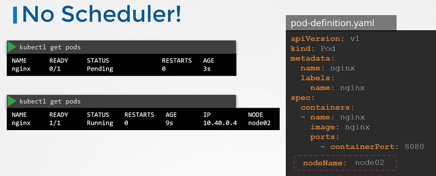
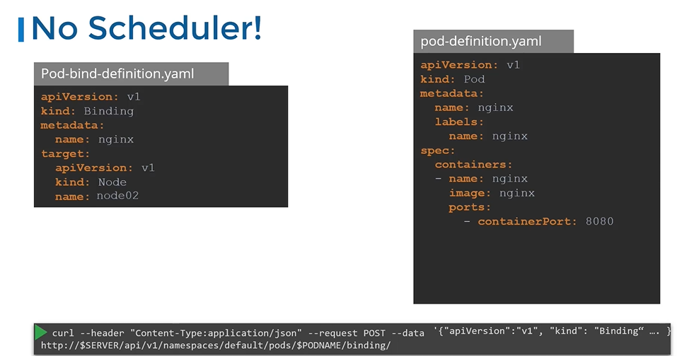

# Manual Scheduling
  - Take me to [Video Tutorial](https://kodekloud.com/topic/manual-scheduling/)
  
In this section, we will take a look at **`Manually Scheduling`** a **`POD`** on a node.

## How Scheduling Works
- What do you do when you do not have a scheduler in your cluster?
  - Every POD has a field called NodeName that by default is not set. You don't typically specify this field when you create the manifest file, kubernetes adds it automatically.
  - Once identified it schedules the POD on the node by setting the nodeName property to the name of the node by creating a binding object.
    ```
    apiVersion: v1
    kind: Pod
    metadata:
     name: nginx
     labels:
      name: nginx
    spec:
     containers:
     - name: nginx
       image: nginx
       ports:
       - containerPort: 8080
     nodeName: node02
    ```
    
    
## No Scheduler
  - You can manually assign pods to node itself. Well without a scheduler, to schedule pod is to set **`nodeName`** property in your pod definition file while creating a pod.
    
    
    
  - Another way
    ```
    apiVersion: v1
    kind: Binding
    metadata:
      name: nginx
    target:
      apiVersion: v1
      kind: Node
      name: node02
    ```
    ```
    apiVersion: v1
    kind: Pod
    metadata:
     name: nginx
     labels:
      name: nginx
    spec:
     containers:
     - name: nginx
       image: nginx
       ports:
       - containerPort: 8080
    ```
    
    
    
K8s Reference Docs:
- https://kubernetes.io/docs/reference/using-api/api-concepts/
- https://kubernetes.io/docs/concepts/scheduling-eviction/assign-pod-node/#nodename
    
    
   
