# Labels and Selectors
  - Take me to [Video Tutorial](https://kodekloud.com/courses/539883/lectures/9816604)
  
In this section, we will take a look at **`Labels and Selectors`**

Labels and Selectors are standard methods to group things together.
- Lets say you have set of different species 
  
  
  
- A user wants to filter them based on different criteria such as based on  **`Class`** or **`Kind`** or **`Color`**

  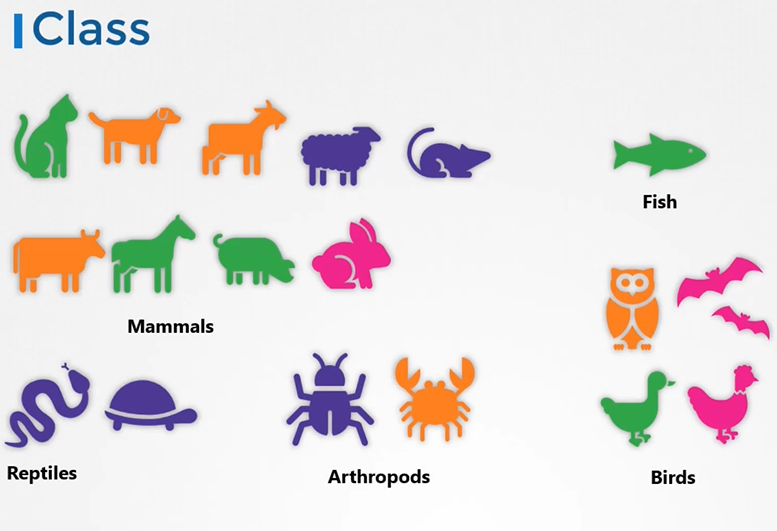
  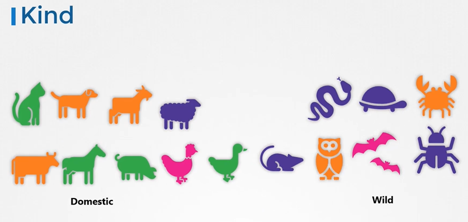
  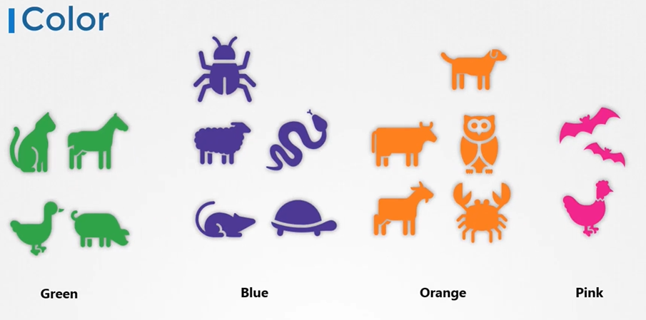
  
- And not just group, you want to filter them based on a criteria such a all **`Green Color - Animals`**

  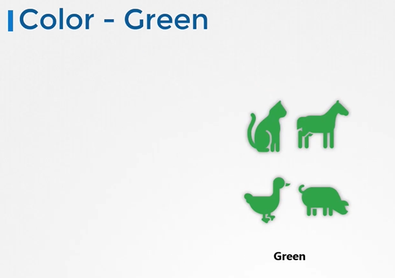
  
- With multiple criteria such as **`Green Color and that is also a Bird`**

  
  
#### Labels are properties attach to each item.

  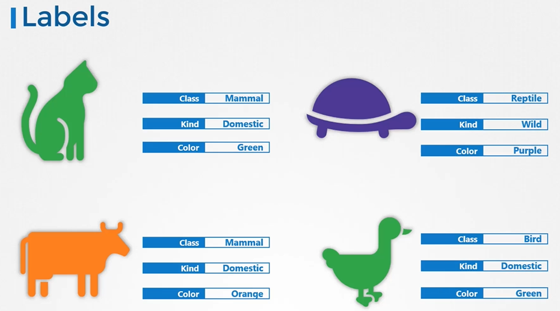
  
#### Selectors help you to filter these items
 
  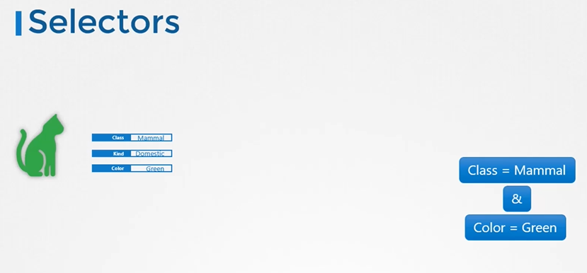
  
How are labels and selectors are used in kubernetes?
- We have created different types of objects in kubernetes such as **`PODs`**, **`ReplicaSets`**, **`Deployments`** etc.
  
  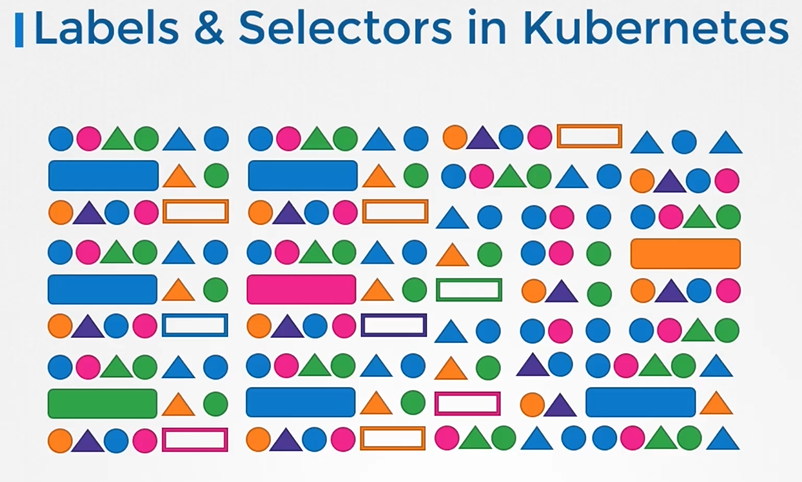
  
- To group objects by thier types

  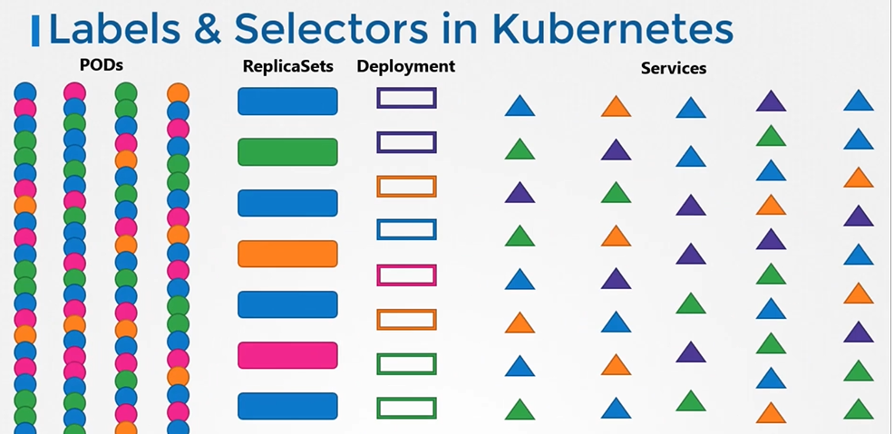
  
- View objects by applicaton
  
  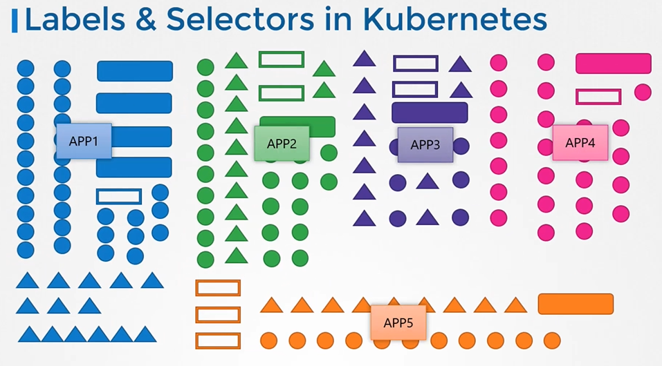
  
- To group objects by thier function
 
  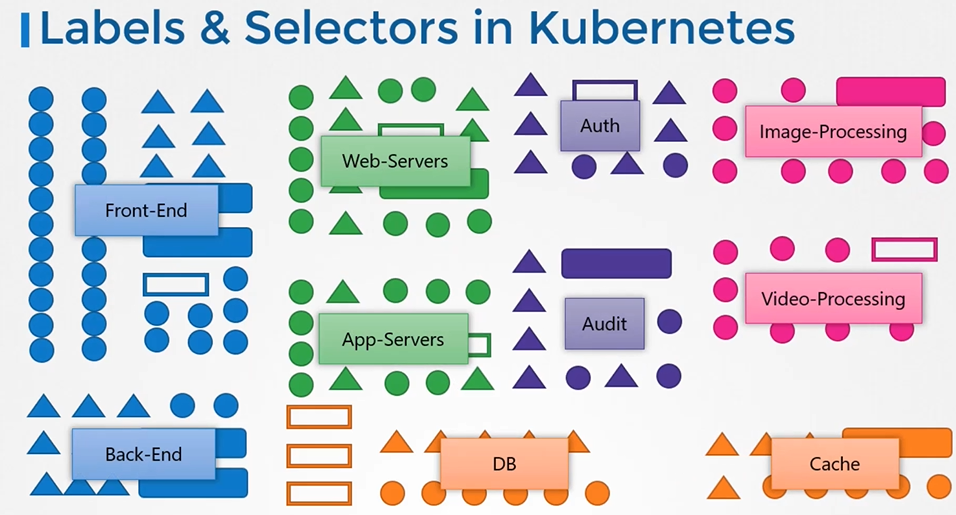
 
- To filter specific objects

  

How do you specify lables?
 
 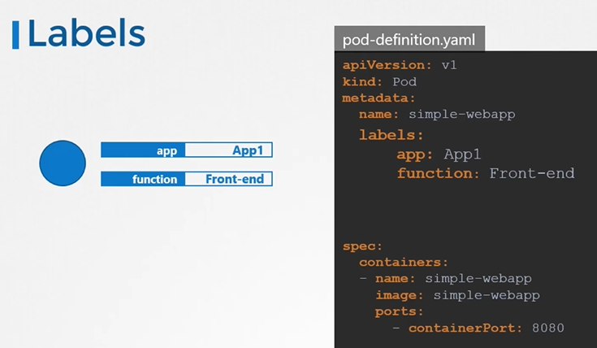
 
Once the pod is created, to select the pod with labels run the below command
```
$ kubectl get pods --selector app=App1
```

Kubernetes use lablels to connect different objects together

  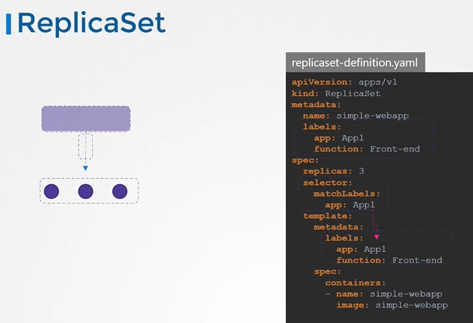

For services
 
  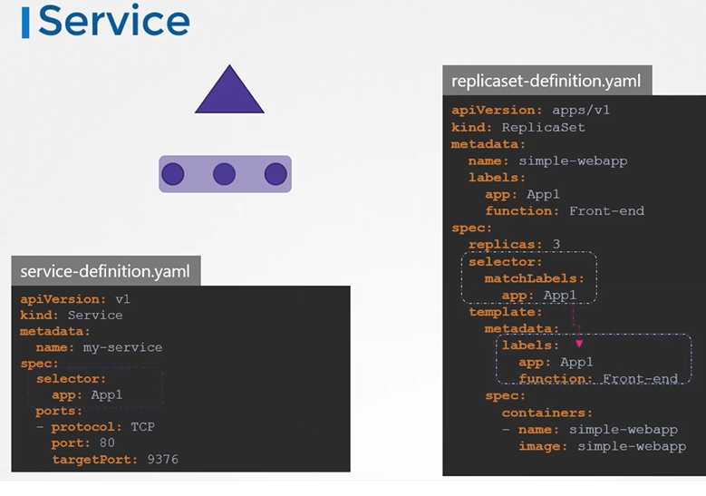
  
## Annotations
- While labels and selectors are used to group objects, annotations are used to record other details for informative purpose.
  
  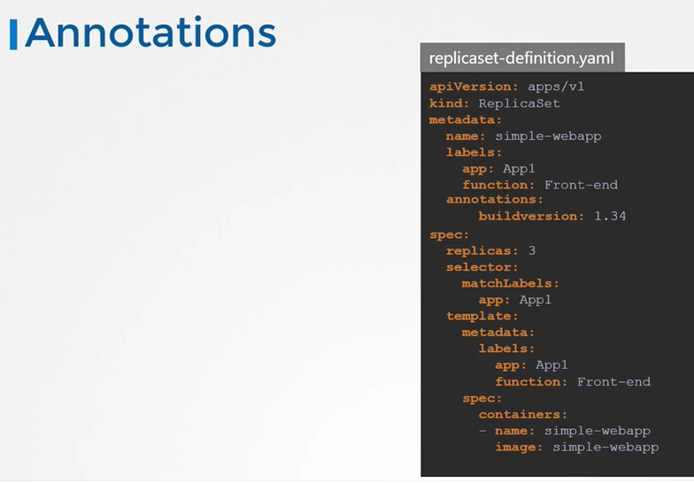
