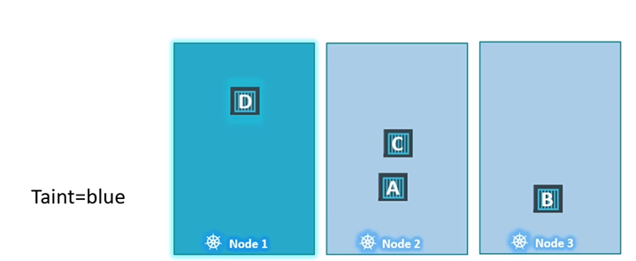
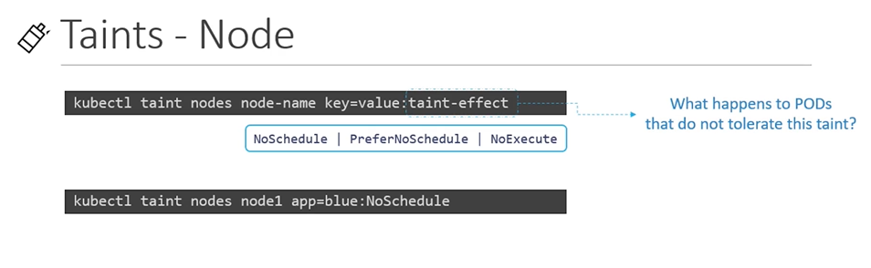
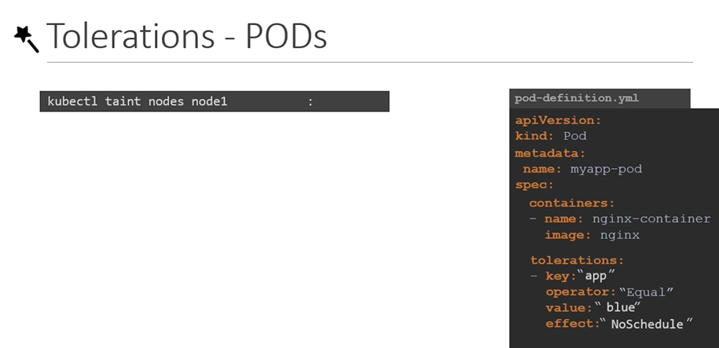
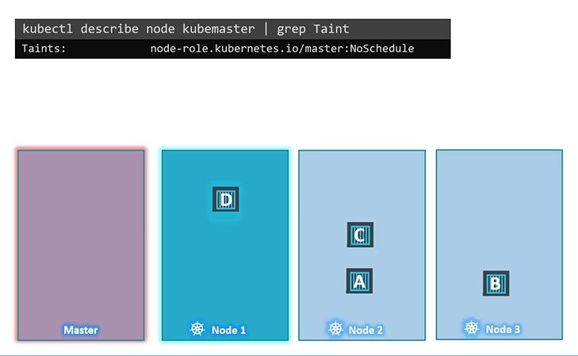

# Taints and Tolerations
  - Take me to [Video Tutorial](https://kodekloud.com/courses/539883/lectures/10277934)
  
In this section, we will take a look at taints and tolerations.
- Pod to node relationship and how you can restrict what pods are placed on what nodes.

#### Taints and Tolerations are used to set restrictions on what pods can be scheduled on a node. 
- Pods which are tolerant to the particular taint node will only get scheduled on that node.
- Taints are set on nodes.
- Tolerations are set on pods.

  
  
## Taints
- Use **`kubectl taint nodes`** command to taint a node.

  Syntax
  ```
  $ kubectl taint nodes <node-name> key=value:taint-effect
  ```
 
  Example
  ```
  $ kubectl taint nodes node1 app=blue:NoSchedule
  ```
  
- The taint effect defines what would happen to the pods if they do not tolerate the taint.
- There are 3 taint effects
  - **`NoSchedule`**: Which means the pods will not be scheduled on the node.
  - **`PreferNoSchedule`**: Which means the system will try to avoid placing a pod on the node but that is not guaranteed.
  - **`NoExecute`**: which means that new pods will not be scheduled on the node and the existing pods on the node, if any, will be evicted if they do not tolerate the taint. These pods my have been scheduled on the node before the taint was applied to the node.
  
  
  
## Tolerations
   - Tolerations are added to pods and it can be added by adding a **`tolerations`** section in pod defination.
     ```
     apiVersion: v1
     kind: Pod
     metadata:
      name: myapp-pod
     spec:
      containers:
      - name: nginx-container
        image: nginx
     tolerations:
     - key: "app"
       operator: "Equal"
       value: "blue"
       effect: "NoSchedule"
     ```
    
  
    

#### Taints and Tolerations does not tell the pod to go to a particular node. Instead, it tells the node to only accept pods with certain tolerations.
- If your requirement is to restrict a pod to certain nodes, it is achieved through another concept called as **`Node Affinity`**.
- The scheduler does not schedule any pods on the master node. When the k8s cluster is first set up, a taint is set on the master node automatically that prevents any pods from being scheduled on this node. You modify this behaviour, however a best practice is to not deploy application workloads on a master node.
- To see this taint, run the below command
  ```
  $ kubectl describe node kubemaster |grep Taint
  ```
 
 
  
     
#### K8s Reference Docs
- https://kubernetes.io/docs/concepts/scheduling-eviction/taint-and-toleration/

