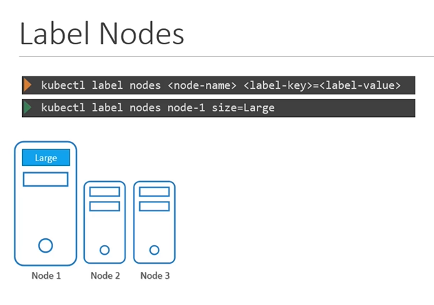
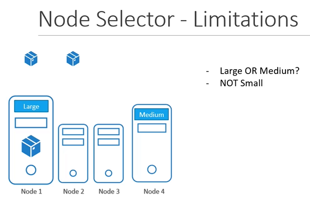

# Node Selectors
  - Take me to [Video Tutorial](https://kodekloud.com/courses/539883/lectures/10277935)

In this section, we will take a look at Node Selectors in Kubernetes

#### We add new property called Node Selector to the spec section and specify the label.
- The scheduler uses these labels to match and identify the right node to place the pods on.
  ```
  apiVersion: v1
  kind: Pod
  metadata:
   name: myapp-pod
  spec:
   containers:
   - name: data-processor
     image: data-processor
   nodeSelector:
    size: Large
  ```

  
- To label nodes

  Syntax
  ```
  $ kubectl label nodes <node-name> <label-key>=<label-value>
  ```
  Example
  ```
  $ kubectl label nodes node-1 size=Large
  ```
  

  
- To create a pod definition
  ```
  apiVersion: v1
  kind: Pod
  metadata:
   name: myapp-pod
  spec:
   containers:
   - name: data-processor
     image: data-processor
   nodeSelector:
    size: Large
  ```
  ```
  $ kubectl create -f pod-definition.yml
  ```
  

  
## Node Selector - Limitations
- We used a single label and selector to achieve our goal here. But what if our requirement is much more complex.
  

 
- For this we have **`Node Affinity and Anti Affinity`**
  
#### K8s Reference Docs
- https://kubernetes.io/docs/concepts/scheduling-eviction/assign-pod-node/#nodeselector


