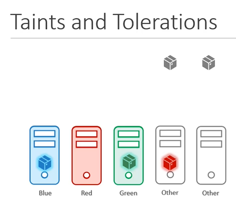
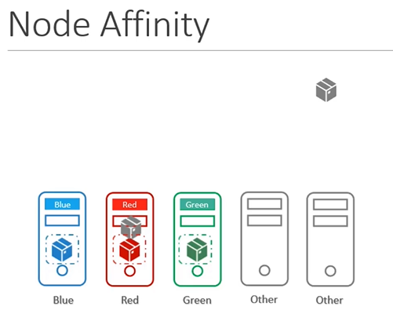
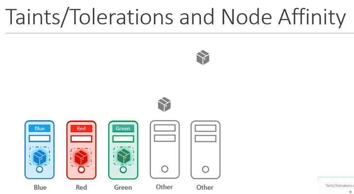

# Taints and Tolerations vs Node Affinity
  - Take me to [Video Tutorial](https://kodekloud.com/courses/539883/lectures/10277937)

In this section, we will take a look at Taints and Tolerations vs Node Affinity
- Taints and Toleration does not gurantee that the pods will only prefer these nodes, in this case, the red nodes may ends up on one of the other nodes that do not have a taint or toleration set.
  
  
  
- Let us try to solve the same problem with node affinity. With node affinity, we first label the nodes, in this case with respective colors and we then set node selectors on the pods to tie the pods to the nodes. As such the pods end up on the right nodes. However, that does not guarantee that other pods are not placed on these nodes. In this case, there is a chance that one of the other pods may end up on our nodes.
  
  
  
- As such, a combination of taints and tolerations and node affinity rules can be used together to completely dedicate nodes for specific parts. We first use taints and tolerations to prevent other pods from being placed on our nodes and then we use node affinity to prevent our pods from being placed on thier nodes
  
  

  
#### K8s Reference Docs:
- https://kubernetes.io/docs/concepts/scheduling-eviction/taint-and-toleration/
- https://kubernetes.io/docs/tasks/configure-pod-container/assign-pods-nodes-using-node-affinity/
