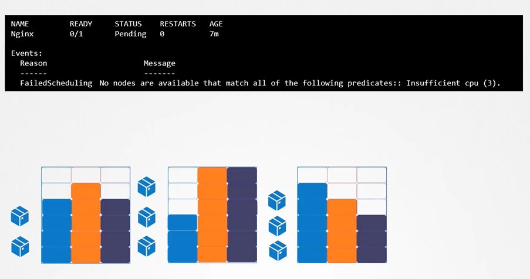
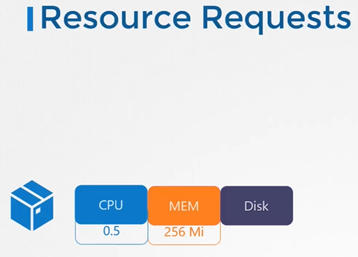
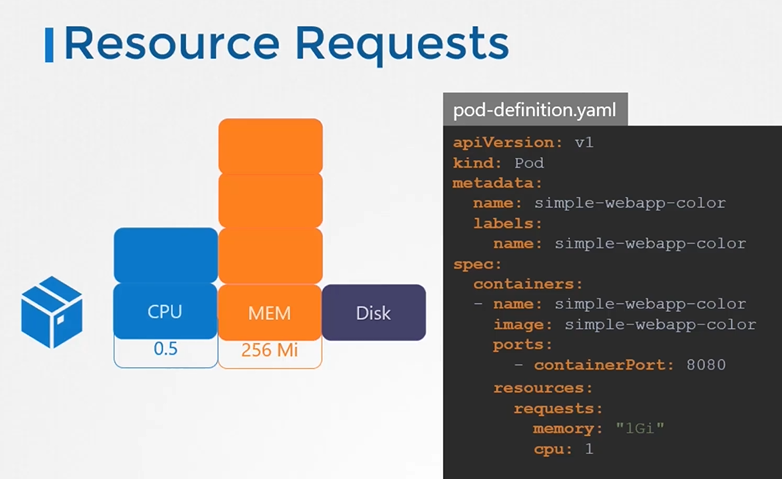
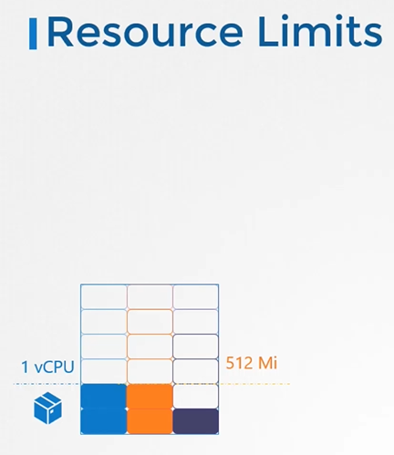
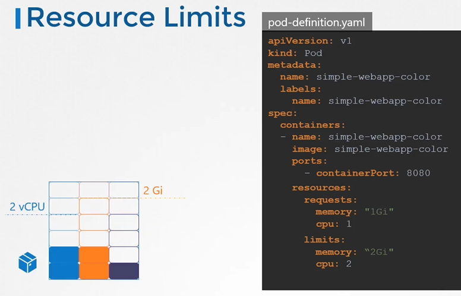
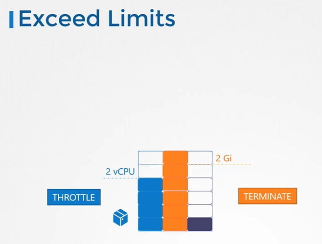

# Resource Limits
  - Take me to [Video Tutorials](https://kodekloud.com/topic/resource-limits/)
  
In this section we will take a look at Resource Limits

#### Let us take a look at 3 node kubernetes cluster.
- Each node has a set of CPU, Memory and Disk resources available.
- If there is no sufficient resources available on any of the nodes, kubernetes holds the scheduling the pod. You will see the pod in pending state. If you look at the events, you will see the reason as insufficient CPU.
  
  
  
> **Fork correction:** the original lecture claimed Kubernetes assumes a default request of `0.5` CPU /
> `256Mi` memory and a default limit of `1` CPU / `512Mi`. **That is wrong.** Kubernetes applies **no**
> default requests or limits. A container with no `resources` block has neither, and lands in the
> `BestEffort` QoS class. Defaults only exist where a `LimitRange` in the namespace supplies them.
> See [FORK-CHANGES.md](../../FORK-CHANGES.md).

## Resource Requirements
- A **`Resource Request`** is what the scheduler uses to find a node with enough *unreserved* capacity. Requests are about **scheduling**; limits are about **runtime enforcement**. If you set no request, it is `0` — the pod schedules almost anywhere and is the first thing evicted under pressure.
  
  
  
- If your application within the pod requires more than the default resources, you need to set them in the pod definition file.

  ```
  apiVersion: v1
  kind: Pod
  metadata:
    name: simple-webapp-color
    labels:
      name: simple-webapp-color
  spec:
   containers:
   - name: simple-webapp-color
     image: simple-webapp-color
     ports:
      - containerPort:  8080
     resources:
       requests:
        memory: "1Gi"
        cpu: "1"
  ```
   
   
## Resources - Limits
- A **`Limit`** is the ceiling the container runtime enforces. There is **no default limit** either — an unset limit means the container may consume whatever is free on the node.
  
  
  
- You can set the resource limits in the pod definition file.
  
  ```
  apiVersion: v1
  kind: Pod
  metadata:
    name: simple-webapp-color
    labels:
      name: simple-webapp-color
  spec:
   containers:
   - name: simple-webapp-color
     image: simple-webapp-color
     ports:
      - containerPort:  8080
     resources:
       requests:
        memory: "1Gi"
        cpu: "1"
       limits:
         memory: "2Gi"
         cpu: "2"
  ```
  
  
#### Note: Remember Requests and Limits for resources are set per container in the pod.
  
## Exceed Limits
- what happens when a pod tries to exceed resources beyond its limits?

   

- **CPU** is compressible, so the container is **throttled** back to its limit. It is not killed.
- **Memory** is not compressible, so exceeding a memory limit gets the container **OOMKilled** and restarted. `kubectl describe pod` shows `Last State: Terminated, Reason: OOMKilled`.

## Where defaults actually come from — LimitRange

A `LimitRange` is a **namespaced** object that injects requests/limits into containers that do not declare their own, and rejects ones outside `min`/`max`.

```yaml
apiVersion: v1
kind: LimitRange
metadata:
  name: cpu-mem-defaults
  namespace: dev
spec:
  limits:
  - type: Container
    default:            # becomes the container's LIMIT if unset
      cpu: "1"
      memory: 512Mi
    defaultRequest:     # becomes the container's REQUEST if unset
      cpu: 500m
      memory: 256Mi
    max:
      cpu: "2"
    min:
      cpu: 100m
```

A `LimitRange` applies at **admission time only** — creating one does not retro-fit values onto pods that already exist.

## ResourceQuota — the aggregate cap

```bash
kubectl create quota dev-quota --namespace dev \
  --hard=requests.cpu=4,requests.memory=8Gi,limits.cpu=8,limits.memory=16Gi
```

Once a quota sets `requests.*` / `limits.*`, every new pod in that namespace **must** declare the matching field or it is rejected. This is the usual reason a pod creation fails with `must specify limits.cpu`.

## Quality of Service classes

| QoS | Condition | Eviction order |
| --- | --- | --- |
| `Guaranteed` | every container sets requests **and** limits, and they are equal | last |
| `Burstable` | some requests/limits set, but not equal | second |
| `BestEffort` | nothing set anywhere in the pod | first |

```bash
kubectl get pod <name> -o jsonpath='{.status.qosClass}'
```

#### K8s Reference Docs:
- https://kubernetes.io/docs/concepts/configuration/manage-resources-containers/
- https://kubernetes.io/docs/concepts/policy/limit-range/
- https://kubernetes.io/docs/concepts/policy/resource-quotas/
- https://kubernetes.io/docs/concepts/workloads/pods/pod-qos/

> **See also:** scaling on these metrics is now an explicit CKA competency —
> [docs/18-2025-Curriculum-Additions/06-Horizontal-Pod-Autoscaling.md](../18-2025-Curriculum-Additions/06-Horizontal-Pod-Autoscaling.md).
  
  
