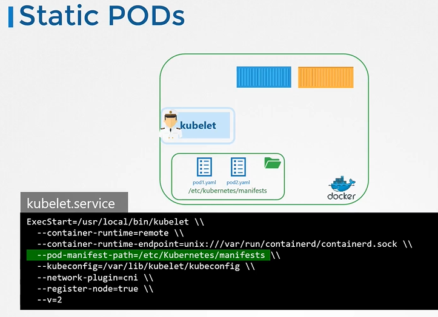
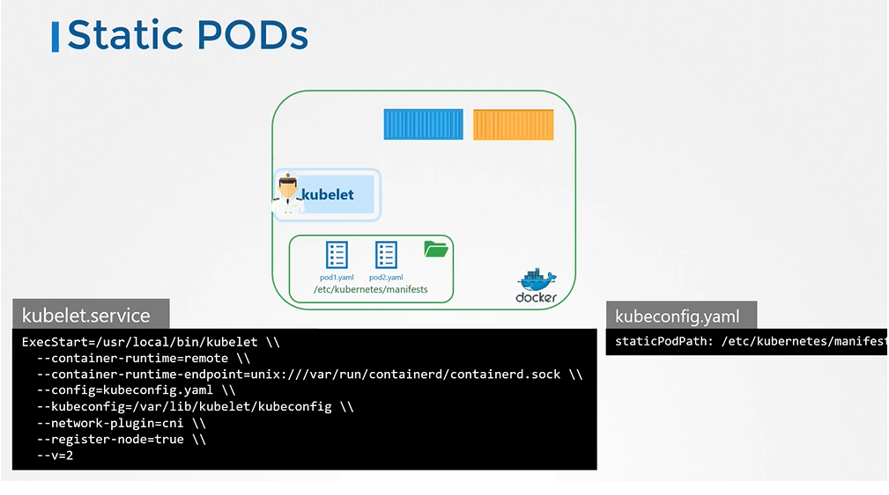
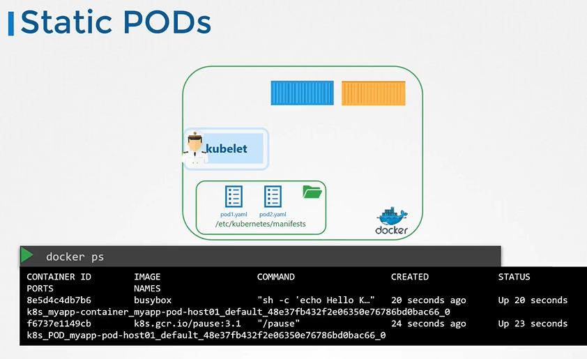
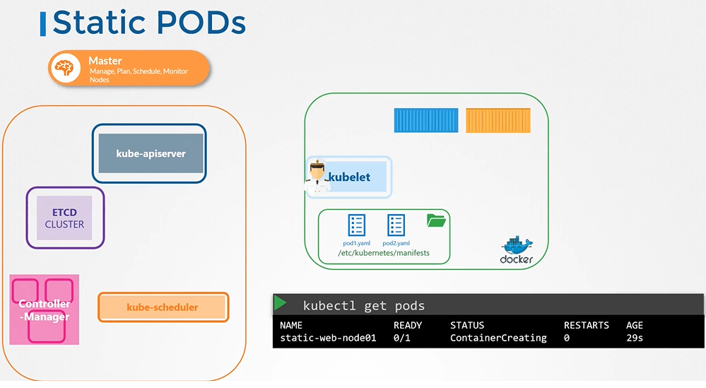
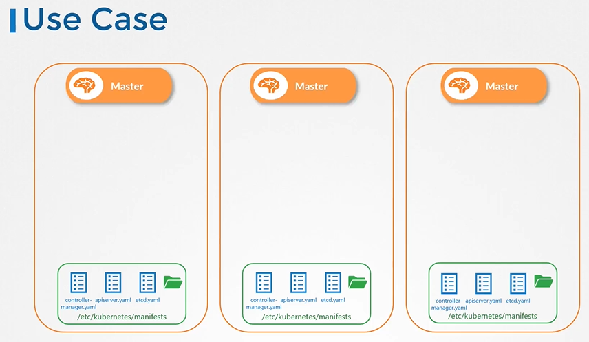
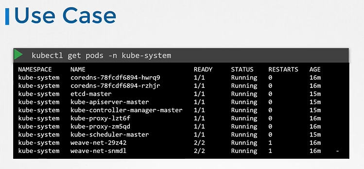

# Static Pods 
  - Take me to [Video Tutorial](https://kodekloud.com/courses/539883/lectures/10352432)
  
In this section, we will take a look at Static Pods

#### How do you provide a pod defination file to the kubelet without a kube-api server?
- You can configure the kubelet to read the pod defination files from a directory on the server designated to store information about pods.
- Place the pod defination files in this directory (/etc/kubernetes/manifests), the kubelet periodically checks this directory for files, reads these files and create pods on the host.
- Not only does it create the pod it can ensure that the pod stays alive.
- If the application crashes, the kubelet attempts to restart it.
- If you make a change to any of the file within this directory, the kubelet recreates the pod for those changes to take effect.
- If you remove a file from this directory the pod is deleted automatically.
- You cannot create replicasets or deployments or services by placing a defination file in the designated directory.

## Confgure Static Pod
- The designated directory can be any directory on the host and the location of that directory is passed in to the kubelet as an option while running the service.
  - The option is named as **`--pod-manifest-path`**.
  
  
  
## Another way to configure static pod 
- Instead of specifying the option directly in the **`kubelet.service`** file, you could provide a path to another config file using the config option, and define the directoy path as staticPodPath in the file.

  

## View the static pods
- To view the static pods
  ```
  $ docker ps
  ```
  

#### The kubelet can create both kinds of pods - the static pods and the ones from the api server at the same time.
- Static pods can be listed as any other pod.
- when the kubelet creates a static pod, if it is a part of a cluster, it also creates a mirror object in the kube-apiserver. 
- You can view the details of the pod but you cannot delete or edit it like the usual pods. You can only delete them by modifying the files from the nodes manifest folder.

  

## Static Pods - Use Case

  
  
  
  
## StaticPods vs DaemonSets

   
  

#### K8s Reference Docs
- https://kubernetes.io/docs/tasks/configure-pod-container/static-pod/
