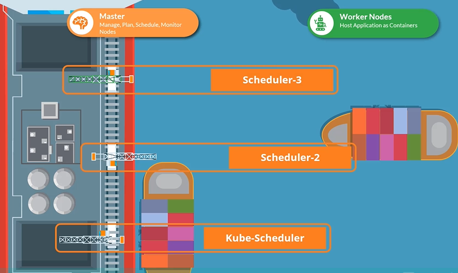
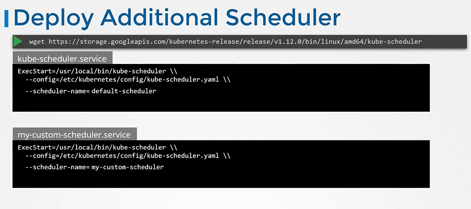
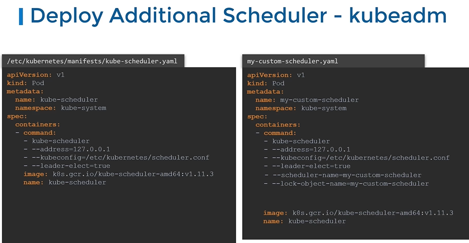
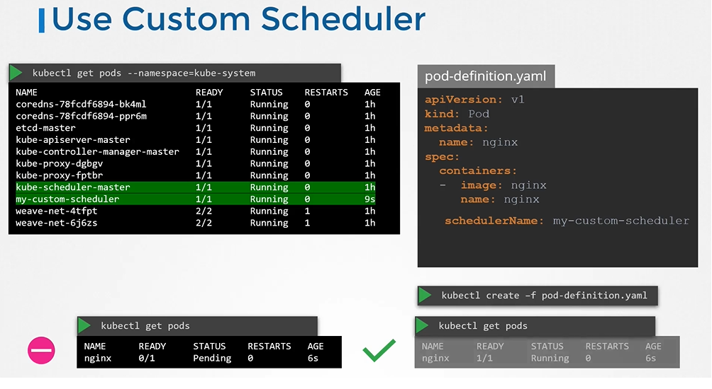
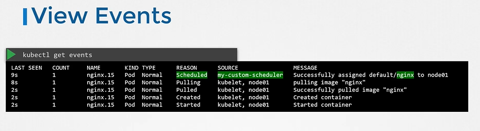
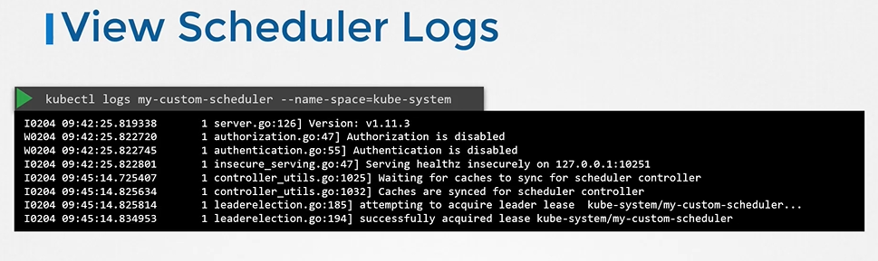

# Multiple Schedulers 
  - Take me to [Video Tutorial](https://kodekloud.com/topic/multiple-schedulers/)

In this section, we will take a look at multiple schedulers

## Custom Schedulers
- Your kubernetes cluster can schedule multiple schedulers at the same time.

  
  
> **Fork correction:** the original lecture downloaded a **v1.12.0** `kube-scheduler` binary and passed
> `--scheduler-name` on the command line. That flag is gone. A second scheduler is now configured with a
> **`KubeSchedulerConfiguration`** file (`kubescheduler.config.k8s.io/v1`, GA since 1.25) passed via
> `--config`, running the same `registry.k8s.io/kube-scheduler` image as the built-in one.
> See [FORK-CHANGES.md](../../FORK-CHANGES.md).

## Deploy additional scheduler

- Write the scheduler config. `profiles[].schedulerName` is the name pods will reference.

  ```yaml
  # /etc/kubernetes/my-scheduler-config.yaml
  apiVersion: kubescheduler.config.k8s.io/v1
  kind: KubeSchedulerConfiguration
  profiles:
    - schedulerName: my-scheduler
  leaderElection:
    leaderElect: false        # set true (with a distinct resourceName) only if you run >1 replica
  clientConnection:
    kubeconfig: /etc/kubernetes/scheduler.conf
  ```

  

- One scheduler binary can serve **several** profiles — add more entries under `profiles:` rather than running more pods, if all you need is different plugin configuration.

## Deploy additional scheduler - kubeadm

  

  ```yaml
  # my-custom-scheduler.yaml — drop in /etc/kubernetes/manifests/ to run as a static pod
  apiVersion: v1
  kind: Pod
  metadata:
    name: my-custom-scheduler
    namespace: kube-system
  spec:
    containers:
      - name: kube-scheduler
        image: registry.k8s.io/kube-scheduler:v1.31.0   # match your cluster's version
        command:
          - kube-scheduler
          - --config=/etc/kubernetes/my-scheduler-config.yaml
        volumeMounts:
          - name: config
            mountPath: /etc/kubernetes/my-scheduler-config.yaml
            readOnly: true
          - name: kubeconfig
            mountPath: /etc/kubernetes/scheduler.conf
            readOnly: true
    volumes:
      - name: config
        hostPath:
          path: /etc/kubernetes/my-scheduler-config.yaml
          type: File
      - name: kubeconfig
        hostPath:
          path: /etc/kubernetes/scheduler.conf
          type: File
  ```

  - To create a scheduler pod
    ```
    $ kubectl create -f my-custom-scheduler.yaml
    ```

  - Running it as a **Deployment** instead needs a ServiceAccount bound to the `system:kube-scheduler` ClusterRole plus the `extension-apiserver-authentication-reader` Role in `kube-system`, and the config supplied as a ConfigMap.
  
## View Schedulers
- To list the scheduler pods
  ```
  $ kubectl get pods -n kube-system
  ```

## Use the Custom Scheduler
- Create a pod definition file and add new section called **`schedulerName`** and specify the name of the new scheduler
  ```
  apiVersion: v1
  kind: Pod
  metadata:
    name: nginx
  spec:
    containers:
    - image: nginx
      name: nginx
    schedulerName: my-custom-scheduler
  ```
  
  
- To create a pod definition
  ```
  $ kubectl create -f pod-definition.yaml
  ```
- To list pods
  ```
  $ kubectl get pods
  ```

## View Events
- To view events
  ```
  $ kubectl get events
  ```
  
  
## View Scheduler Logs
- To view scheduler logs
  ```
  $ kubectl logs my-custom-scheduler -n kube-system
  ```
  

- To confirm **which** scheduler actually placed a pod, read the `Scheduled` event's source:
  ```
  $ kubectl get events -o wide | grep Scheduled
  ```
  
#### K8s Reference Docs
- https://kubernetes.io/docs/tasks/extend-kubernetes/configure-multiple-schedulers/
  
