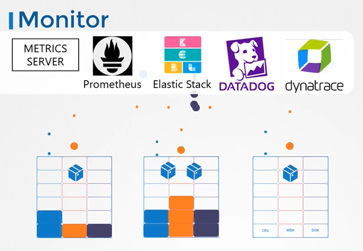
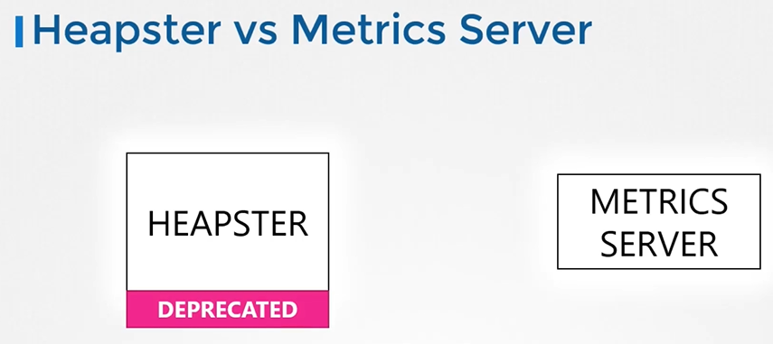
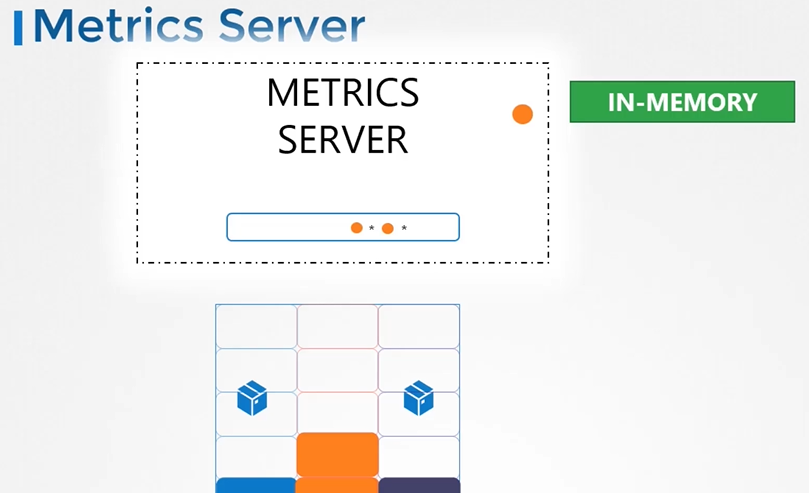
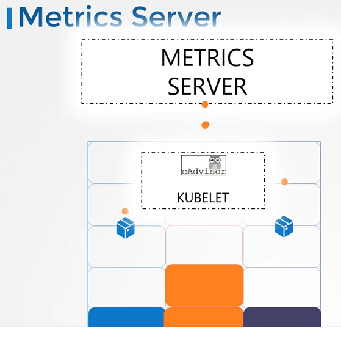
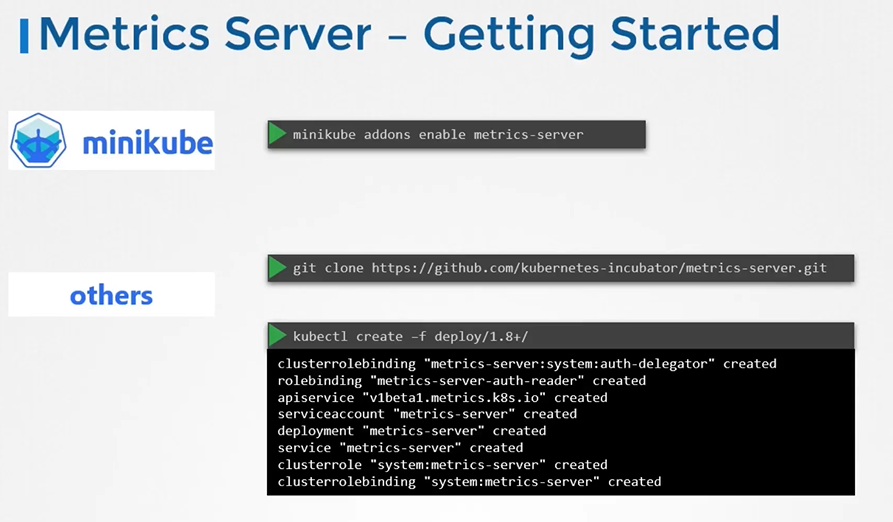

# Monitor Cluster Components
  - Take me to [Video Tutuorials](https://kodekloud.com/courses/539883/lectures/9808186)
  
In this section, we will take a look at monitoring kubernetes cluster

#### How do you monitor resource consumption in kubernetes? or more importantly, what would you like to monitor?
- I'd like to know **`Node Level`** metrics such as the number of nodes in the cluster.
- How many of them are healthy as well as the performance metrics such as CPU, Memory, Network and Disk Utilization.
- As well as **`POD Level`** metrics such as the number of PODs, and performance metrics of each POD such as the CPU and Memory consumption on them.
- So we need a solution that will monitor these metrics store them and provide analytics around this data
- There are number of opensource solutions available today, such as **`metrics-server`**, **`prometheus`**, **`Elastic Stack`**, **`Datadog`** and **`Dynatrace`**.

  
 
## Heapster vs Metrics Server
- Heapster was one of the original projects that enabled monitoring and analysis features for kubernetes.
- Heapster is now deprecated and a slimmed down version was formed known as the **`metrics server`**.

  
  
## Metrics Server
- You can have one metrics server per kubernetes cluster, the metrics server retrieves metrics from each of the kubernetes nodes and pods, aggregates them and stores them in memory.
- Note that the metric server is only an in memory monitoring solution and does not store the metrics on the disk and as a result you cannot see historical performance data.

  


#### How are the metrics generated for the PODs on these nodes?
- Kubernetes runs an agent on each node known as the kubelet, which is responsible for receiving instructions from the kubernetes API master server and running PODs on the nodes.
- The kubelet also contains a subcomponent known as CAdvisor or Container Advisor.
- CAdvisor is responsible for performance metrics from pods, and exposing them through the kubelet API to make the metrics available for the metrics server.

  
  
## Metrics Server - Getting Started

  
  
- Clone the metric server from github repo
  ```
  $ git clone https://github.com/kubernetes-incubator/metrics-server.git
  ```
- Deploy the metric server
  ```
  $ kubectl create -f metric-server/deploy/1.8+/
  ```
  
- View the cluster performance
  ```
  $ kubectl top node
  ```
- View performance metrics of pod
  ```
  $ kubectl top pod
  ```
  
  
  
  
