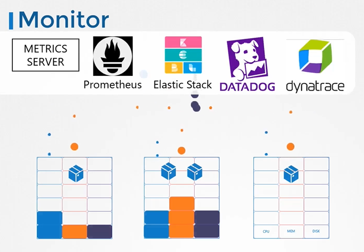
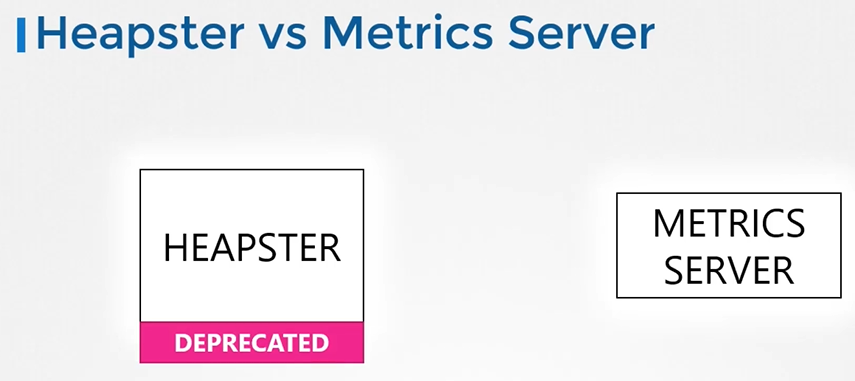
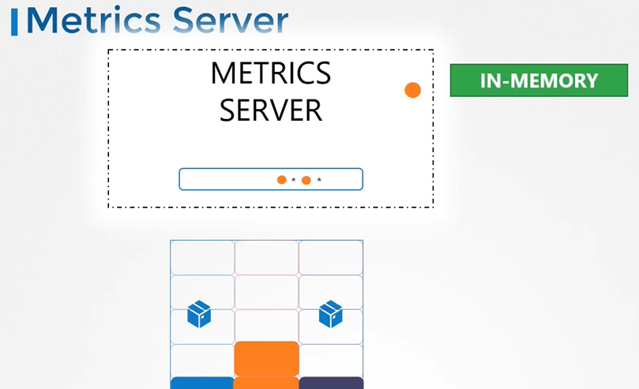
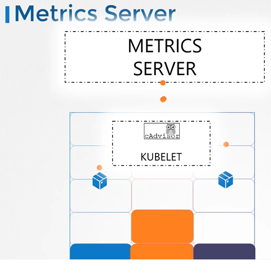
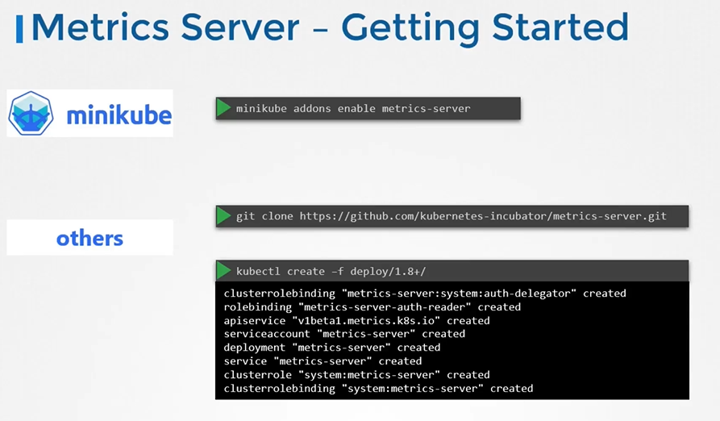
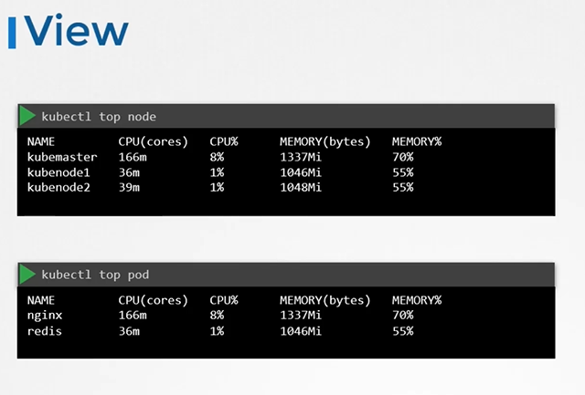

# Monitor Cluster Components
  - Take me to [Video Tutuorials](https://kodekloud.com/topic/monitor-cluster-components/)
  
In this section, we will take a look at monitoring kubernetes cluster

#### How do you monitor resource consumption in kubernetes? or more importantly, what would you like to monitor?
  
 
## Heapster vs Metrics Server
- Heapster is now deprecated and a slimmed down version was formed known as the **`metrics server`**.

  
  
## Metrics Server

  

#### How are the metrics generated for the PODs on these nodes?

  
  
## Metrics Server - Getting Started

  
  
> **Fork correction:** `kubernetes-incubator/metrics-server` and its `deploy/1.8+/` directory no longer
> exist. The project moved to **`kubernetes-sigs/metrics-server`** and ships a single `components.yaml`.
> See [FORK-CHANGES.md](../../FORK-CHANGES.md).

- Deploy the metrics server — one manifest, no clone required
  ```
  $ kubectl apply -f https://github.com/kubernetes-sigs/metrics-server/releases/latest/download/components.yaml
  ```
- On a kubeadm lab cluster the kubelet's serving certificate is self-signed, so metrics-server sits at
  `0/1 Running` with `x509: cannot validate certificate`. Add the insecure flag:
  ```
  $ kubectl -n kube-system patch deployment metrics-server --type=json \
      -p='[{"op":"add","path":"/spec/template/spec/containers/0/args/-","value":"--kubelet-insecure-tls"}]'
  ```
- Confirm the aggregated API is registered before trusting `kubectl top` (it takes ~60s to populate):
  ```
  $ kubectl get apiservices | grep metrics
  v1beta1.metrics.k8s.io   kube-system/metrics-server   True
  ```
  
- View the cluster performance
  ```
  $ kubectl top node
  ```
- View performance metrics of pod
  ```
  $ kubectl top pod
  ```
  
  
  
  
