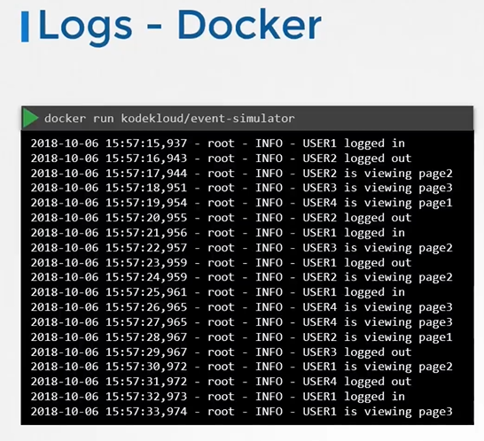
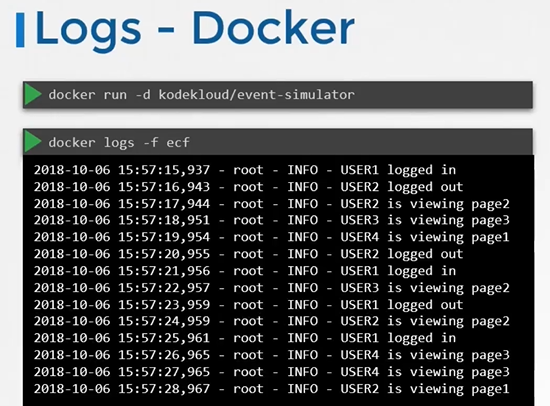
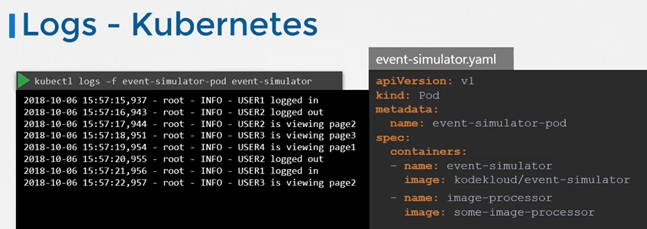

# Managing Application Logs
  - Take me to [Video Tutorial](https://kodekloud.com/courses/539883/lectures/9808184)

In this section, we will take a look at managing application logs

#### Let us start with logging in docker


 

 
#### Logs - Kubernetes
```
apiVersion: v1
kind: Pod
metadata:
  name: event-simulator-pod
spec:
  containers:
  - name: event-simulator
    image: kodekloud/event-simulator
```
 
 
- To view the logs
  ```
  $ kubectl logs -f event-simulator-pod
  ```
- If there are multiple containers in a pod then you must specify the name of the container explicitly in the command.
  ```
  $ kubectl logs -f <pod-name> <container-name>
  $ kubectl logs -f even-simulator-pod event-simulator
  ```

  
  
#### K8s Reference Docs
- https://kubernetes.io/blog/2015/06/cluster-level-logging-with-kubernetes/
 
