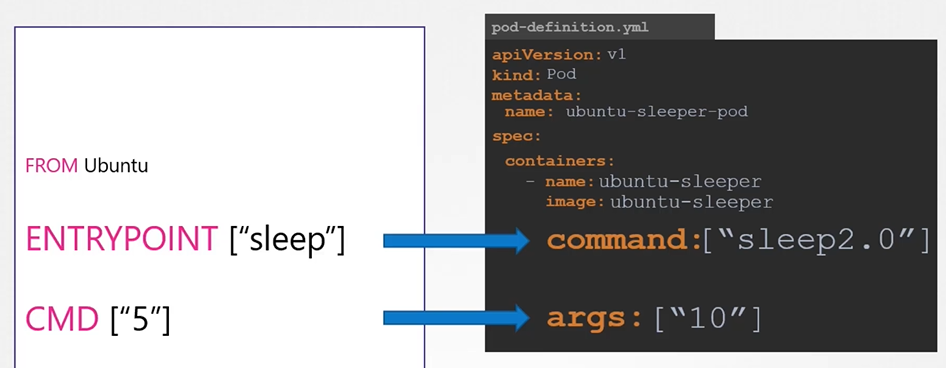

# Commands and Arguments in Kubernetes
  - Take me to [Video Tutorial](https://kodekloud.com/topic/commands-and-arguments-in-kubernetes-2/)

In this section, we will take a look at commands and arguments in kubernetes

- Anything that is appended to the docker run command will go into the **`args`** property of the pod definition file in the form of an array.
- The command field corresponds to the entrypoint instruction in the Dockerfile so to summarize there are 2 fields that correspond to 2 instructions in the Dockerfile.
  ```
  apiVersion: v1
  kind: Pod
  metadata:
    name: ubuntu-sleeper-pod
  spec:
   containers:
   - name: ubuntu-sleeper
     image: ubuntu-sleeper
     command: ["sleep2.0"]
     args: ["10"]
  ```
  
  
#### K8s Reference Docs
- https://kubernetes.io/docs/tasks/inject-data-application/define-command-argument-container/
