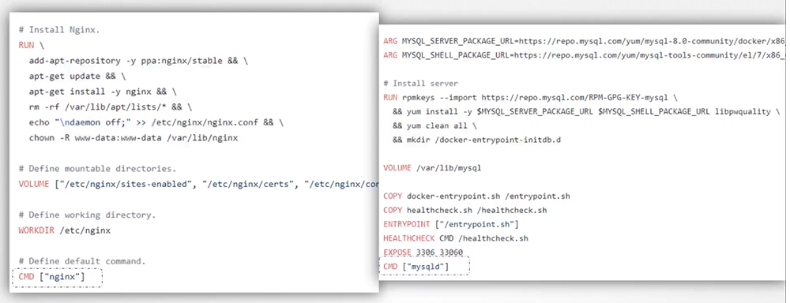
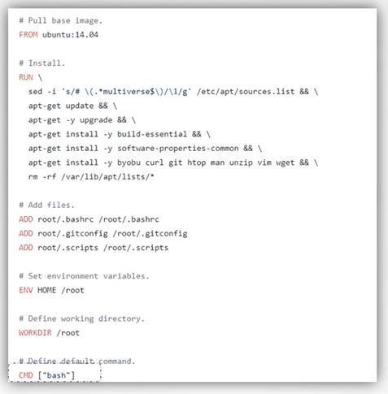
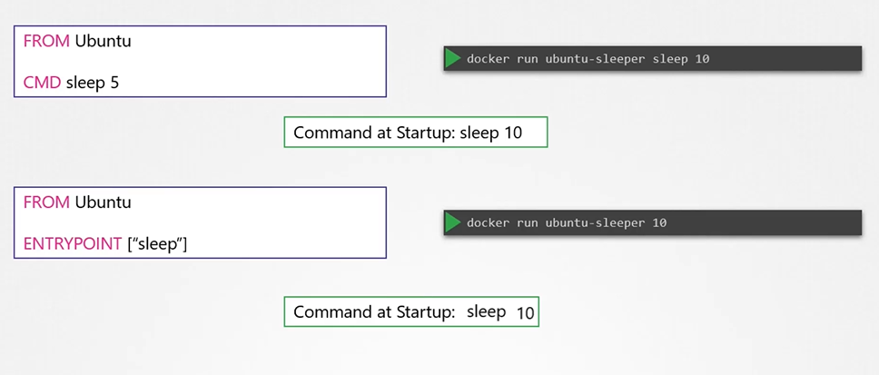
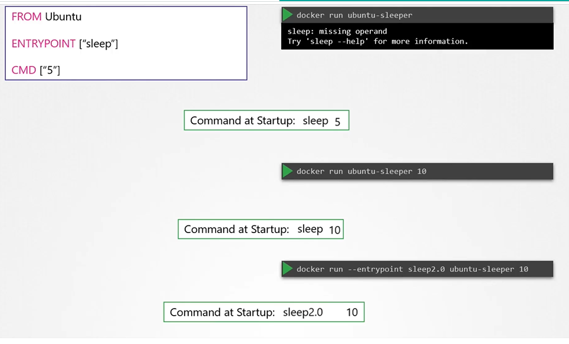

# Commands and Arguments in Docker
  - Take me to [Video Tutorial](https://kodekloud.com/courses/539883/lectures/9808205)
  
In this section, we will take a look at commands and arguments in docker

- To run a docker container
  ```
  $ docker run ubuntu
  ```
- To list running containers
  ```
  $ docker ps 
  ```
- To list all containers including that are stopped
  ```
  $ docker ps -a
  ```
  
  
  
#### Unlike virtual machines, containers are not meant to host operating system.
- Containers are meant to run a specific task or process such as to host an instance of a webserver or application server or a database server etc.

  
  
- Once the tasks is complete the container exits. A container only lives as long as the process inside it is alive.
- If the web service inside the container is stopped or crashes the container exists.
- So, who defines what process is run within the container? If you look at the **`Dockerfile`** for popular docker images like NGINX you will see an instruction called **`CMD`** which stands for command that defines the program that will be run with be run within the container when it starts
  
 

- Let us look at the Dockerfile for this image you will see that it uses bash as the default command. Now bash is not really a process like a web server or database server. It is a shell that listens for inputs from a terminal if it cannot find a terminal it exits.

  
  
#### How do you specify a different command to start the container?
- One Option is to append a command to the docker run command and that way it overrides the default command specified within the image.
  ```
  $ docker run ubuntu sleep 5
  ```
- This way when the container starts it runs the sleep program, waits for 5 seconds and then exists. How do you make that change permenent?
  
  
  
- There are different ways of specifying the command either the command simply as is in a shell form or in a JSON array format.
 
  
  
- Now, build the docker image
  ```
  $ docker build -t ubuntu-sleeper .
  ```
- Run docker container
  ```
  $ docker run ubuntu-sleeper
  ```
  
  
  
## Entrypoint Instruction
- The entrypoint instruction is like the command instruction as in you can specify the program that will be run when the container starts and whatever you specify on the command line.
- In case of the CMD instruction the command line parameters passed will get replaced entirely, whereas in case of entrypoint the command line parameters will get appended.

  

  

#### K8s Reference Docs
- https://docs.docker.com/engine/reference/builder/#cmd
