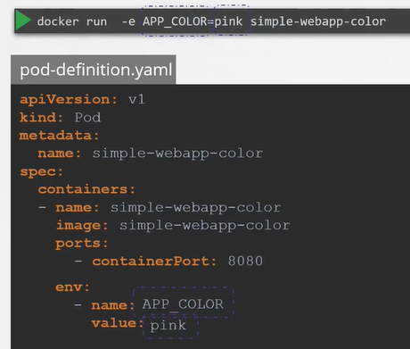
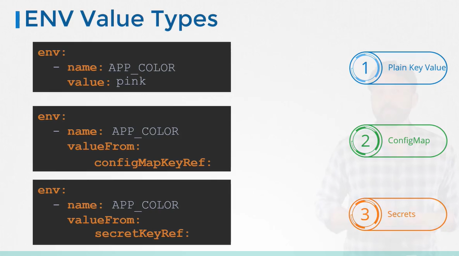

# Configure Environment Variables In Applications
  - Take me to [Video Tutorial](https://kodekloud.com/courses/539883/lectures/10589125)
  
#### ENV variables in Docker
```
$ docker run -e APP_COLOR=pink simple-webapp-color
```

#### ENV variables in kubernetes 
- To set an environment variable set an **`env`** property in pod defination file.
  
  
  
- There are other ways of setting the environment variables such as **`ConfigMaps`** and **`Secrets`**

  
  
