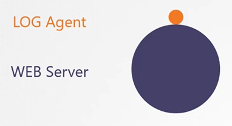
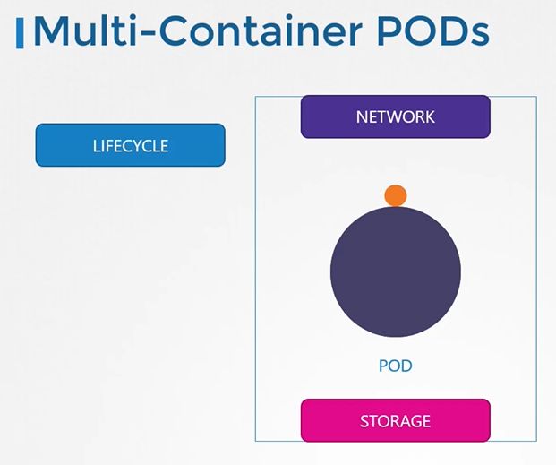

# Multi-Container Pods
  - Take me to [Video Tutorial](https://kodekloud.com/courses/539883/lectures/10589155)

In this section, we will take a look at multi-container pods

## Monolith and Microservices
- The idea of decoupling a large monolithic application into subcomponents known as micro services enables us to develop and deploy a set of independent small and reusable code. This architecture can then help us scale up down as well as modify each service as required as opposed to modifying the entire application.
- However at times you may need 2 services to work together such as a web server and a logging service. You need one agent instance per web server instance paired together.

  
  
#### Multi-Container Pods
- Multi-container pods that share the same lifecycle which means they are created together and destroyed together. 
- They share the same network space which means they can refer to each other as localhost and they have access to the same storage volumes.
- This way you do not have to establish volume sharing or services between the pods to enable communication between them.

  
  
- To create a new multi-container pod, add the new container information to the pod defination file.
  ```
  apiVersion: v1
  kind: Pod
  metadata:
    name: simple-webapp
    labels:
      name: simple-webapp
  spec:
    containers:
    - name: simple-webapp
      image: simple-webapp
      ports:
      - ContainerPort: 8080
    - name: log-agent
      image: log-agent
  ```
  
 
#### K8s Reference Docs
- https://kubernetes.io/docs/tasks/access-application-cluster/communicate-containers-same-pod-shared-volume/
