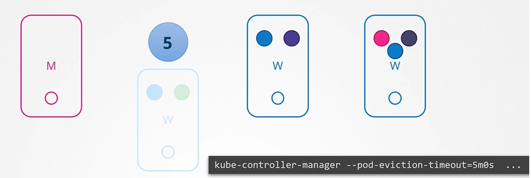
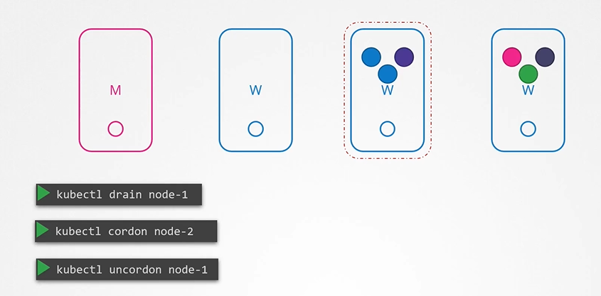

# OS Upgrades
  - Take me to [Video Tutorial](https://kodekloud.com/topic/os-upgrades/)
  
In this section, we will take a look at OS upgrades.

#### If the node was down for more than 5 minutes, then the pods are terminated from that node

  
  
- You can purposefully **`drain`** the node of all the workloads so that the workloads are moved to other nodes.
  ```
  $ kubectl drain node-1
  ```
- The node is also cordoned or marked as unschedulable.
- When the node is back online after a maintenance, it is still unschedulable. You then need to uncordon it.
  ```
  $ kubectl uncordon node-1
  ```
- There is also another command called cordon. Cordon simply marks a node unschedulable. Unlike drain it does not terminate or move the pods on an existing node.

  
  
  
#### K8s Reference Docs
- https://kubernetes.io/docs/tasks/administer-cluster/safely-drain-node/
