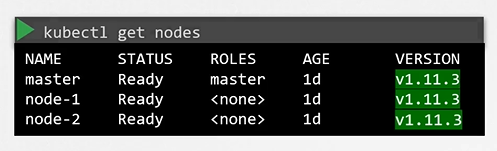
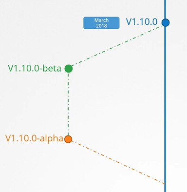
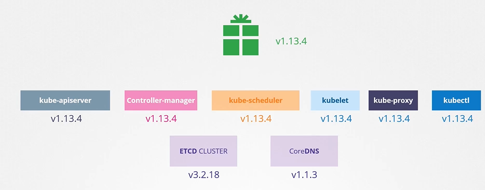

# Kubernetes Software Versions
  - Take me to [Video Tutorial](https://kodekloud.com/topic/kubernetes-software-versions/)
  
In this section, we will take a look at various kubernetes releases and versions

#### We can see the kubernetess version that we installed
```
$ kubectl get nodes
```


#### Let's take a closer look at the version number
- It consists of 3 parts
  - First is the major version
  - Second is the minor version
  - Finally, the patch version
  
  
  
#### Kubernetes follows a standard software release versioning procedure
- You can find all kubernetes releases at https://github.com/kubernetes/kubernetes/releases

  
  
  
  
#### Downloaded package has all the kubernetes components in it except **`ETCD Cluster`** and **`CoreDNS`** as they are seperate projects.

 
 
#### References

 - https://github.com/kubernetes/community/blob/master/contributors/design-proposals/release/versioning.md
 - https://github.com/kubernetes/community/blob/master/contributors/design-proposals/api-machinery/api-group.md
 - https://blog.risingstack.com/the-history-of-kubernetes/
 - https://kubernetes.io/docs/setup/release/version-skew-policy/
 
 


