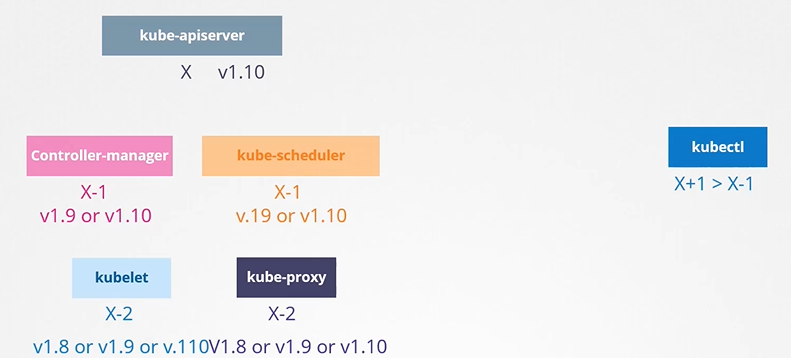
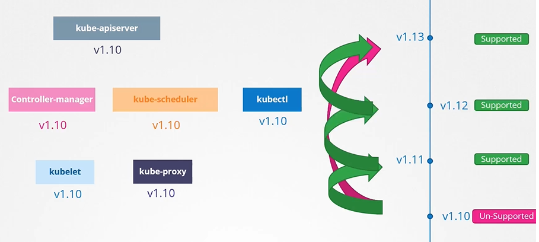
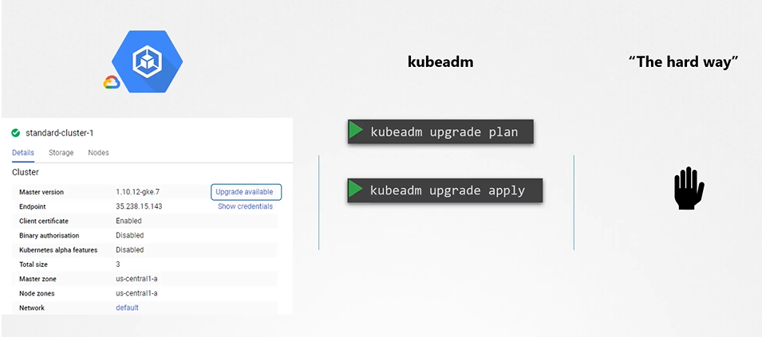

# Cluster Upgrade Introduction
  - Take me to [Video Tutorial](https://kodekloud.com/courses/539883/lectures/9808227)
  
#### Is it mandatory for all of the kubernetes components to have the same versions?
- No, The components can be at different release versions.
- Since, the kube-apiserver is the primary component in the control plane and that is the component that all other components talk to, none of the other components should ever be at a version higher than the kube-apiserver.
- The controller manager and Scheduler can be at one version lower (X -1 ).
- Kubelet and Kube-Proxy components can be at 2 versions lower  ( X-2 ).
- kubectl utility could be at a version higher than the apiserver(X+1), the same version as the apiserver, or at version lower than the apiserver (X-1)

  
  
#### At any time, kubernets supports only up to the recent 3 minor versions
- The recommended approach is to upgrade one minor version at a time.
  
  
  
#### Options to upgrade k8s cluster
 
  
  

  
  
  
