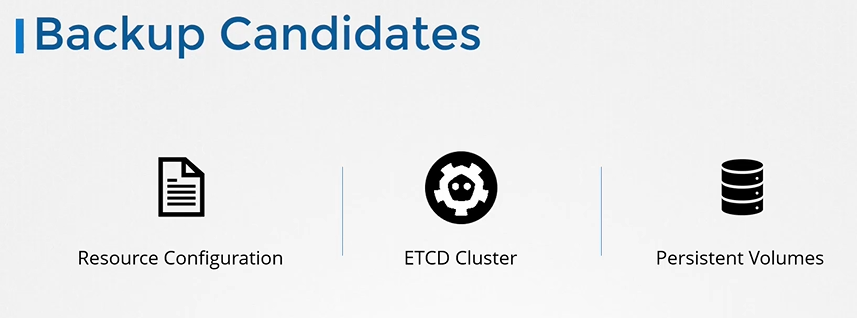
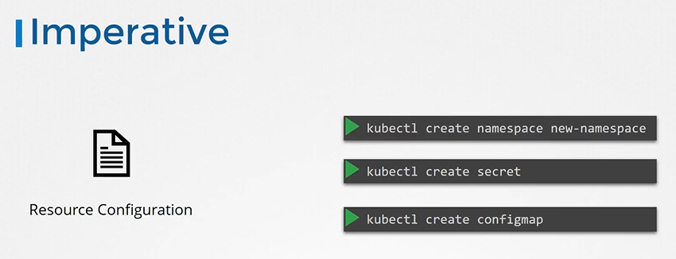
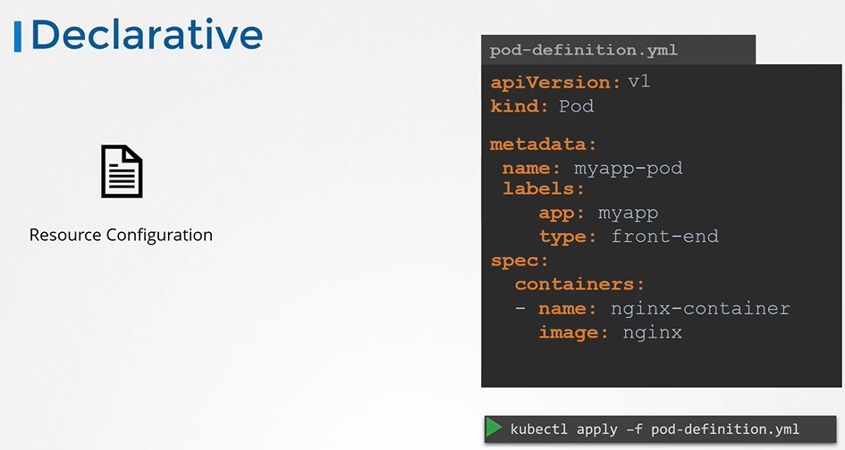
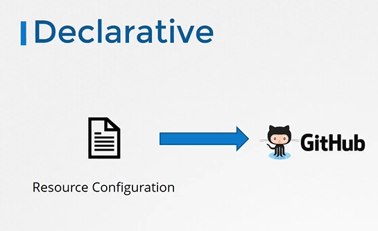
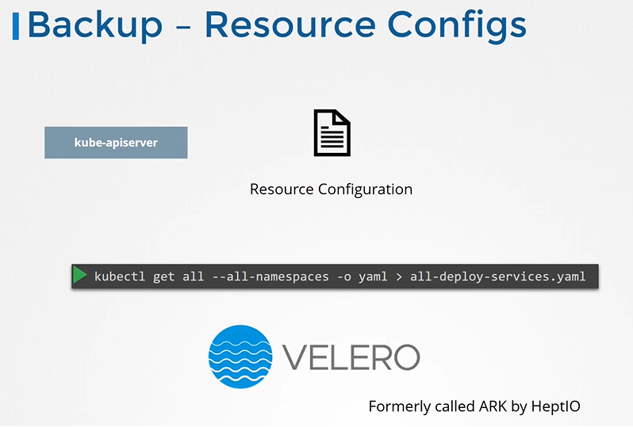
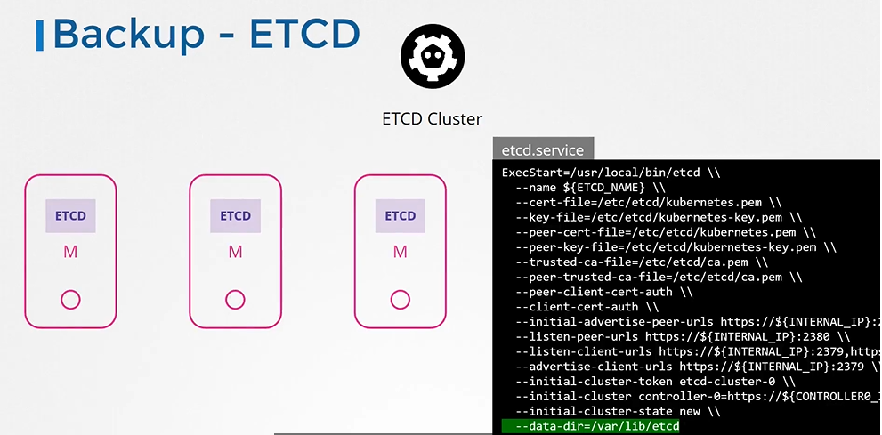
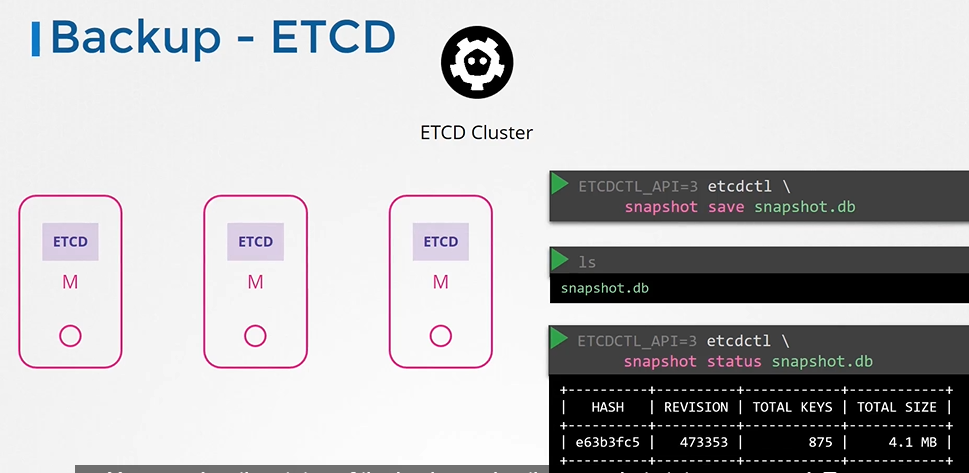
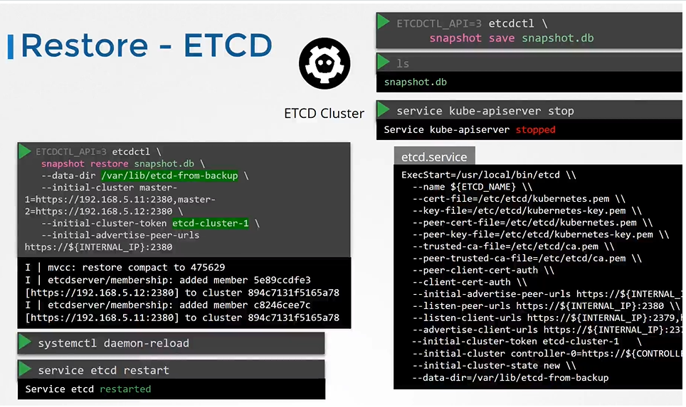
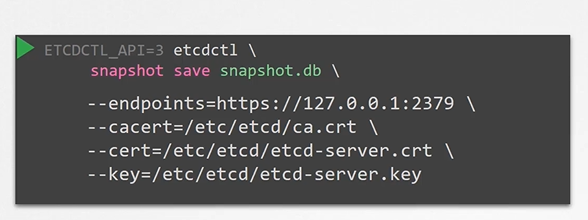

# Backup and Restore Methods
  - Take me to [Video Tutorial](https://kodekloud.com/topic/backup-and-restore-methods/)
  
In this section, we will take a look at backup and restore methods

## Backup Candidates
 
 
 
## Resource Configuration
- Imperative way
  
  

- Declarative Way (Preferred approach)
  ```
  apiVersion: v1
  kind: Pod
  metadata:
    name: myapp-pod
    labels:
      app: myapp
      type: front-end
  spec:
    containers:
    - name: nginx-container
      image: nginx
  ```
 
 
- A good practice is to store resource configurations on source code repositories like github.

  

## Backup - Resource Configs

  ```
  $ kubectl get all --all-namespaces -o yaml > all-deploy-services.yaml (only for few resource groups)
  ```

- There are many other resource groups that must be considered. There are tools like **`ARK`** or now called **`Velero`** by Heptio that can do this for you.

  
  
## Backup - ETCD
- So, instead of backing up resources as before, you may choose to backup the ETCD cluster itself. 
  
  
  
- You can take a snapshot of the etcd database by using **`etcdctl`** utility snapshot save command.
  ```
  $ etcdctl snapshot save snapshot.db
  ```
  ```
  $ etcdctl snapshot status snapshot.db --write-out=table
  ```
  

> **Fork note:** `ETCDCTL_API=3` was needed with etcd 3.3 and earlier. **From etcd 3.4 onwards v3 is the
> default**, so the prefix is harmless noise on any cluster you will meet. It has been dropped from the
> commands here. Check with `etcdctl version`.

## Restore - ETCD

> **Fork correction:** the lecture says `service kube-apiserver stop`. That applies only to a
> **non-kubeadm** ("the hard way") cluster where the apiserver is a systemd unit. On a **kubeadm**
> cluster — what the exam gives you — the apiserver and etcd are **static pods**, and you stop them by
> moving their manifests out of `/etc/kubernetes/manifests/`.
> See [FORK-CHANGES.md](../../FORK-CHANGES.md).

### On a kubeadm cluster (the exam case)

```bash
# 1. Restore the snapshot into a NEW data directory. Never restore over a live /var/lib/etcd.
#    This is a purely local file operation: no --endpoints, --cert or --key needed.
sudo etcdctl snapshot restore /opt/snapshot.db --data-dir=/var/lib/etcd-from-backup

# 2. Point the etcd static pod at the new directory. Edit /etc/kubernetes/manifests/etcd.yaml:
#      volumes:
#      - hostPath:
#          path: /var/lib/etcd-from-backup    # <- was /var/lib/etcd
#          type: DirectoryOrCreate
#        name: etcd-data
sudo vi /etc/kubernetes/manifests/etcd.yaml

# 3. The kubelet watches that directory and recreates the pod on its own. If it does not,
#    bounce both static pods by moving the manifests out and back:
sudo mv /etc/kubernetes/manifests/kube-apiserver.yaml /tmp/
sudo mv /etc/kubernetes/manifests/etcd.yaml /tmp/
# ...wait for the containers to disappear...
sudo mv /tmp/etcd.yaml /etc/kubernetes/manifests/
sudo mv /tmp/kube-apiserver.yaml /etc/kubernetes/manifests/

# 4. Watch it come back. kubectl will not work while the apiserver is down — use crictl.
watch crictl ps
```

The `hostPath` in `etcd.yaml` must match the `--data-dir` you restored to, or etcd starts against an
empty directory and the cluster comes up blank.

### On a non-kubeadm cluster (etcd as a systemd service)

- First stop the kube-apiserver service
  ```
  $ service kube-apiserver stop
  ```
- Run the `etcdctl snapshot restore` command
- Update `--data-dir` in the etcd unit file
- Reload system configs
  ```
  $ systemctl daemon-reload
  ```
- Restart etcd
  ```
  $ service etcd restart
  ```

  

- Start the kube-apiserver
  ```
  $ service kube-apiserver start
  ```

#### With all etcdctl commands specify the cert,key,cacert and endpoint for authentication.

> **Fork correction:** the certificate is **`server.crt` / `server.key`**, not `etcd-server.crt`. The
> lecture slide is wrong; the practice tests in this repo use the correct path. Rather than trusting any
> note, read the real values off the running static pod:
> `grep -E "cert-file|key-file|trusted-ca-file|data-dir" /etc/kubernetes/manifests/etcd.yaml`

```
$ etcdctl snapshot save /tmp/snapshot.db \
  --endpoints=https://127.0.0.1:2379 \
  --cacert=/etc/kubernetes/pki/etcd/ca.crt \
  --cert=/etc/kubernetes/pki/etcd/server.crt \
  --key=/etc/kubernetes/pki/etcd/server.key
```

- Health and membership checks **do** need the endpoint and certs:
```
$ etcdctl member list \
  --endpoints=https://127.0.0.1:2379 \
  --cacert=/etc/kubernetes/pki/etcd/ca.crt \
  --cert=/etc/kubernetes/pki/etcd/server.crt \
  --key=/etc/kubernetes/pki/etcd/server.key
```

  
  
#### K8s Reference Docs
- https://kubernetes.io/docs/tasks/administer-cluster/configure-upgrade-etcd/


 
