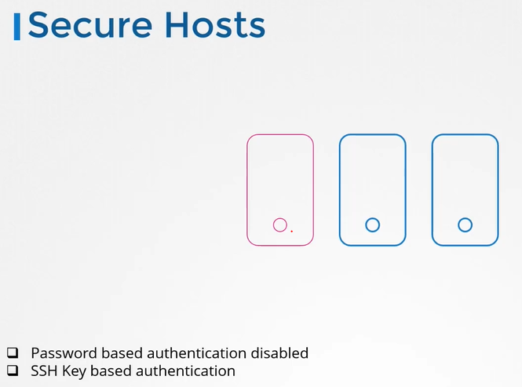
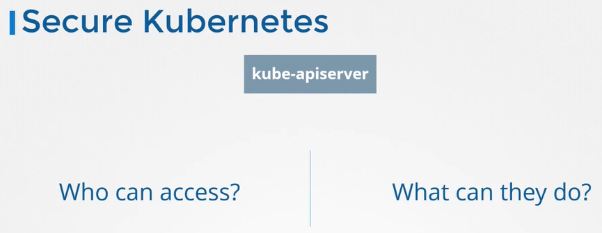
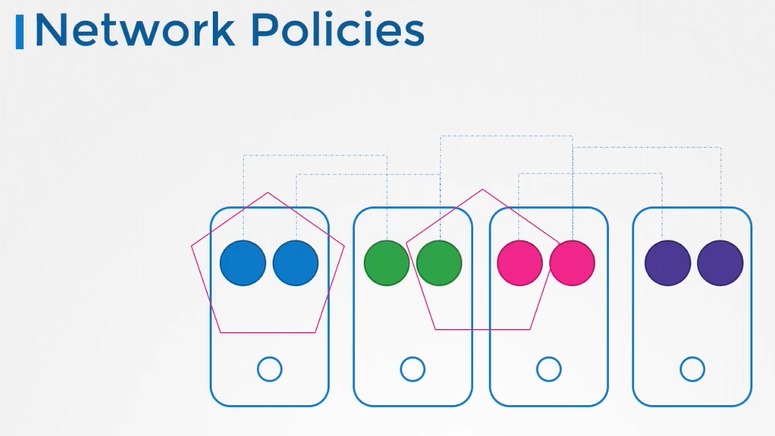

# Kubernetes Security Primitives
  - Take me to [Video Tutorial](https://kodekloud.com/topic/kubernetes-security-primitives/)
  
In this section, we will take a look at kubernetes security primitives

## Secure Hosts

 
  
## Secure Kubernetes
- We need to make two types of decisions.
  - Who can access?
  - What can they do?
 
  
  
## Authentication
- Who can access the API Server is defined by the Authentication mechanisms.
  
## Authorization
- Once they gain access to the cluster, what they can do is defined by authorization mechanisms.

## TLS Certificates
- All communication with the cluster, between the various components such as the ETCD Cluster, kube-controller-manager, scheduler, api server, as well as those running on the working nodes such as the kubelet and kubeproxy is secured using TLS encryption.

 
 
## Network Policies
What about communication between applications within the cluster?

  
  
