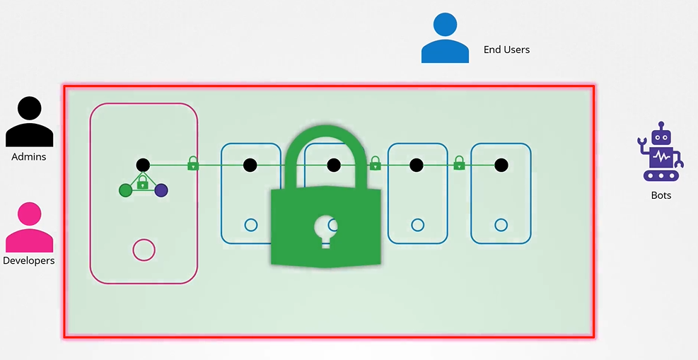
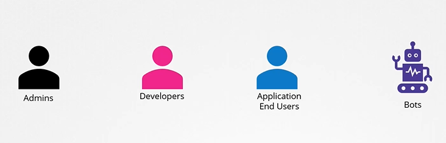
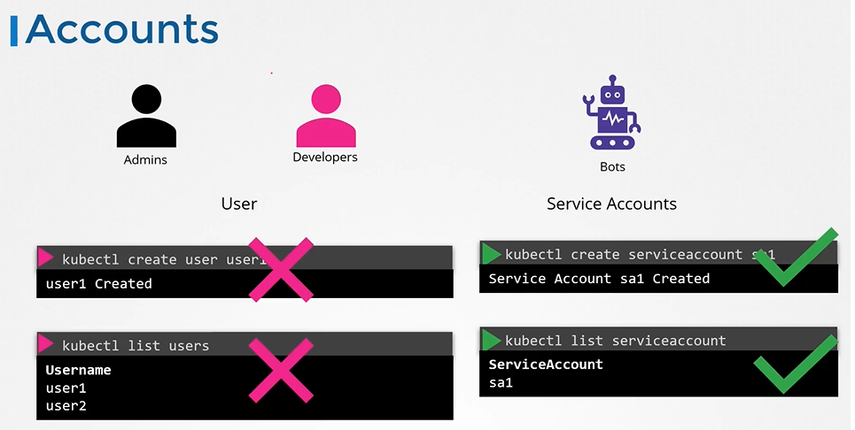
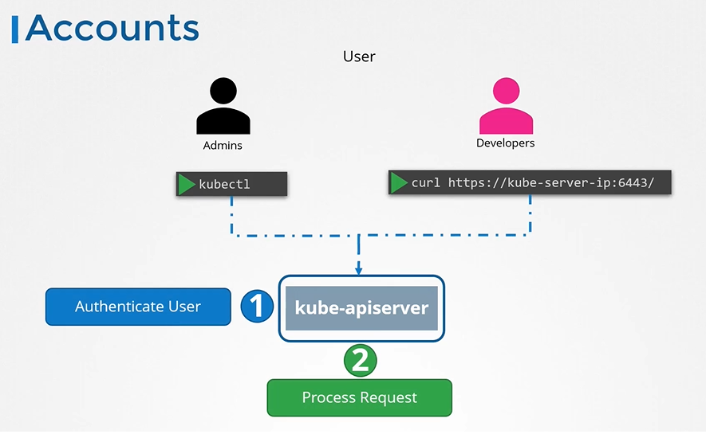
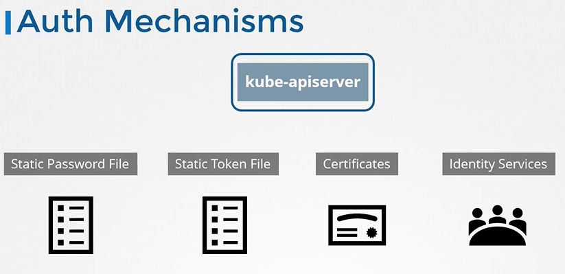
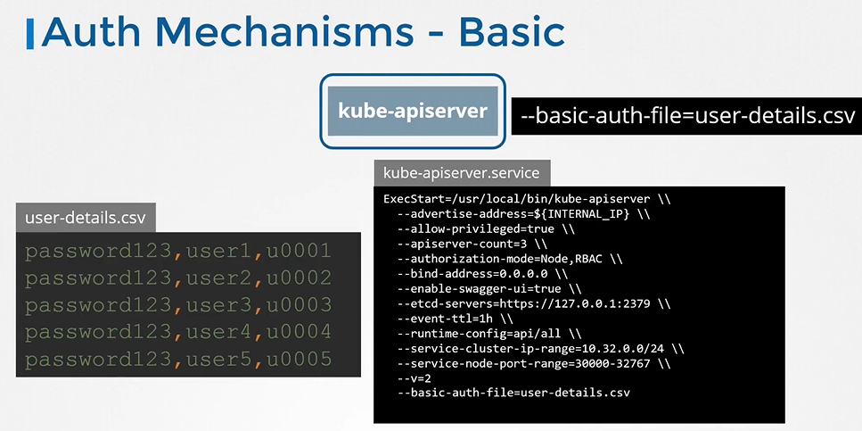
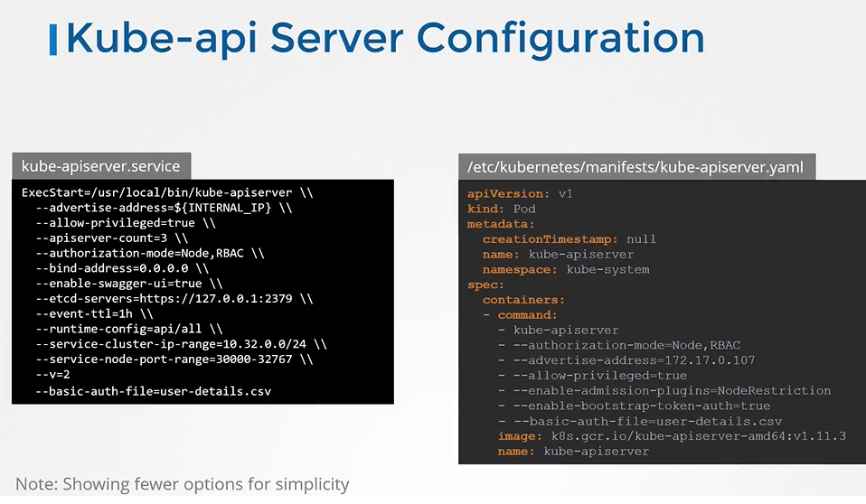
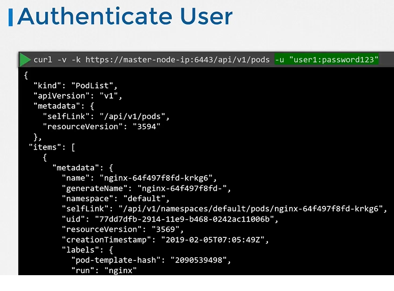
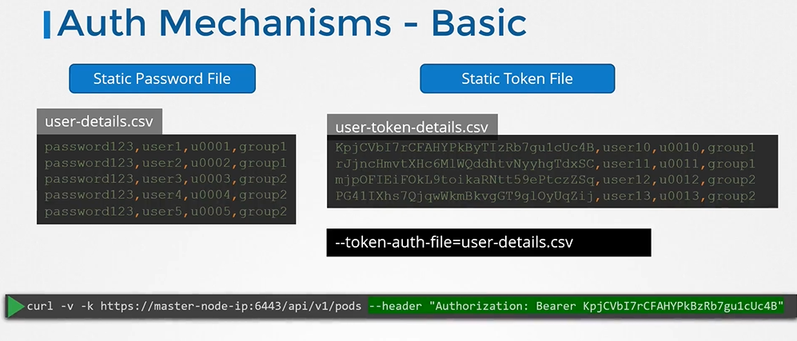
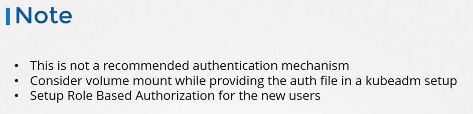

# Authentication
  - Take me to [Video Tutorial](https://kodekloud.com/courses/539883/lectures/9808250)
  
In this section, we will take a look at authentication in a kubernetes cluster

## Accounts
- We have users like Administrators that access the cluster to perform administrative tasks
- The developers that access to cluster to test or deploy applications.
- We have end users who access the applications deployed on the cluster
- We have third party applications accessing the cluster for integration purposes.

  
  
#### Different users that may be accessing the cluster security of end users who access the applications deployed on the cluster is managed by the applications themselves internally.

 
 
- So, we left with 2 types of users
  - Humans, such as the Administrators and Developers
  - Robots such as other processes/services or applications that require access to the cluster.
  
- You cannot create users in a kubernetes clusters or view the list of users.
- However in case of service accounts can manage them

  
  
- All user access is managed by apiserver and all of the requests goes through apiserver.
 
  
  
## Authentication Mechanisms
- There are different authentication mechanisms that can be configured.
  - You can have a list of username and passwords in a static password file.
  - Or Username and Tokens in a static token file.
  - Or You can authenticate using certificates.
  - And another option is to connect to third party authentication protocols like LDAP, Kerberos etc.
  
  
  
## Authentication Mechanisms - Basic
- You can create a list of users and their passwords in a csv file and use that as the source for user information.
- We then pass the file name as an option to the kube-apiserver via kube-apiserver.service
  
  
  
## kube-apiserver configuration
- If you set up via kubeadm then update kube-apiserver.yaml manifest file with the option.
  
  
  
## Authenticate User

- To authenticate using the basic credentials while accessing the API server specify the username and password in a curl command.
  ```
  $ curl -v -k http://master-node-ip:6443/api/v1/pods -u "user1:password123"
  ```
  
  
- We can have additional column in the user-details.csv file to assign users to specific groups.
- Similarly instead of static password file, you can use static token file and pass an option (--token-auth-file) to the kube-apiserver. 
- While authenticating specify token as the autherization bearer token to your requests.

  
  
## Note
 
 
  
  
  
  
  
