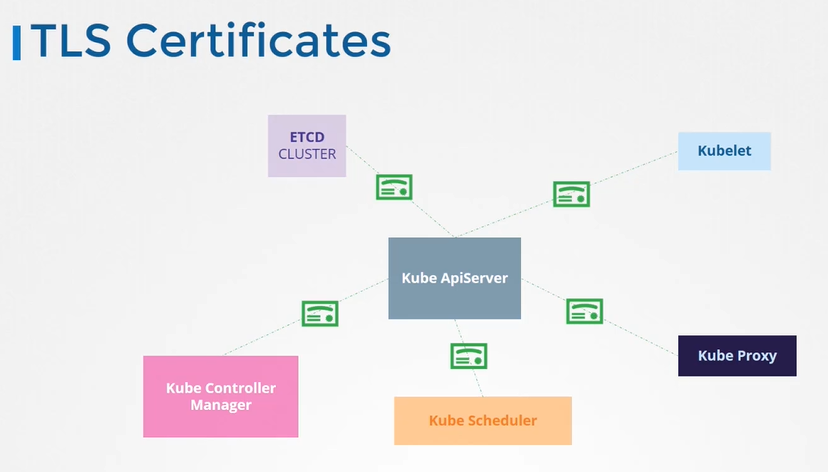
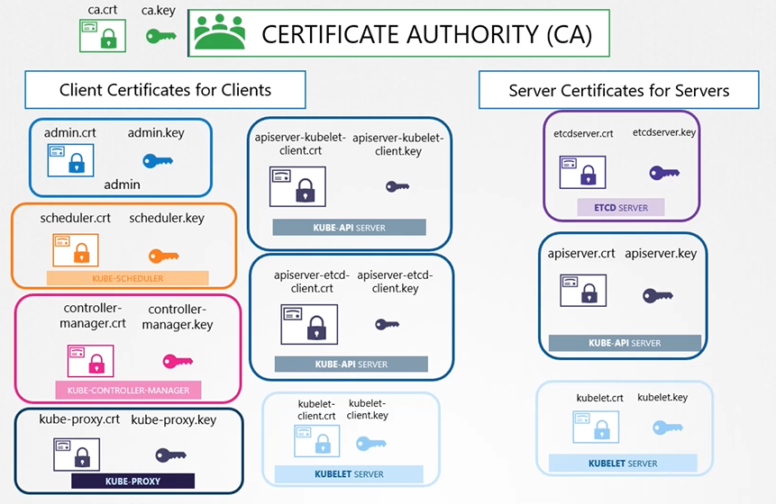

# TLS in Kubernetes
  - Take me to [Video Tutorial](https://kodekloud.com/topic/tls-in-kubernetes/)
  
In this section, we will take a look at TLS in kubernetes

#### The two primary requirements are to have all the various services within the cluster to use server certificates and all clients to use client certificates to verify they are who they say they are.
- Server Certificates for Servers
- Client Certificates for Clients

  
  
#### Let's look at the different components within the k8s cluster and identify the various servers and clients and who talks to whom.

  
  
