# TLS in kubernetes - Certificate Creation
  - Take me to [Video Tutorial](https://kodekloud.com/topic/tls-in-kubernetes-certificate-creation/)
  
In this section, we will take a look at TLS certificate creation in kubernetes

## Generate Certificates
- There are different tools available such as easyrsa, openssl or cfssl etc. or many others for generating certificates.

## Certificate Authority (CA)

- Generate Keys
  ```
  $ openssl genrsa -out ca.key 2048
  ```
- Generate CSR
  ```
  $ openssl req -new -key ca.key -subj "/CN=KUBERNETES-CA" -out ca.csr
  ```
- Sign certificates
  ```
  $ openssl x509 -req -in ca.csr -signkey ca.key -out ca.crt
  ```
 
 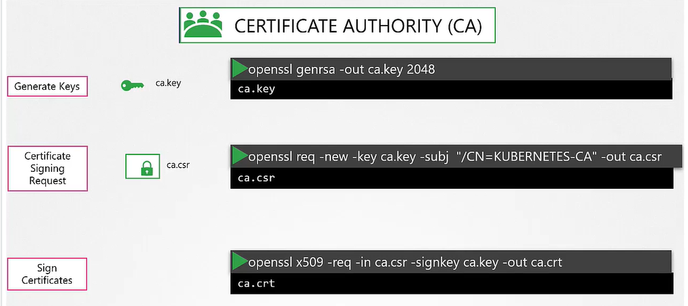
 
## Generating Client Certificates

#### Admin User Certificates

- Generate Keys
  ```
  $ openssl genrsa -out admin.key 2048
  ```
- Generate CSR
  ```
  $ openssl req -new -key admin.key -subj "/CN=kube-admin" -out admin.csr
  ```
- Sign certificates
  ```
  $ openssl x509 -req -in admin.csr -CA ca.crt -CAkey ca.key -out admin.crt
  ```
  
  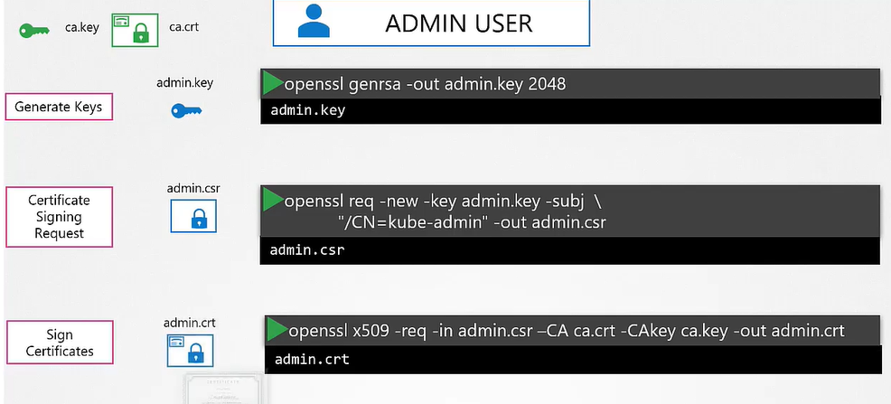
  
- Certificate with admin privilages
  ```
  $ openssl req -new -key admin.key -subj "/CN=kube-admin/O=system:masters" -out admin.csr
  ```
  
#### We follow the same procedure to generate client certificate for all other components that access the kube-apiserver.

  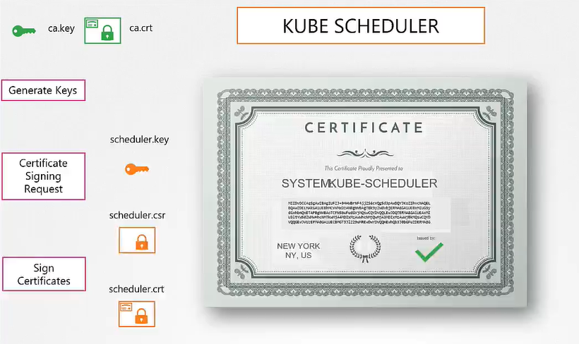
  
  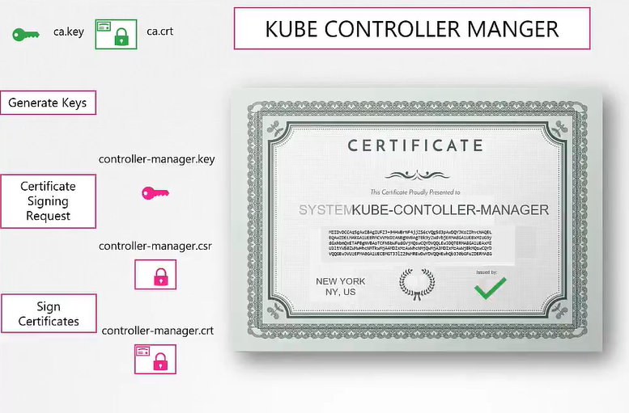
  
  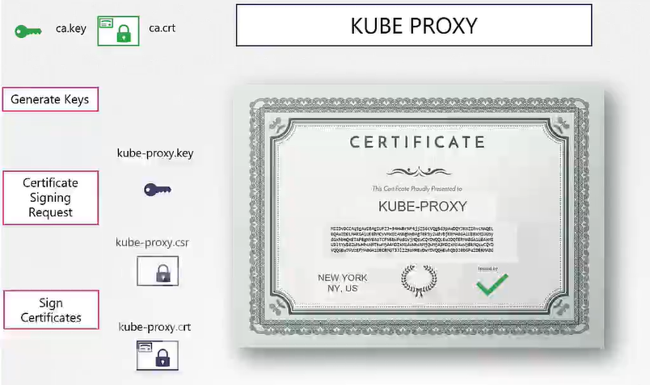
   
  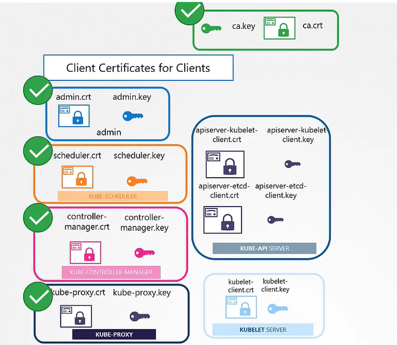
  
## Generating Server Certificates

## ETCD Server certificate

  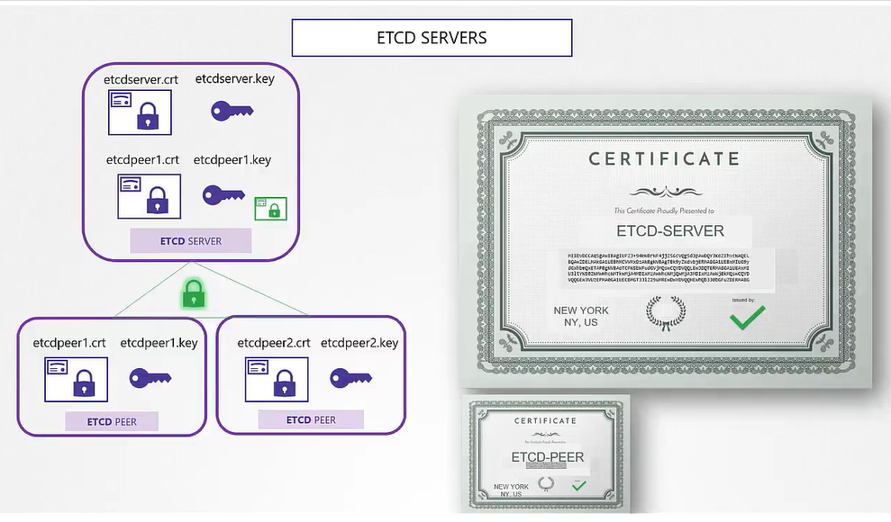
  
  
  
## Kube-apiserver certificate

  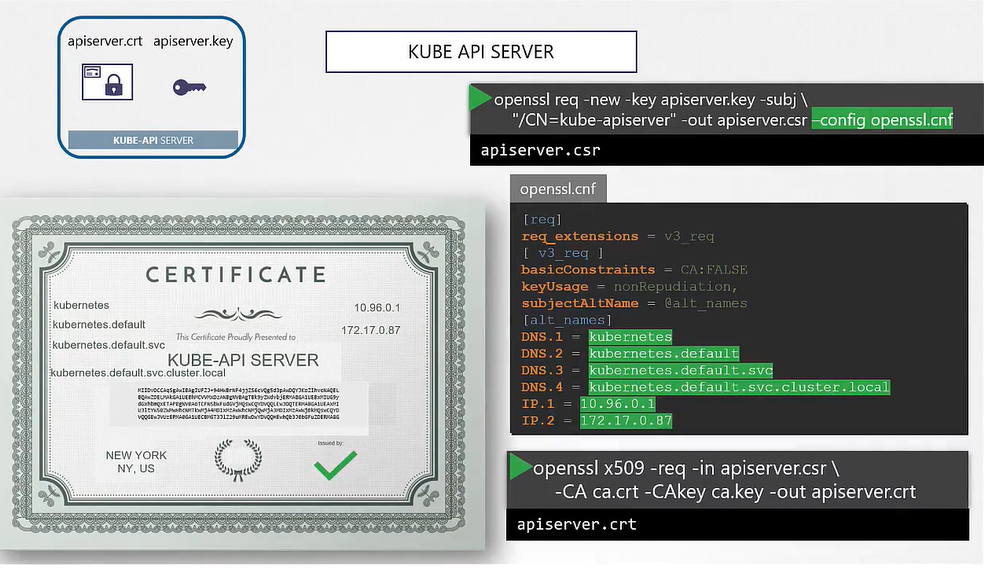
  
  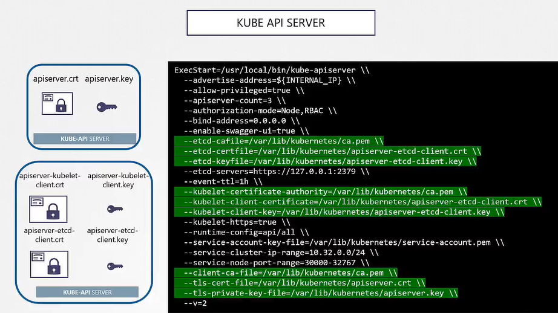
  
## Kubectl Nodes (Server Cert)

   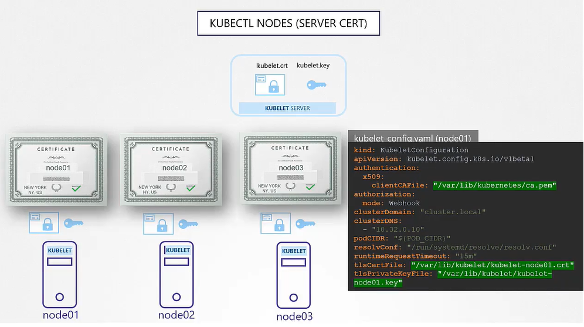
   
## Kubectl Nodes (Client Cert)

   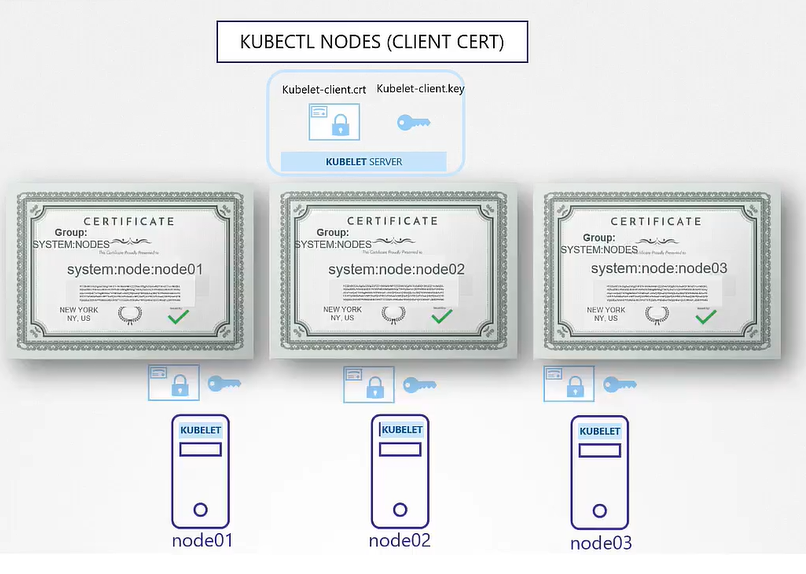
   
   
   
  
  

  

  


  
  
  
  
 
