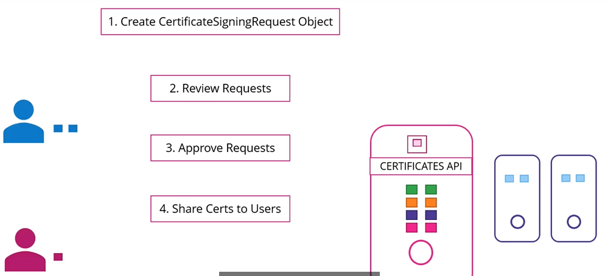
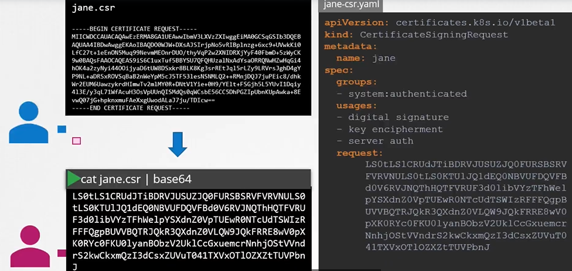
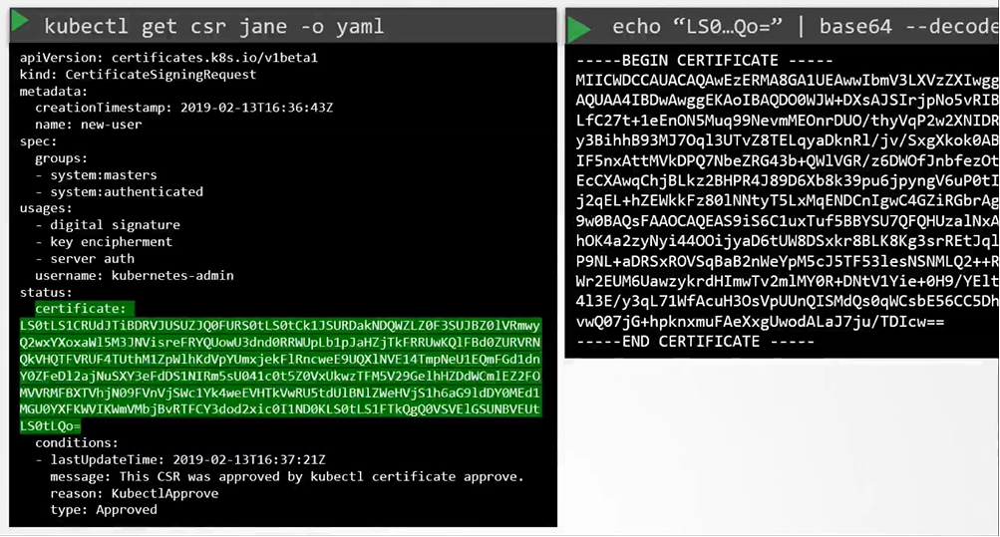
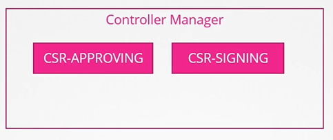
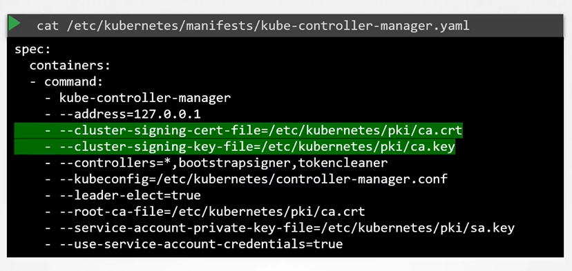

# Certificate API
  - Take me to [Video Tutorial](https://kodekloud.com/courses/539883/lectures/9808253)
  
In this section, we will take a look at how to manage certificates and certificate API's in kubernetes

## CA (Certificate Authority)
- The CA is really just the pair of key and certificate files that we have generated, whoever gains access to these pair of files can sign any certificate for the kubernetes environment.

#### Kubernetes has a built-in certificates API that can do this for you. 
- With the certificate API, we now send a certificate signing request (CSR) directly to kubernetes through an API call.
   
  
   
#### This certificate can then be extracted and shared with the user.
- A user first creates a key
  ```
  $ openssl genrsa -out jane.key 2048
  ```
- Generates a CSR
  ```
  $ openssl req -new -key jane.key -subj "/CN=jane" -out jane.csr 
  ```
- Sends the request to the administrator and the adminsitrator takes the key and creates a CSR object, with kind as "CertificateSigningRequest" and a encoded "jane.csr"
  ```
  apiVersion: certificates.k8s.io/v1beta1
  kind: CertificateSigningRequest
  metadata:
    name: jane
  spec:
    groups:
    - system:authenticated
    usages:
    - digital signature
    - key encipherment
    - server auth
    request:
      <certificate-goes-here>
  ```
  $ cat jane.csr |base64 
  $ kubectl create -f jane.yaml
  ```
 
  
- To list the csr's
  ```
  $ kubectl get csr
  ```
- Approve the request
  ```
  $ kubectl certificate approve jane
  ```
- To view the certificate
  ```
  $ kubectl get csr jane -o yaml
  ```
- To decode it
  ```
  $ echo "<certificate>" |base64 --decode
  ```
  
  
  
#### All the certificate releated operations are carried out by the controller manager. 
- If anyone has to sign the certificates they need the CA Servers, route certificate and private key. The controller manager configuration has two options where you can specify this.

  
  
  
  
  
#### K8s Reference Docs
- https://kubernetes.io/docs/reference/access-authn-authz/certificate-signing-requests/
- https://kubernetes.io/docs/tasks/tls/managing-tls-in-a-cluster/
 
  


