# KubeConfig 
  - Take me to [Video Tutorial](https://kodekloud.com/courses/539883/lectures/9808258)

In this section, we will take a look at kubeconfig in kubernetes


#### Client uses the certificate file and key to query the kubernetes Rest API for a list of pods using curl.
- You can specify the same using kubectl

  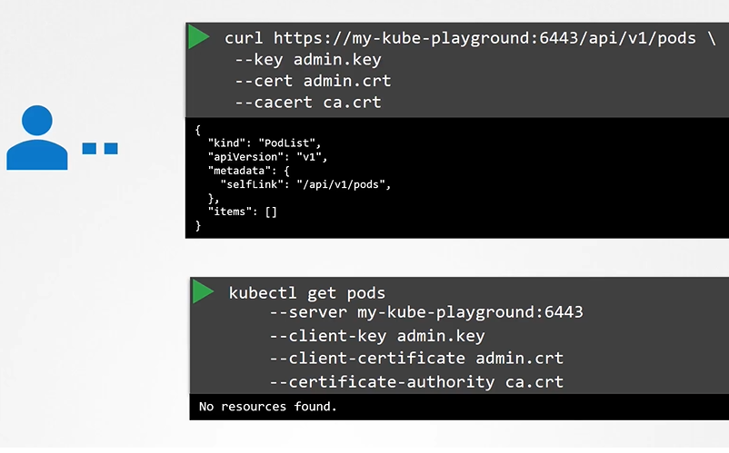
  
- We can move these information to a configuration file called kubeconfig. And the specify this file as the kubeconfig option in the command.
  ```
  $ kubectl get pods --kubeconfig config
  ```
- By default, the kubectl tool looks for a file named config under a directory **`.kube`** under the users home directory. So if you create the kubeconfig file there, you don't have to specify the path explicitly in the kubectl command.
  ```
  $ kubectl get pods
  ```
  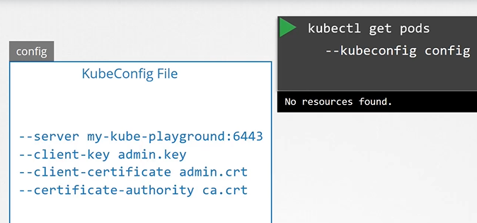
  
  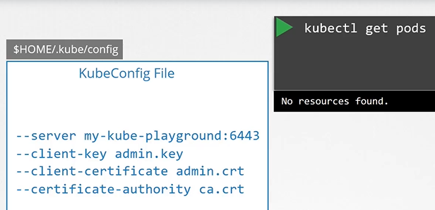
  
## Kubeconfig File
- The kubeconfig file has 3 sections
  - Clusters
  - Contexts
  - USers
  
  
  
  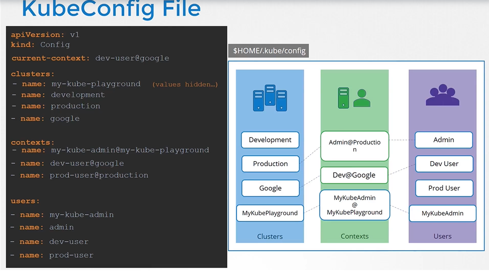
  
- To view the current file being used
  ```
  $ kubectl config view
  ```
- You can specify the kubeconfig file with kubectl config view with "--kubeconfig" flag
  ```
  $ kubectl config veiw --kubeconfig=my-custom-config
  ```
  
  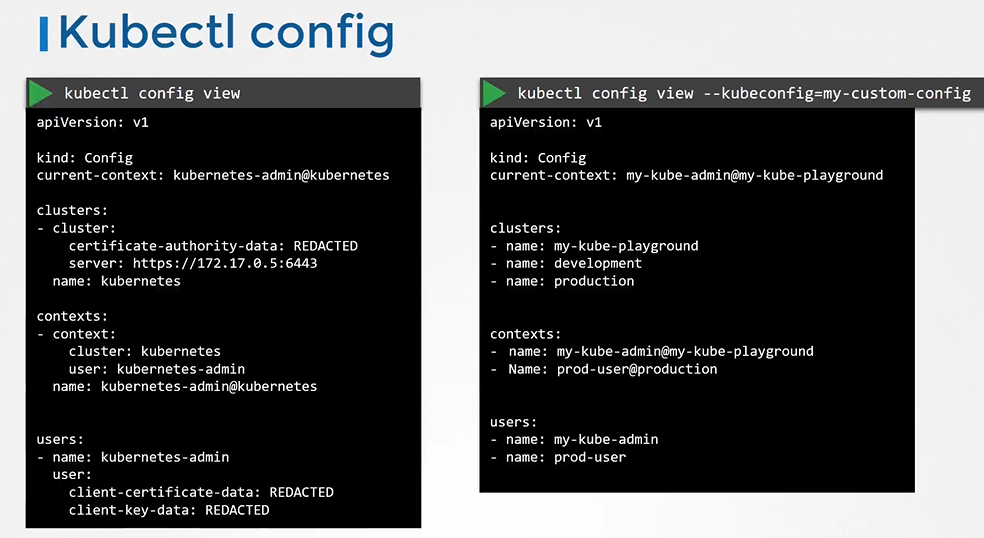
  
- How do you update your current context? Or change the current context
  ```
  $ kubectl config view --kubeconfig=my-custom-config
  ```
  
  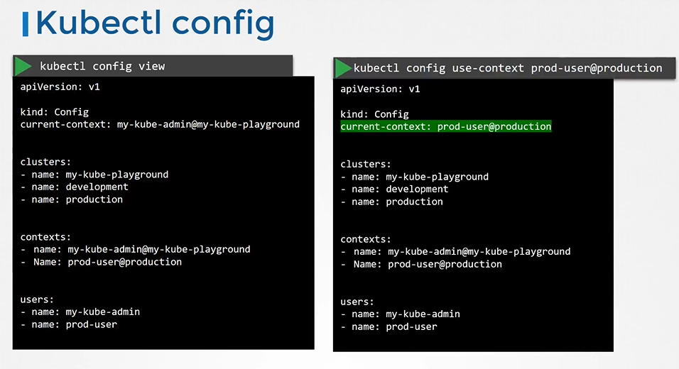
  
- kubectl config help
  ```
  $ kubeclt config -h
  ```
  
  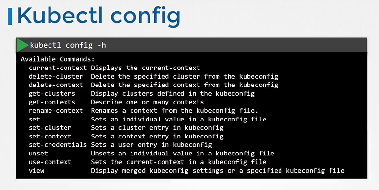
  
## What about namespaces?
- For example, each cluster may be configured with multiple namespaces within it.
- The context section in the kubeconfig file can take additional field called namespace. This way, when you switch to this context, you will automatically be in that namespace.

  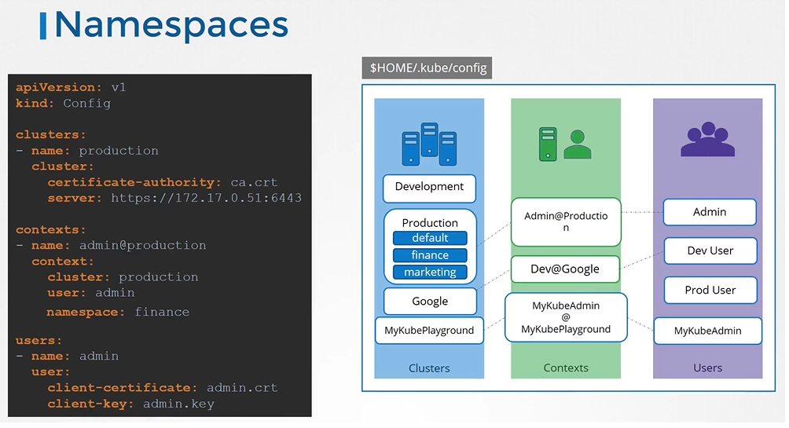
 
## Certificates in kubeconfig

  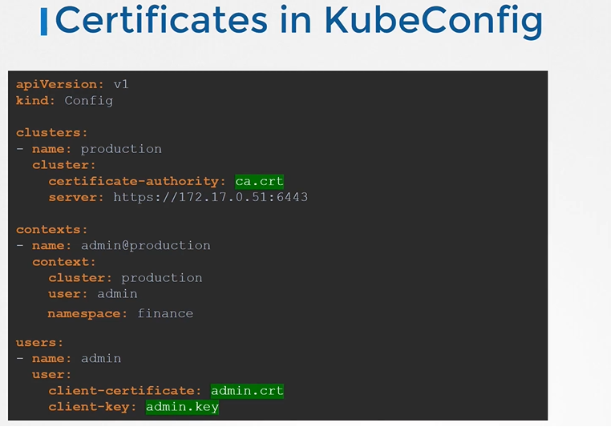
 
  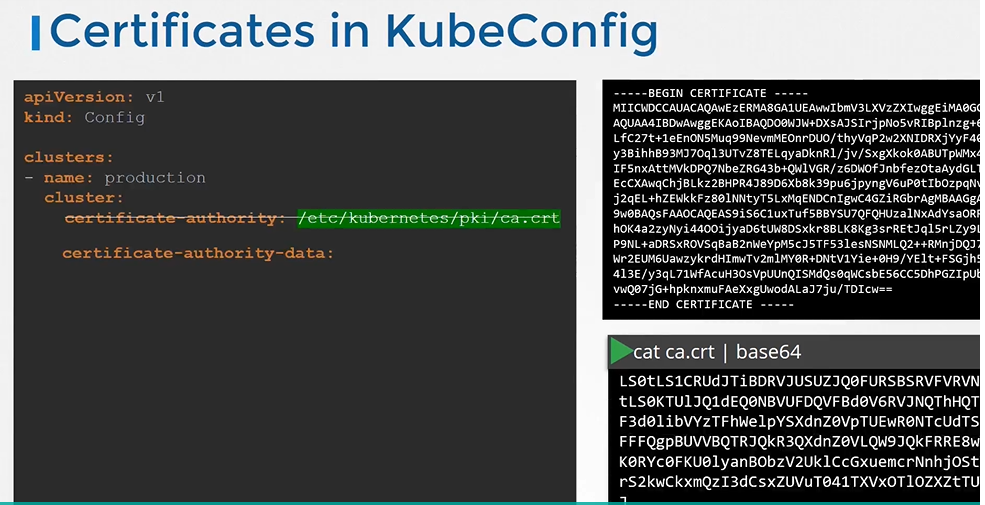
  
  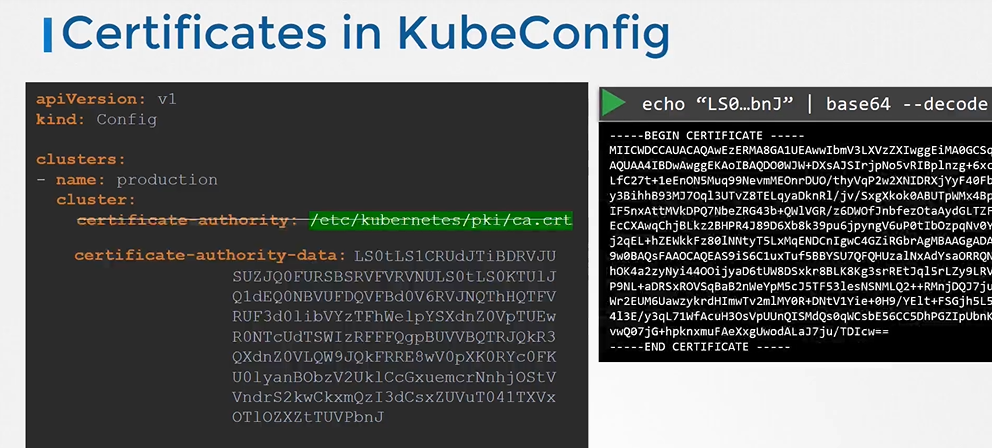
 
#### K8s Reference Docs
- https://kubernetes.io/docs/tasks/access-application-cluster/configure-access-multiple-clusters/
- https://kubernetes.io/docs/reference/generated/kubectl/kubectl-commands#config
