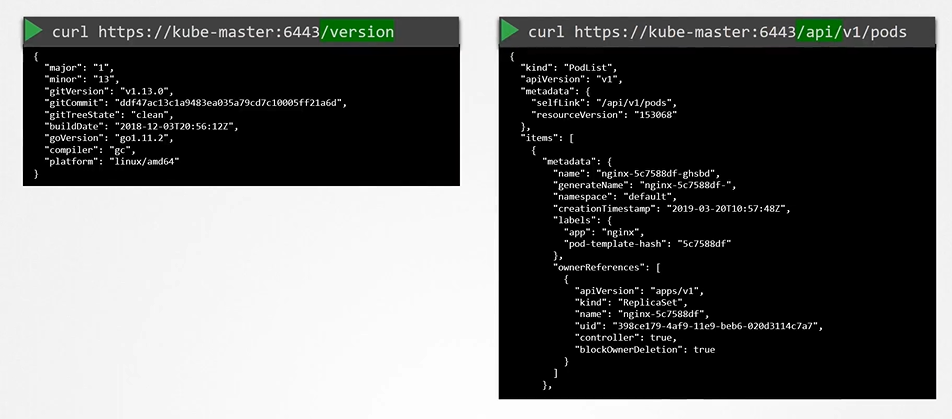
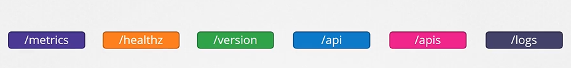
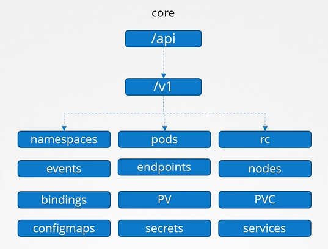
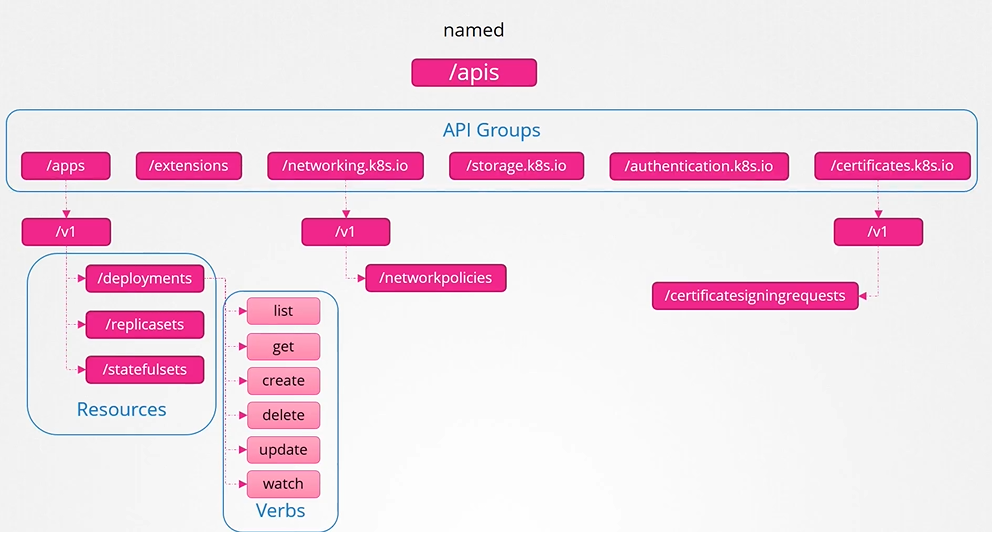
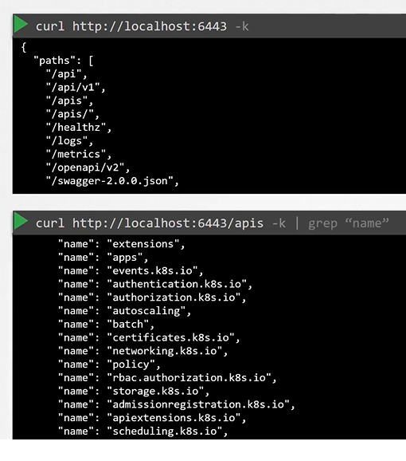
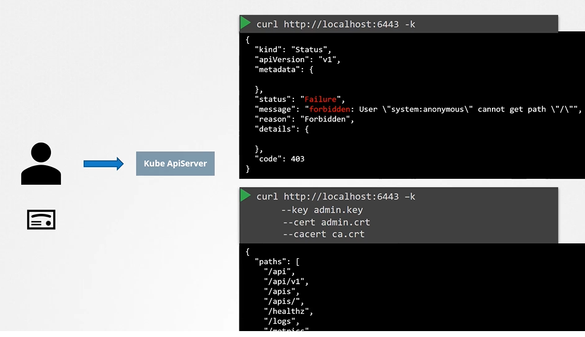
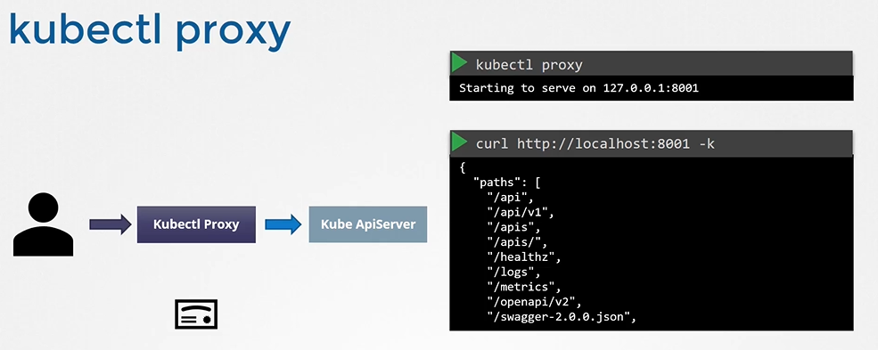
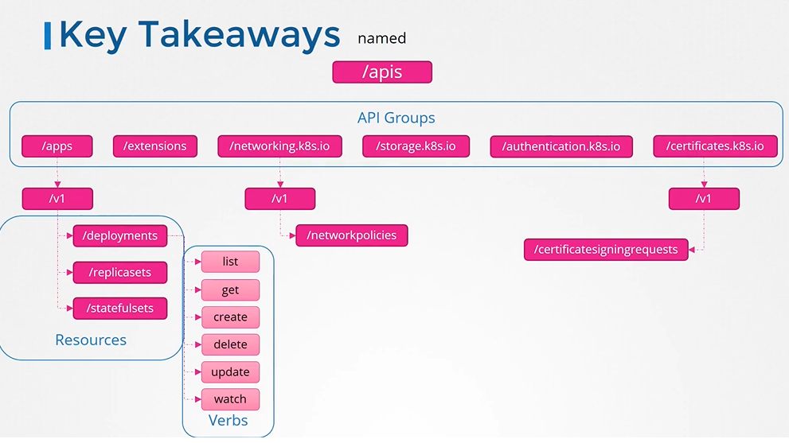

# API Groups
  - Take me to [Video Tutorial](https://kodekloud.com/courses/539883/lectures/9808255)
  
In this section, we will take a look at API Groups in kubernetes

## To return version and list pods via API's 

 
 
- The kubernetes API is grouped into multiple such groups based on thier purpose. Such as one for **`APIs`**, one for **`healthz`**, **`metrics`** and **`logs`** etc.

  
 
## API and APIs
- These APIs are catagorized into two.
  - The core group - Where all the functionality exists
    
    
 
  - The Named group - More organized and going forward all the newer features are going to be made available to these named groups.
  
    
    
- To list all the api groups

  
  
## Note on accessing the kube-apiserver
- You have to authenticate by passing the certificate files.

  
  
- An alternate is to start a **`kubeproxy`** client
  
  
  
## kube proxy vs kubectl proxy
 
  
  
## Key Takeaways

  

#### K8s Reference Docs
- https://kubernetes.io/docs/concepts/overview/kubernetes-api/
- https://kubernetes.io/docs/reference/using-api/api-concepts/
- https://kubernetes.io/docs/tasks/extend-kubernetes/http-proxy-access-api/
