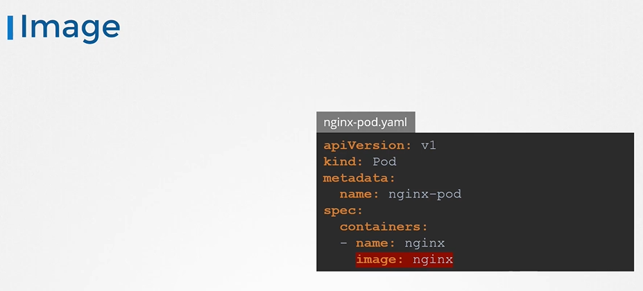
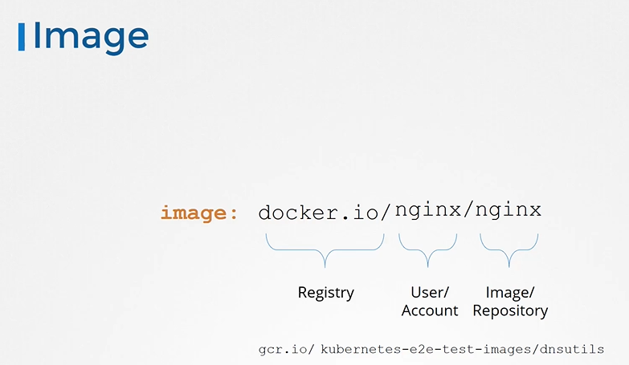
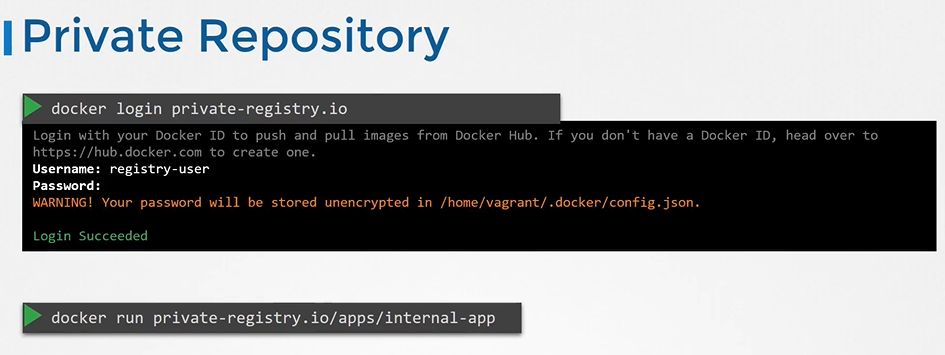
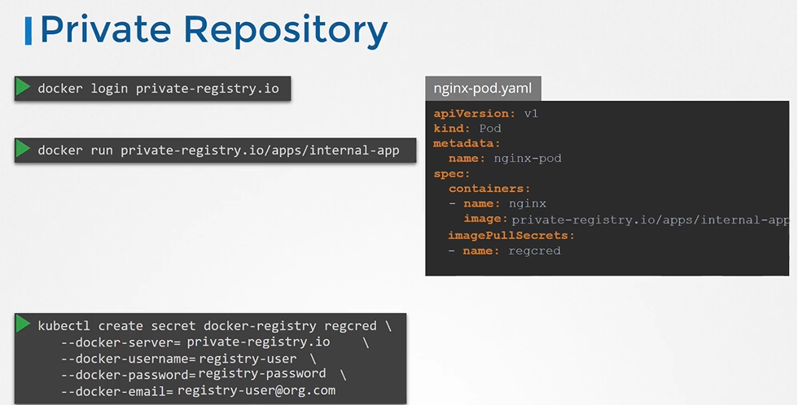

# Image Security
  - Take me to [Video Tutorial](https://kodekloud.com/topic/image-security/)

In this section we will take a look at image security

# Image
   
  ```
  apiVersion: v1
  kind: Pod
  metadata:
    name: nginx-pod
  spec:
    containers:
    - name: nginx
      image: nginx
  ```
  
  
  
  
  
# Private Registry
- To login to the registry
  ```
  $ docker login private-registry.io
  ```
- Run the application using the image available at the private registry
  ```
  $ docker run private-registry.io/apps/internal-app
  ```
  
  
  
- To pass the credentials to the docker untaged on the worker node for that we first create a secret object with credentials in it.
  ```
  $ kubectl create secret docker-registry regcred \
    --docker-server=private-registry.io \ 
    --docker-username=registry-user \
    --docker-password=registry-password \
    --docker-email=registry-user@org.com
  ```
- We then specify the secret inside our pod definition file under the imagePullSecret section 
  ```
  apiVersion: v1
  kind: Pod
  metadata:
    name: nginx-pod
  spec:
    containers:
    - name: nginx
      image: private-registry.io/apps/internal-app
    imagePullSecrets:
    - name: regcred
  ```
  
  
  #### K8s Reference Docs
  - https://kubernetes.io/docs/concepts/containers/images/
