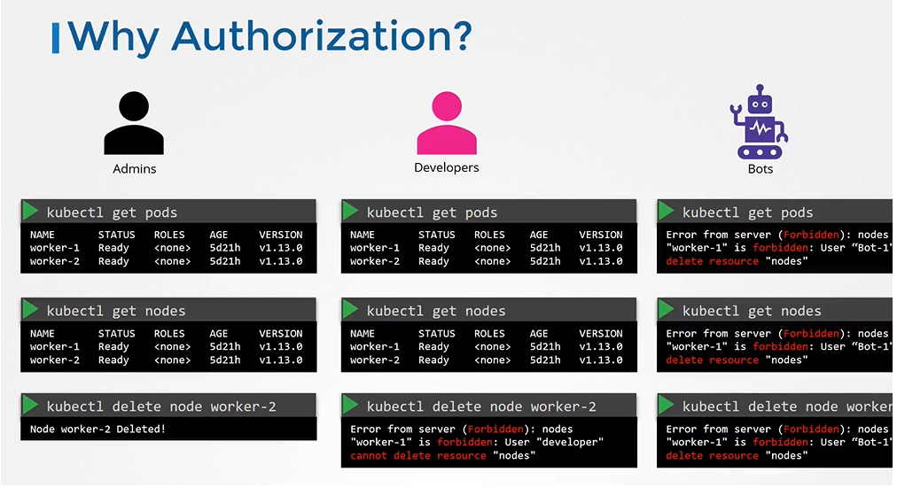
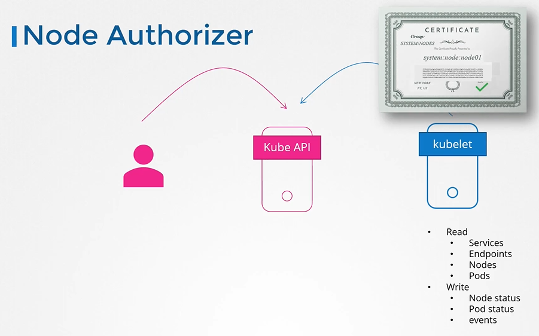
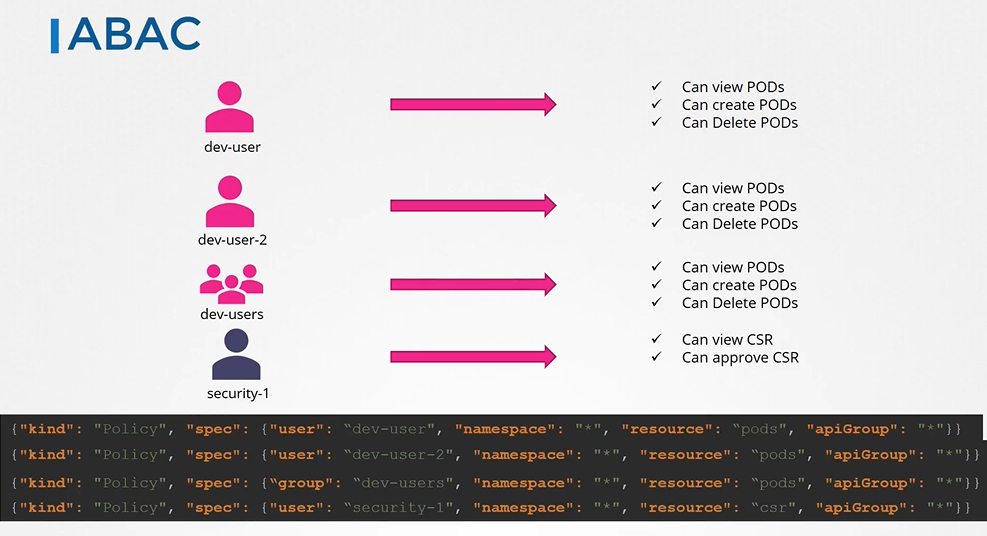
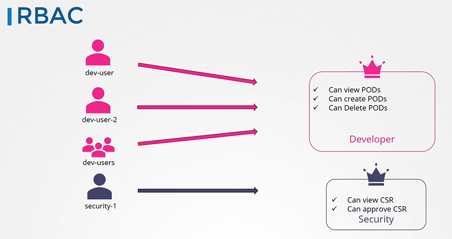
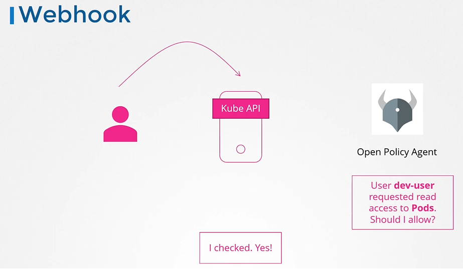
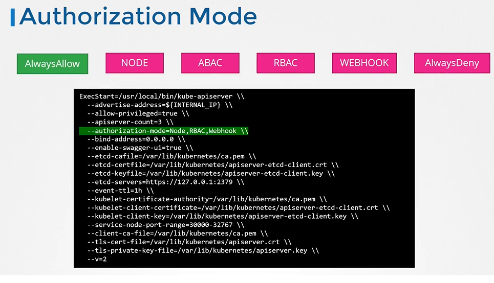
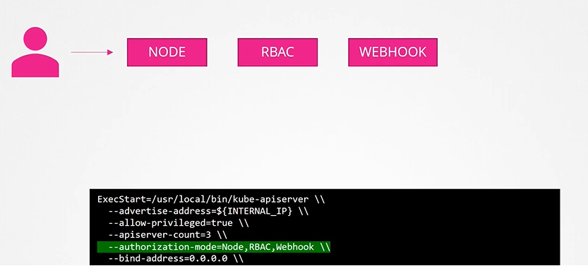

# Authorization
  - Take me to [Video Tutorial](https://kodekloud.com/courses/539883/lectures/9808261)
  
In this section, we will take a look at authorization in kubernetes

## Why do you need Authorization in your cluster?
- As an admin, you can do all operations
  ```
  $ kubectl get nodes
  $ kubectl get pods
  $ kubectl delete node worker-2
  ```
- We will be creating access for other admins, developers, testers etc.
  - For Developers, we can allow them to view, deploy application 
  - Same goes with service accounts, we only want to provide the external application the minimum level of access to perform its required operations.
  
  
  
## Authorization Mechanisms
- There are different authorization mechanisms supported by kubernetes
  - Node Authorization
  - Attribute-based Authorization (ABAC)
  - Role-Based Authorization (RBAC)
  - Webhook
  
## Node Authorization
- The kubelet accesses the API server to read information about services and endpoints, nodes and pods.
- The kubelet also reports to the kube-apiserver with information about the node such as its status.
- These requests are handled by a special authorizer known as **`Node Authorizer`**

  
  
## ABAC
- ABAC is where you associate a user or group of users with a set of permissions (eg. dev-user can view, create and delete pods).
- Everytime you need to add or make a change in the security, you must edit this policy file manually and restart the kube-apiserver.

  
  
## RBAC
- With RBAC, instead of directly associating, a user or a group with a set of permissions, we define a role.
- RBAC provide a more standard approach to managing access within the kubernetes cluster

  

## Webhook
- Now, what if you want to outsource all the authorization mechanisms. Say you want to manage authorization externally and not through the built-in mechanisms.
- For instance, open policy agent is a third-party tool that helps with admission control and authorization.
- You can have kubernetes make an API call to open policy agent with the information about the user and his access requirements.
  
  
  
## Authorization Modes
- The mode options can be defined on the kube-apiserver

  
  
- When you specify multiple modes, it will authorize in the order in which it is specified

  
  
  
  #### K8s Reference Docs
  - https://kubernetes.io/docs/reference/access-authn-authz/authorization/
  
