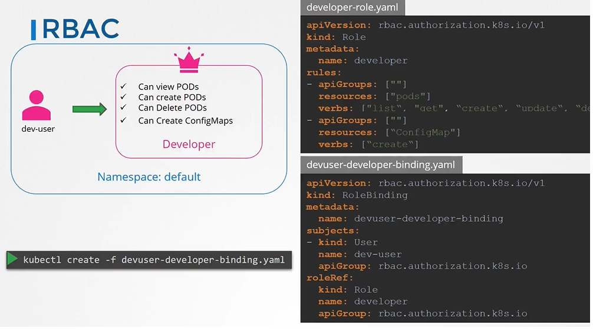
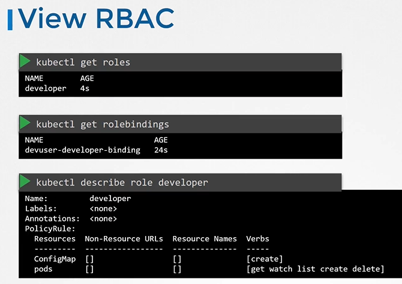
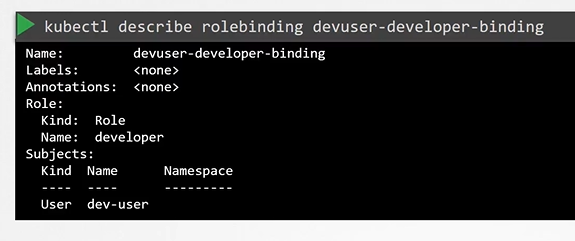
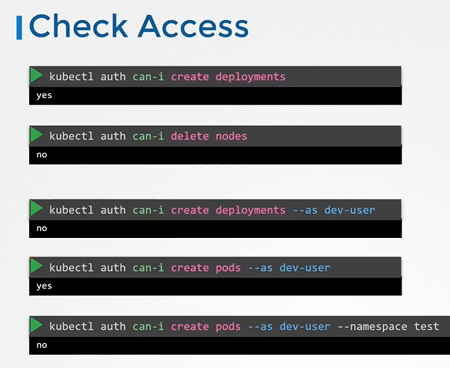
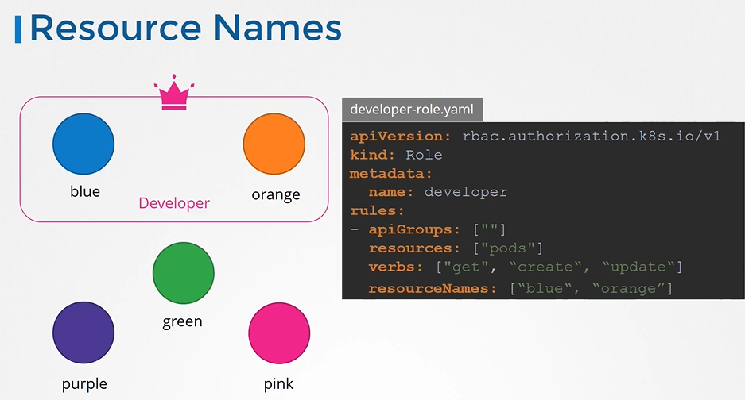

# RBAC
  - Take me to [Video Tutorial](https://kodekloud.com/topic/role-based-access-controls/)

In this section, we will take a look at RBAC

## How do we create a role?
- Each role has 3 sections
  - apiGroups
  - resources
  - verbs
- create the role with kubectl command
  ```
  $ kubectl create -f developer-role.yaml
  ```

## The next step is to link the user to that role.
- For this we create another object called **`RoleBinding`**. This role binding object links a user object to a role.
- create the role binding using kubectl command
  ```
  $ kubectl create -f devuser-developer-binding.yaml
  ```
- Also note that the roles and role bindings fall under the scope of namespace.
  ```
  apiVersion: rbac.authorization.k8s.io/v1
  kind: Role
  metadata:
    name: developer
  rules:
  - apiGroups: [""] # "" indicates the core API group
    resources: ["pods"]
    verbs: ["get", "list", "update", "delete", "create"]
  - apiGroups: [""]
    resources: ["ConfigMap"]
    verbs: ["create"]
  ```
  ```
  apiVersion: rbac.authorization.k8s.io/v1
  kind: RoleBinding
  metadata:
    name: devuser-developer-binding
  subjects:
  - kind: User
    name: dev-user # "name" is case sensitive
    apiGroup: rbac.authorization.k8s.io
  roleRef:
    kind: Role
    name: developer
    apiGroup: rbac.authorization.k8s.io
  ```
  
  

## View RBAC
  
- To list roles
  ```
  $ kubectl get roles
  ```
- To list rolebindings
  ```
  $ kubectl get rolebindings
  ```
- To describe role 
  ```
  $ kubectl describe role developer
  ```
  
  
    
- To describe rolebinding
  ```
  $ kubectl describe rolebinding devuser-developer-binding
  ```
  
  
  
#### What if you being a user would like to see if you have access to a particular resource in the cluster.
## Check Access

- You can use the kubectl auth command
  ```
  $ kubectl auth can-i create deployments
  $ kubectl auth can-i delete nodes
  ```
  ```
  $ kubectl auth can-i create deployments --as dev-user
  $ kubectl auth can-i create pods --as dev-user
  ```
  ```
  $ kubectl auth can-i create pods --as dev-user --namespace test
  ```
  
  
  
## Resource Names
- Note on resource names we just saw how you can provide access to users for resources like pods within the namespace.
  ```
  apiVersion: rbac.authorization.k8s.io/v1
  kind: Role
  metadata:
    name: developer
  rules:
  - apiGroups: [""] # "" indicates the core API group
    resources: ["pods"]
    verbs: ["get", "update", "create"]
    resourceNames: ["blue", "orange"]
  ```  
  
  
#### K8s Reference Docs
- https://kubernetes.io/docs/reference/access-authn-authz/rbac/
- https://kubernetes.io/docs/reference/access-authn-authz/rbac/#command-line-utilities
