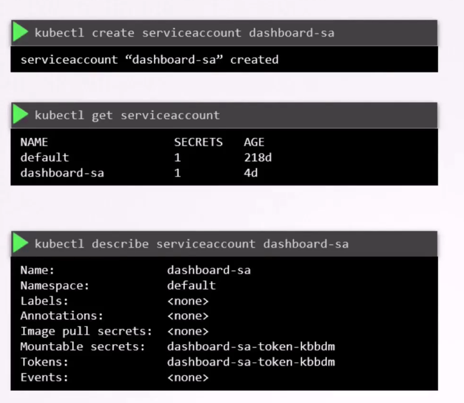
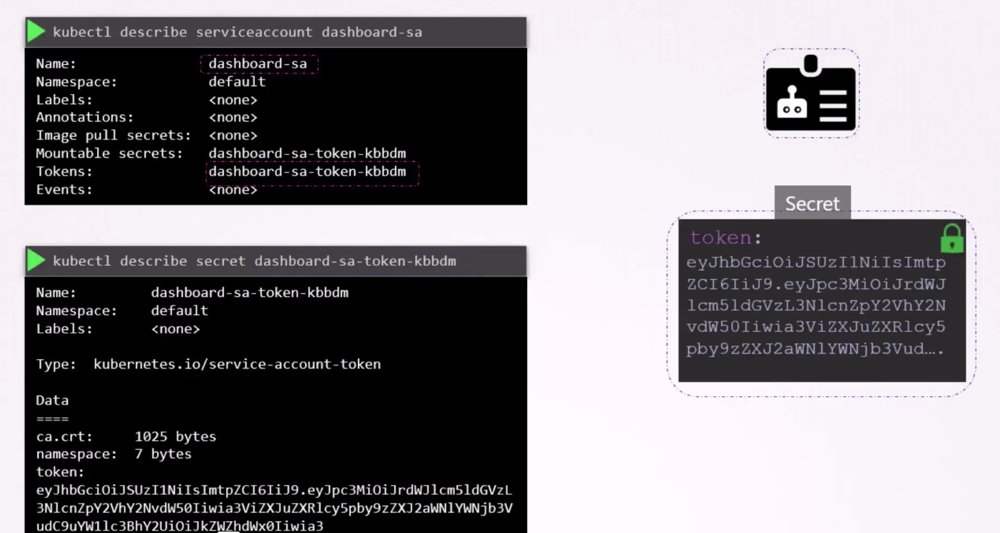
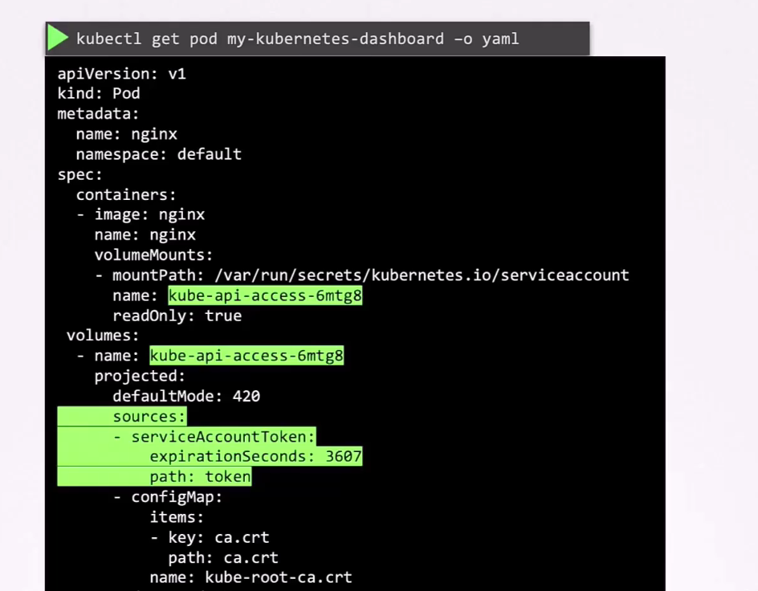
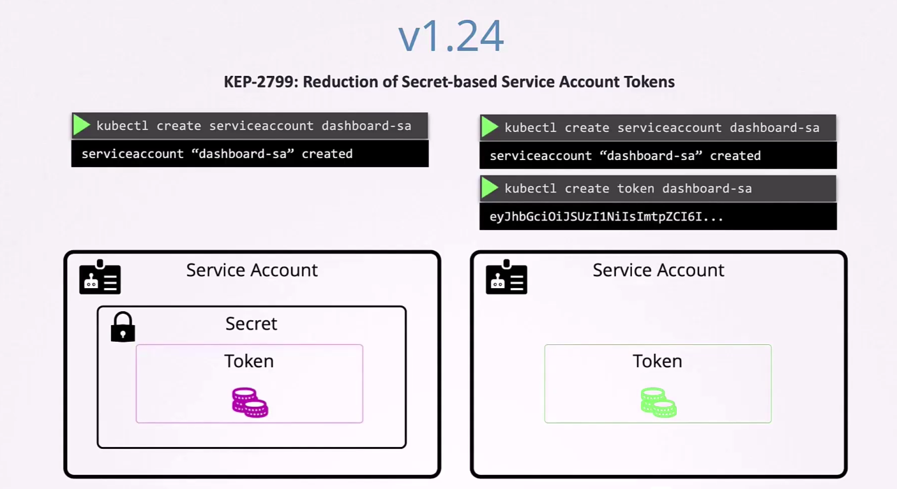
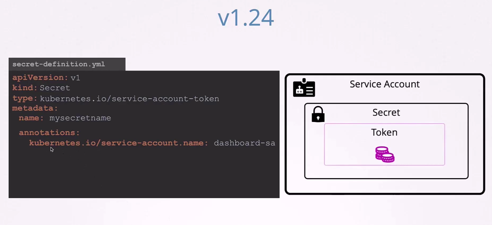

# Service Account
  - Take me to [Video Tutorial](https://kodekloud.com/topic/service-account/)
  
In this section, we will explore **Service Accounts** in Kubernetes and understand their significance and usage.

### Why Do You Need a Service Account in Your Cluster?

Kubernetes operates with two main types of users:

1. **Human Users**: These are users who interact with the Kubernetes cluster through tools like `kubectl`.
2. **Bots/Applications**: These include services like Prometheus, Jenkins, and other system applications.


Service accounts are primarily used to authenticate these bots or applications to the Kubernetes API server.

### Service Account Creation




### Service Accounts and Authentication


When you want to access the Kubernetes API from within a pod, you need to authenticate the pod with the API server. **Service accounts** are used for this authentication process.

When a service account is created in Kubernetes, a secret token is also created. This token can be used as a bearer token that can be used to authenticate   to the API server. By default, this token is mounted as a volume in the pod and is accessible at the following path within the pod: `/var/run/secrets/kubernetes.io/serviceaccount/token`.
 




By default, every Kubernetes namespace has a `default` service account. Every pod in that namespace is automatically assigned this `default` service account unless otherwise specified. If you want to use a different service account for a specific pod, you can specify it in the pod specification.

here’s an example of how you can specify a service account for a pod in the pod specification:

```yaml
apiVersion: v1
kind: Pod
metadata:
  name: myapp-pod
spec:
  serviceAccountName: myapp-service-account
  
```

to opt out of  serviceaccount automounting

```yaml
spec:
  automountServiceAccountToken: false
```
 


### Enhanced Security Features (Kubernetes v1.22+)

These service account tokens do not have expiration or audience restrictions by default. However, Kubernetes v1.22 and later introduced improvements to enhance token security.

- Audience Bound: The token is restricted to a specific audience (e.g., the Kubernetes API server).
- Time Bound: The token has an expiration time (default of 1 hour).
- Object Bound: The token is bound to specific objects, such as a pod or service account.

thereby enhanced security by limiting the scope of the token's validity and lifecycle.

so in v1.22, the TokenRequest API was introduced to request a token with a specific audience and expiration time. This API is used for obtaining tokens instead of using service account token Secret objects. Tokens obtained from the TokenRequest API are more secure than those stored in Secret objects because they have a bounded lifetime and are not readable by other API clients.

also in this version  the service account injected as projected volume as shown below

 



 

In kubernetes. io/service-account-token type of Secret is used to store a tokencredential that identifies a service account.
Since v1.22, this type of Secret is no longer used to mount credentials into Pods, and obtaining tokens via the TokenRequest API is recommended instead of using service account token Secret objects. Tokens obtained from the TokenRequest API are more secure than ones stored in Secret objects, because they have a bounded lifetime and are not readable by other API clients. You can use the kubectl create token command to obtain a token from the TokenRequest API. 

### Creating Service Account Tokens
In Kubernetes v1.24, KEP-2799 introduced the reduction of automatically created token secrets for service accounts. You must now manually create service account token secrets using the kubectl create token command.

```bash
 kubectl create token <serviceaccount>
```




You should only create a service account token Secret object if you can't use the TokenRequest API to obtain a token, and the security exposure of persisting a non-expiring token credential in a readable API object is
acceptable to you. for that 

- Create a service account.
- Create a secret for the service account.
- In secret add an annotation `kubernetes.io/service-account.name: <serviceaccountname>` .

 



 
#### K8s Reference Docs
- https://kubernetes.io/docs/tasks/configure-pod-container/configure-service-account/
 
  
  