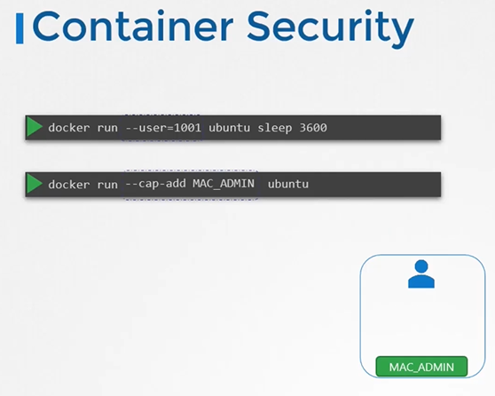
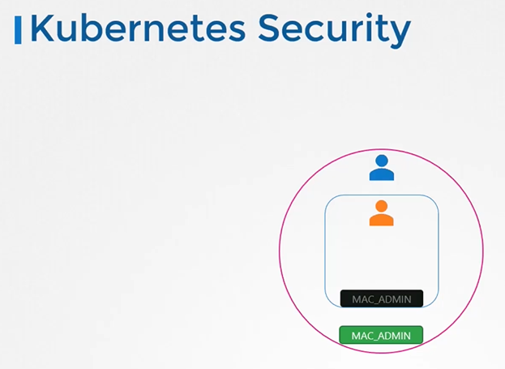
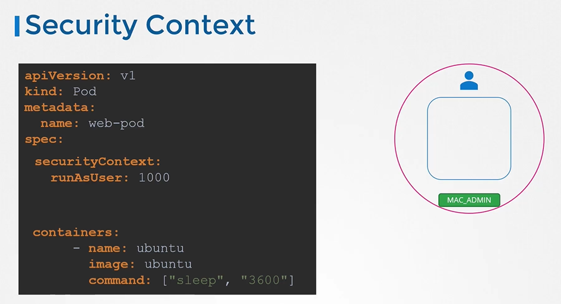
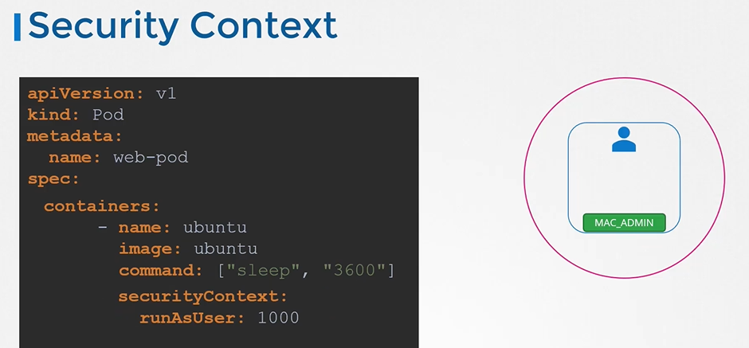
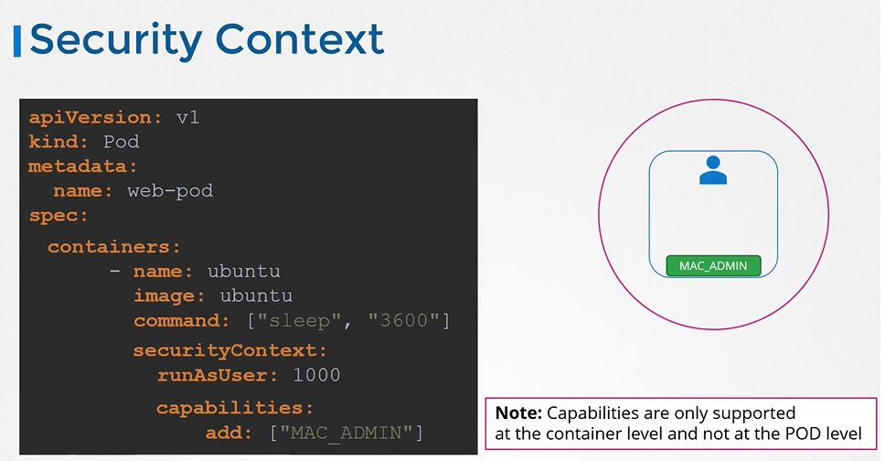

# Security Context
  - Take me to [Video Tutorial]()
  
In this section, we will take a look at security context

## Container Security
 ```
 $ docker run --user=1001 ubuntu sleep 3600
 $ docker run -cap-add MAC_ADMIN ubuntu
 ```
 
 
 
## Kubernetes Security
- You may choose to configure the security settings at a container level or at a pod level.

 

## Security Context
- To add security context on the container and a field called **`securityContext`** under the spec section.
  ```
  apiVersion: v1
  kind: Pod
  metadata:
    name: web-pod
  spec:
    securityContext:
      runAsUser: 1000
    containers:
    - name: ubuntu
      image: ubuntu
      command: ["sleep", "3600"]
  ```
  
  
- To set the same context at the container level, then move the whole section under container section.
  
  ```
  apiVersion: v1
  kind: Pod
  metadata:
    name: web-pod
  spec:
    containers:
    - name: ubuntu
      image: ubuntu
      command: ["sleep", "3600"]
      securityContext:
        runAsUser: 1000
  ```
  
  
- To add capabilities use the **`capabilities`** option
  ```
  apiVersion: v1
  kind: Pod
  metadata:
    name: web-pod
  spec:
    containers:
    - name: ubuntu
      image: ubuntu
      command: ["sleep", "3600"]
      securityContext:
        runAsUser: 1000
        capabilities: 
          add: ["MAC_ADMIN"]
  ```
  
  
  
### K8s Reference Docs
- https://kubernetes.io/docs/tasks/configure-pod-container/security-context/
