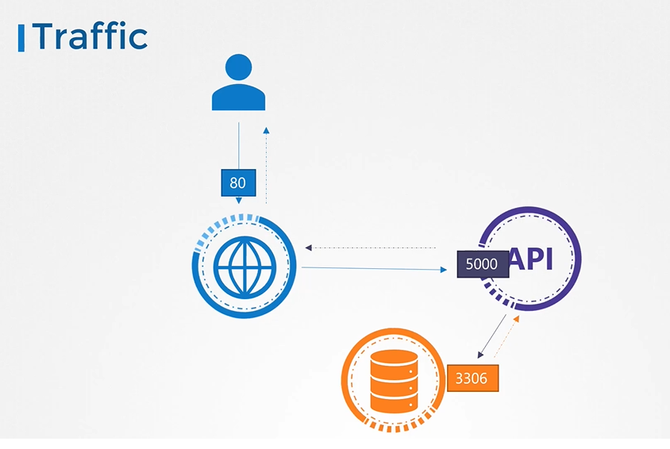
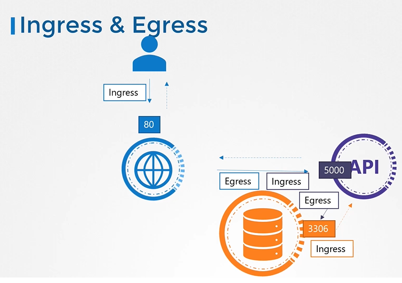
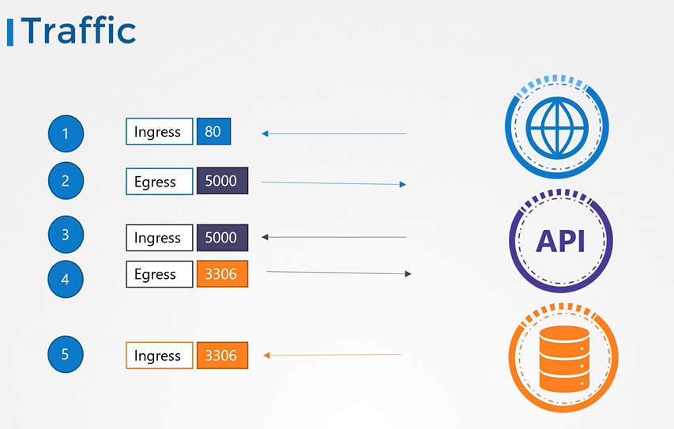
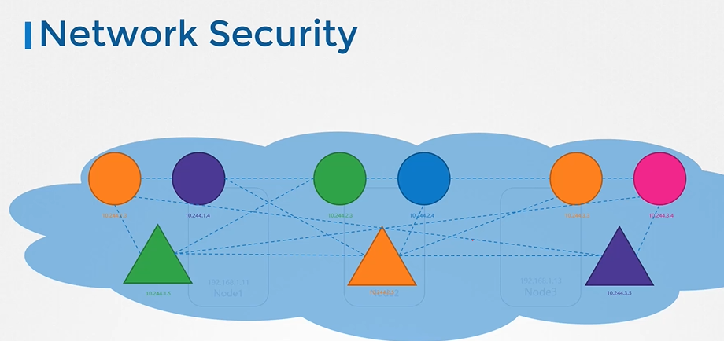
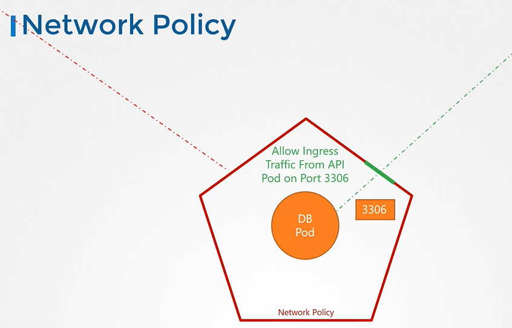
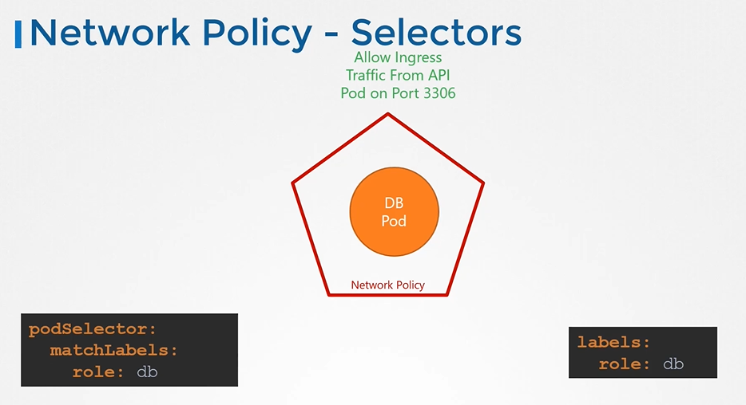
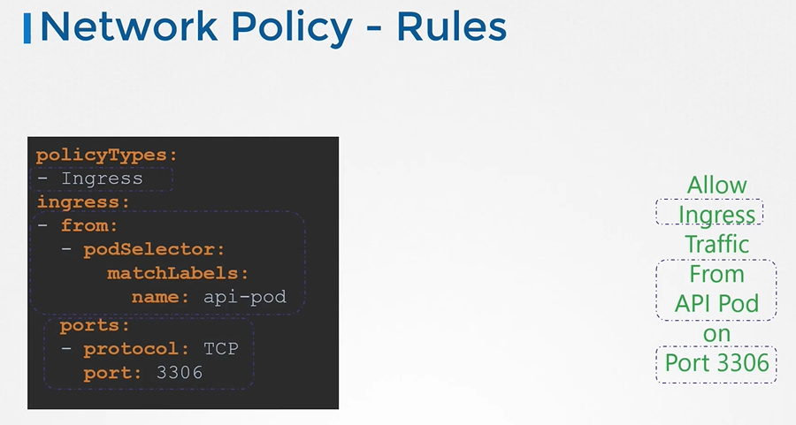
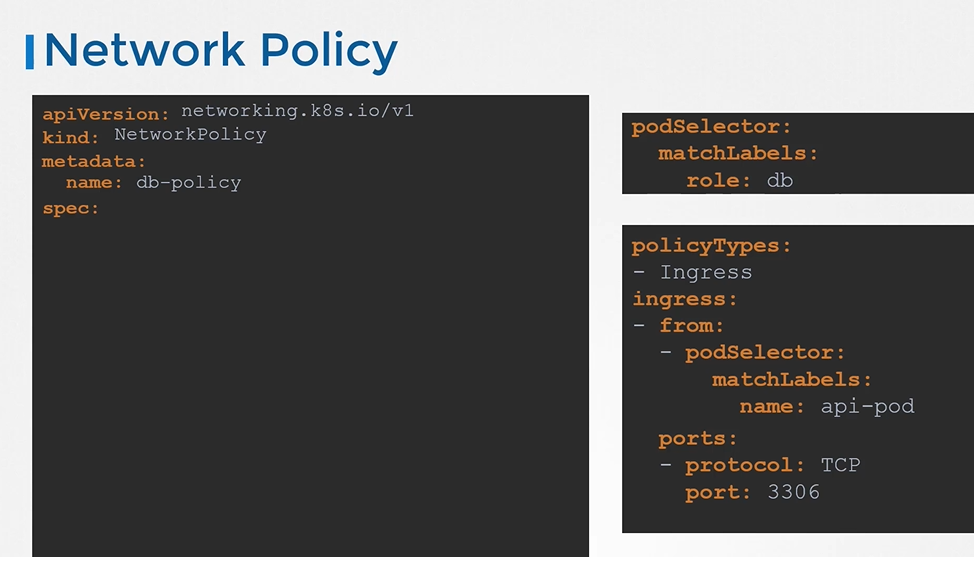
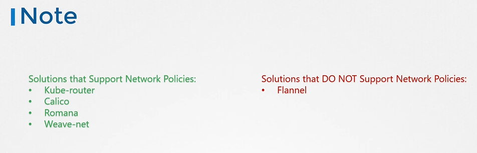

# Network Policies
  - Take me to [Video Tutorials](https://kodekloud.com/topic/network-policies-3/)
  
#### Trafic flowing through a webserver serving frontend to users an app server serving backend API and a database server

  
  
- There are two types of traffic
  - Ingress
  - Egress
  
   
  
   
  
## Network Security

  
  
## Network Policy

  
  
  
  
## Network Policy Selectors
  
  
  
## Network Policy Rules

  
  
## Create network policy
 
- To create a network policy
  ```
  apiVersion: networking.k8s.io/v1
  kind: NetworkPolicy
  metadata:
   name: db-policy
  spec:
    podSelector:
      matchLabels:
        role: db
    policyTypes:
    - Ingress
    ingress:
    - from:
      - podSelector:
          matchLabels:
            role: api-pod
      ports:
      - protocol: TCP
        port: 3306
  ```
  $ kubectl create -f policy-definition.yaml
  ```
  
 
 
 
  
## Note
 
 
 
#### Additional lecture on [Developing Networking Policies](https://kodekloud.com/topic/developing-network-policies/)

#### K8s Reference Docs
- https://kubernetes.io/docs/concepts/services-networking/network-policies/
- https://kubernetes.io/docs/tasks/administer-cluster/declare-network-policy/
 
  
  
  
  
