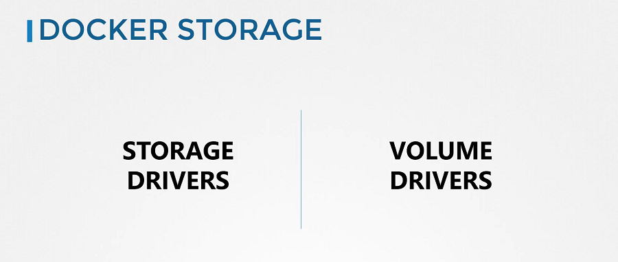

# Introduction to Docker Storage

  - Take me to [Lectures](https://kodekloud.com/courses/certified-kubernetes-administrator-with-practice-tests/lectures/13350395)
  
In this section, we will take a look at **Docker storage**.

- To understand storage in the container orchestration tools like **Kubernetes**, It is important to first understand how storage works with containers. Understanding how storage works with **Docker** first and getting all the basics right will later make it so much easier to understand how it works in **Kubernetes**.

- If you are new to **Docker** then you can learn some basics of docker from the course [Docker for the absolute beginner course](https://kodekloud.com/p/docker-for-the-absolute-beginner-hands-on), that is free. 

## Docker Storage

- There are two concepts comes into the docker, Storage drivers and Volume drivers plugins. 

#### We will first discuss about Storage drivers.

#### Docker Reference Docs

- https://docs.docker.com/storage/storagedriver/
- https://docs.docker.com/storage/volumes/