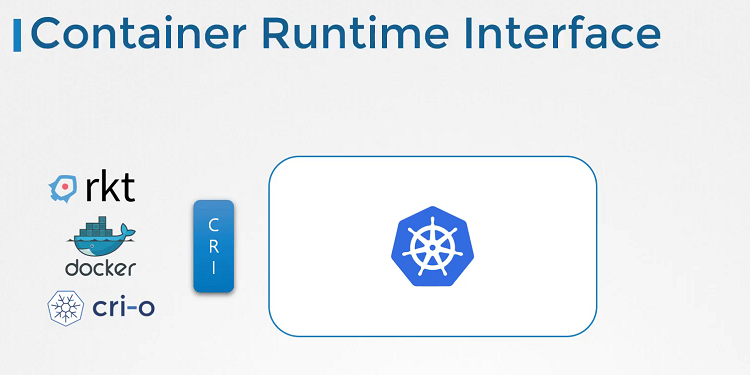
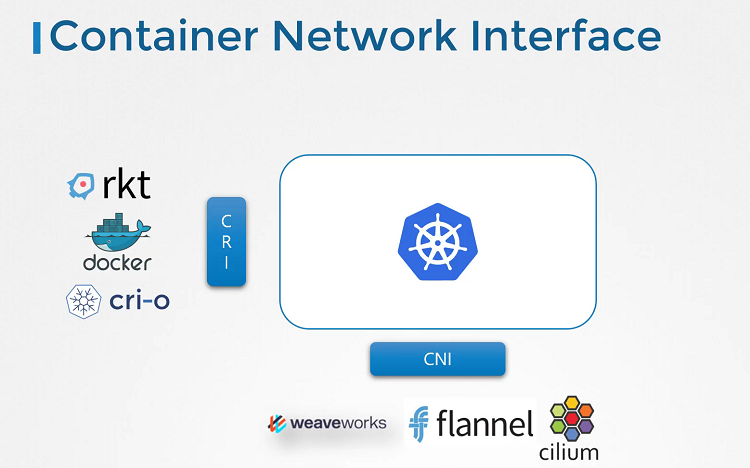

# Container Storage Interface

  - Take me to [Lecture](https://kodekloud.com/topic/container-storage-interface/)

In this section, we will take a look at **Container Storage Interface**

## Container Runtime Interface

- Kubernetes used Docker alone as the container runtime engine, and all the code to work with Docker was embedded within the Kubernetes source code. Other container runtimes, such as rkt and CRI-O.
- The Container Runtime Interface is a standard that defines how an orchestration solution like Kubernetes would communicate with container runtimes like Docker. If any new container runtime interace is developed, they can simply follow the CRI standards.

## Container Networking Interface

- To support different networking solutions, the container networking interface was introduced. Any new networking vendors could simply develop their plugin based on the CNI standards and make their solution work with Kubernetes.

## Container Storage Interface

- The container storage interface was developed to support multiple storage solutions. With CSI, you can now write your own drivers for your own storage to work with Kubernetes. Portworx, Amazon EBS, Azure Disk, GlusterFS etc.
- CSI is not a Kubernetes specific standard. It is meant to be a universal standard and if implemented, allows any container orchestration tool to work with any storage vendor with a supported plugin. Kubernetes, Cloud Foundry and Mesos are onboard with CSI.
- It defines a set of RPCs or remote procedure calls that will be called by the container orchestrator. These must be implemented by the storage drivers.

#### Container Storage Interface 

- https://github.com/container-storage-interface/spec
- https://kubernetes-csi.github.io/docs/
- http://mesos.apache.org/documentation/latest/csi/
- https://www.nomadproject.io/docs/internals/plugins/csi#volume-lifecycle
