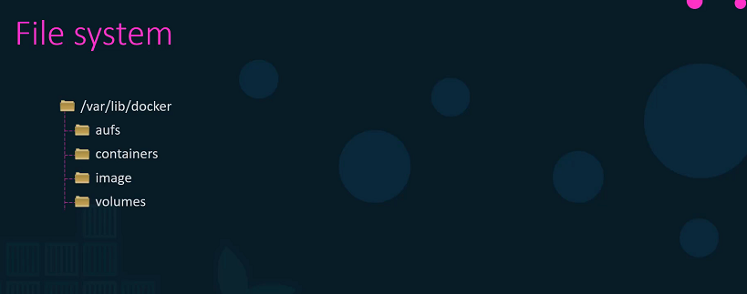
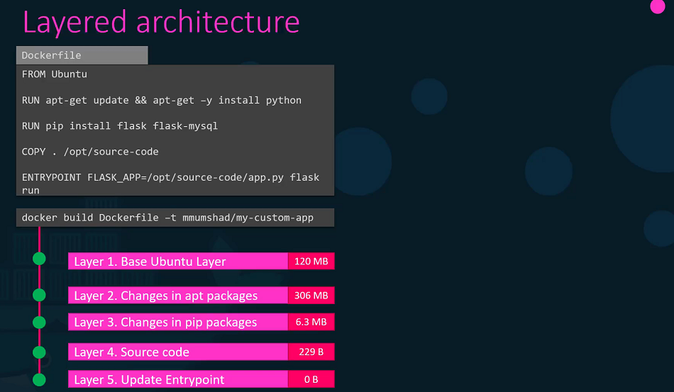
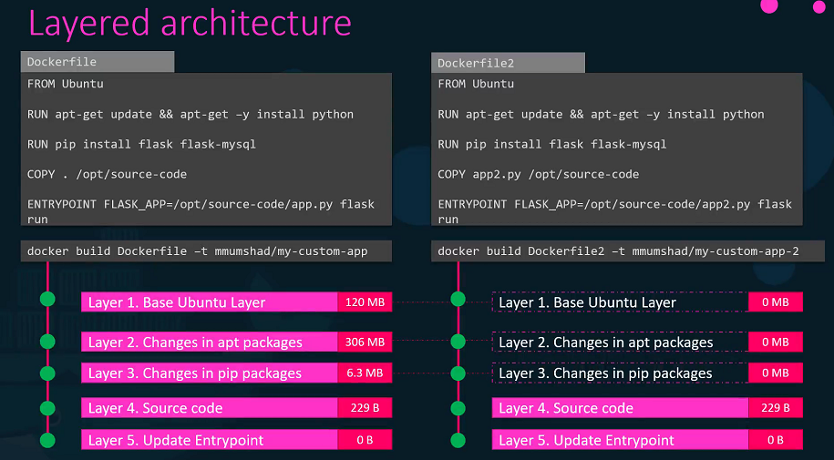
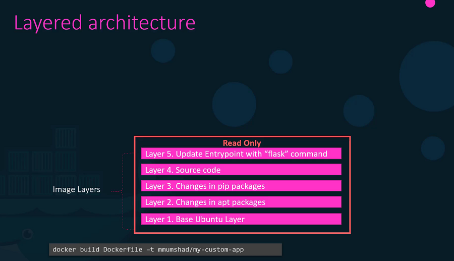
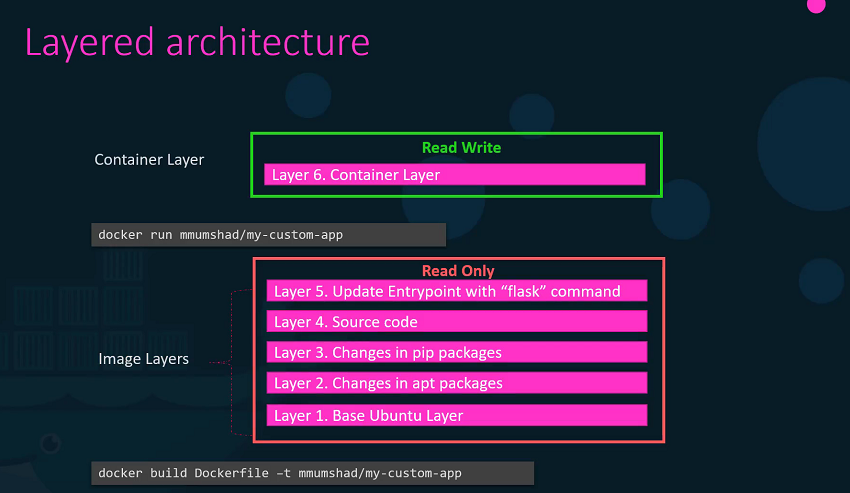
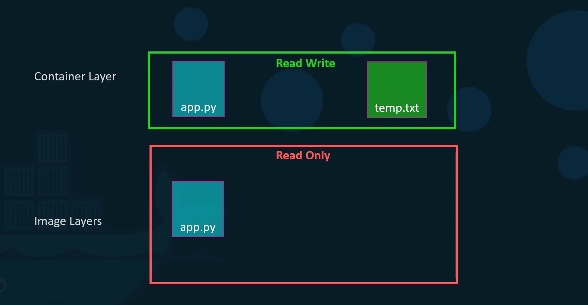

# Storage in Docker

  - Take me to [Lecture](https://kodekloud.com/topic/storage-in-docker-2/)

In this section, we will take a look at docker **Storage driver and Filesystem**.

  - We are going to see where and how Docker stores data and how it manages filesystem of the containers.

## Filesystem

- Let's see how Docker stores data on the local file system. At the first time, When you install Docker on a system, it creates this directory structures at /var/lib/docker.

  ```
  $ cd /var/lib/docker/

  ```



- You have multiple directories under it called aufs, containers, image, volumes etc.
- This is where Docker stores all its data by default.
- All files related to containers are stored under the containers directory and the files related to images are stored under the image directory. Any volumes created by the Docker containers are created under the volumes directory.
- For now, let's just understand where Docker stores its files of an image and a container and in what format.
- To understand that we need to understand Dockers layered architecture.

## Layered Architecture

- When docker builds images, it builds these in a layered architecture. Each line of instruction in the Docker file creates a new layer in the Docker image with just the changes from the previous layer.
- As you can see in the image, layer-1 is the Ubuntu base layer, layer-2 install the packages, layer-3 install the python packages, layer-4 update the source code, layer-5 updates the entry point of the image. Since each layer only stores the changes from the previous layer. It is reflected in the size as well.



- For better understanding the advantages of this layered architecture, Let's take a different Dockerfile, this is very similiar to our first application. only source code and entry point is differnet to create this application. 
- When image builds, docker is not going to build first three layers instead of it reuses the same three layers it built for the first application from the cache. Only creates the last two layers with the new sources and the new entry point. 
- This way, Docker builds images faster and efficiently saves disk spaces. This is also applicable, if you were to update your application code. Docker simply reuses all the previous layers from the cache and quickly rebuild the application image by updating the latest source code. 



- Let's rearrange the layers bottom up so we can understand it better. All of these layers are created when we run the Docker build command to form the final Docker image. Once the build is complete, you cannot modify the contents of these layers and so they are read-only and you can only modify them by initiating a new build.



- When you run a container based off of this image, using the **Docker run** command Docker creates a container based off of these layers and creates a new writeable layer on top of the image layer. The writeable layer is used to store data created by the container such as log files written by the applications, any temporary files generated by the container. 



- When the container is destroyed, this layer and all of the changes stored in it are also destroyed. Remember that the same image layer is shared by all containers created using this image.
- If I will create a new file called temp.txt in the newly created container, which is read and write. 
- The files in the image layer are read-only meaning you cannot edit anything in those layers.




- Let's take an example of our application code. Since we bake our code into the image, the code is part of the image and as such, its read-only. After running a container, what if I wish to modify the source code.
- Yes, I can still modify this file, but before I saved the modified file, Docker automatically creates a copy of the file in the read-write layer and I will then be modifying a different version of the file in the read-write layer. All future modifications will be done on this copy of the file in the read-write layer. This is called copy-on-right mechanism.
- The Image layer being a read-only just means that the files in these layers will not be modified in the image itself. So, the image will remain the same all the time until you rebuild the image using the Docker build command. If container destroyed then all of the data that was stored in the container layer also gets deleted.

## Volumes

- To get a persistent data in the containers, we need to create a volume using the `docker volume create` command. So, when I run the `docker volume create data_volume` command, it creates a directory called data_volume under the `/var/lib/docker/` volumes directory.

  ```
  $ docker volume create data_volume

  $ ls -l /var/lib/docker/volumes/

  drwxr-xr-x 3 root root  4096 Aug 01 17:53 data_volume

  $ docker volume ls 

  DRIVER              VOLUME NAME
	local               data_volume
  ```
- When I run the Docker container using the `docker run` command, I could mount this volume inside the Docker containers, with `-v` options.
- So when I do a `docker run -v` then specify my newly created volume name followed by a colon(:) and the location inside my container, which is the default location where MySQL stores data and that is `/var/lib/mysql` and at the last image name of MySQL. This will create a new container and mount the data volume.

	```
	$ docker run -v data_volume:/var/lib/mysql mysql
  ```
- Even if the container is destroyed, the data is still available. 
- What if you didn't create the Docker volume before the Docker run command. In this image, Docker will automatically create a volume named data_volume2 and mount it to the container.

  ```
  $ docker run -v data_volume2:/var/lib/mysql mysql

  $ docker volume ls

	DRIVER              VOLUME NAME
	local               data_volume
	local               data_volume2
  ```
- You should be able to see all these volumes if you list the contents of the `/var/lib/docker` volumes directory. This is called **Volume mounting**.
- What if we had our data already at another location?
- Let's say we have some external storage on the Docker host at `/data` path and we would like to store database data on that volume and not in the default `/var/lib/docker` volumes directory. In that case, we would run a container using the command `docker run -v`. But in this case, we will provide the complete path to the directory we would like to mount. That is `/data/mysql` and so it will create a container and mount the directory to the container. This is called **Bind mounting**.
- So there are two types of mounts, volume mount and bind mount.
  * Volume mount, mounts of volume from the volumes directory and bind mount, mounts indirectly from any location on the Docker host.
- Instead of `-v` option, we can preferred `--mount` option.

  ```
  $ mkdir -p /data/mysql

  $ docker run --mount type=bind,source=/data/mysql,target=/var/lib/mysql mysql
  ```
- So, who is responsible for doing all of these Operations? 
- Maintaining of layered architecture, creating a writeable layer, moving files across layers to enable copy and write etc. It's the **Storage Drivers**.
- Docker uses storage drivers to enable layered architecture.


#### Common Storage Drivers

- AUFS
- ZFS
- BTRFS
- Device Mapper
- Overlay
- Overlay2

- To Selection of the storage drivers depends on the underlying OS. Docker will choose the best storage driver available automatically based on the operating system.

#### Docker References

- https://docs.docker.com/storage/
- https://docs.docker.com/engine/reference/commandline/volume_create/
- https://docs.docker.com/engine/reference/commandline/volume_ls/
