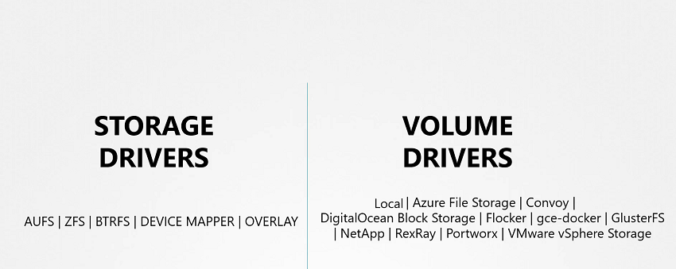
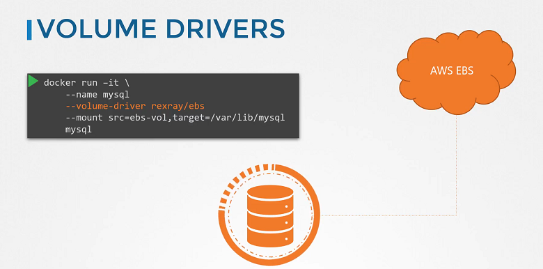

# Volume Driver Plugins in Docker

  - Take me to [Lectures](https://kodekloud.com/courses/certified-kubernetes-administrator-with-practice-tests/lectures/13350437)

In this section, we will take a look at **Volume Driver Plugins in Docker**

- We discussed about Storage drivers. Storage drivers help to manage storage on images and containers.
- We have already seen that if you want to persist storage, you must create volumes. Volumes are not handled by the storage drivers. Volumes are handled by volume driver plugins. The default volume driver plugin is local.
- The local volume plugin helps to create a volume on Docker host and store its data under the `/var/lib/docker/volumes/` directory.
- There are many other volume driver plugins that allow you to create a volume on third-party solutions like Azure file storage, DigitalOcean Block Storage, Portworx, Google Compute Persistent Disks etc.





- When you run a Docker container, you can choose to use a specific volume driver, such as the RexRay EBS to provision a volume from the Amazon EBS. This will create a container and attach a volume from the AWS cloud. When the container exits, your data is safe in the cloud.

```
$ docker run -it --name mysql --volume-driver rexray/ebs --mount src=ebs-vol,target=/var/lib/mysql mysql
```





#### Docker Reference Docs

- https://docs.docker.com/engine/extend/legacy_plugins/
- https://github.com/rexray/rexray

