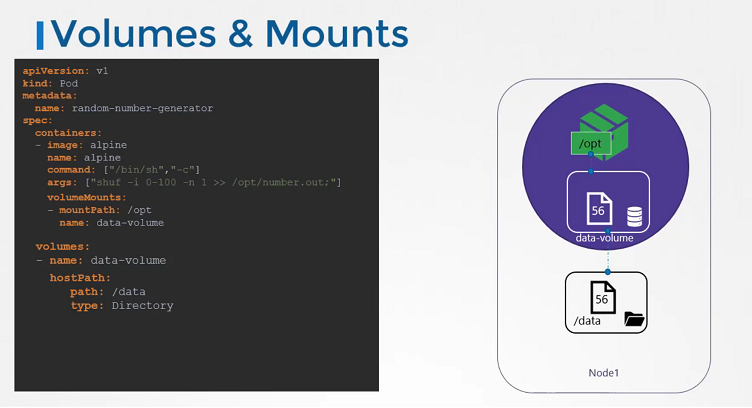
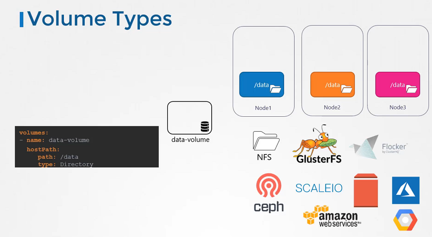

# Volumes

  - Take me to [Lectures](https://kodekloud.com/courses/certified-kubernetes-administrator-with-practice-tests/lectures/9808274)

In this section, we will take a look at **Volumes**

- We discussed about Docker storage, If we don't attach the volume in the container runtime, when container destroyed and then all data will be lost. So, We need to persist data into the Docker container so we attach a volume to the containers when they are created.
- The data are processed by the container is now placed in this volume thereby retaining it permanently. Even if the container is deleted the data remains in the volume.

- In the Kubernetes world, the PODs created in Kubernetes are transient in nature. When a POD is created to process data and then deleted, the data processed by it gets deleted as well. 
- For example, We create a simple POD that generated a random between 1 and 100 and writes that to a file at `/opt/number.out`. To persist into the volume.
- We create a volume for that. In this case I specify a path `/data` on the host. Files are stored in the directory data on my node. We use the volumeMounts field in each container to mount the data-volume to the directory `/opt` within the container. The random number will now be written to `/opt` mount inside the container, which happens to be on the data-volume which is in fact `/data` directory on the host. When the pod gets deleted, the file with the random number still lives on the host.




## Volume Storage Options

- In the volumes, hostPath volume type is fine with the single node. It's not recomended for use with the multi node cluster.
- In the Kubernetes, it supports several types of standard storage solutions such as NFS, GlusterFS, CephFS or public cloud solutions like AWS EBS, Azure Disk or Google's Persistent Disk.




```
volumes:
- name: data-volume
  awsElasticBlockStore:
    volumeID: <volume-id>
    fsType: ext4
```

#### Kubernetes Volumes Reference Docs

- https://kubernetes.io/docs/concepts/storage/volumes/
- https://kubernetes.io/docs/tasks/configure-pod-container/configure-volume-storage/
- https://unofficial-kubernetes.readthedocs.io/en/latest/concepts/storage/volumes/
- https://kubernetes.io/docs/reference/generated/kubernetes-api/v1.18/#volume-v1-core