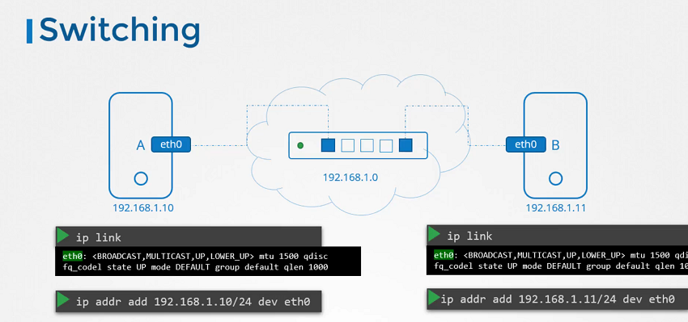
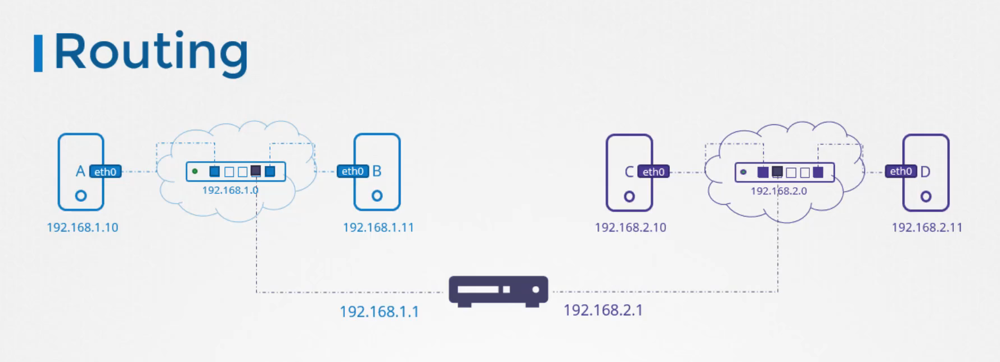

# Pre-requisite Switching Routing Gateways

  - Take me to [Lecture](https://kodekloud.com/topic/pre-requisite-switching-routing-gateways-cni-in-kubernetes/)

In this section, we will take a look at **Switching, Routing and Gateways**

## Switching

- To see the interface on the host system

```
$ ip link
```
- To see the IP Address interfaces.

```
$ ip addr
```



## Routing

- To see the existing routing table on the host system.

```
$ route
```
```
$ ip route show
or
$ ip route list
```

- To add entries into the routing table.

```
$ ip route add 192.168.1.0/24 via 192.168.2.1
```



## Gateways

- To add a default route.
```
$ ip route add default via 192.168.2.1
```

- To check the IP forwarding is enabled on the host.
```
$ cat /proc/sys/net/ipv4/ip_forward
0

$ echo 1 > /proc/sys/net/ipv4/ip_forward
```

- Enable packet forwarding for IPv4.
```
$ cat /etc/sysctl.conf

# Uncomment the line
net.ipv4.ip_forward=1
```

- To view the sysctl variables.
```
$ sysctl -a 
```

- To reload the sysctl configuration.
```
$ sysctl --system
```


