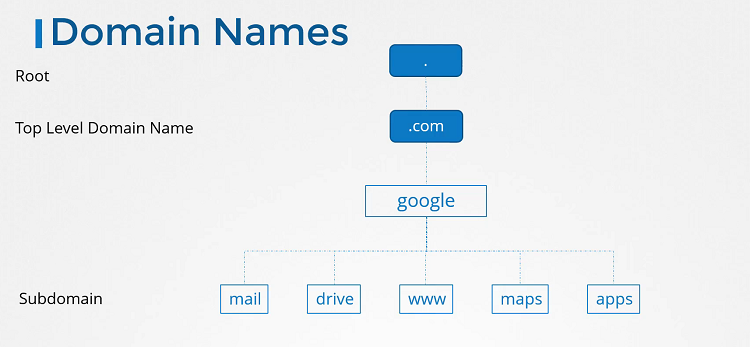
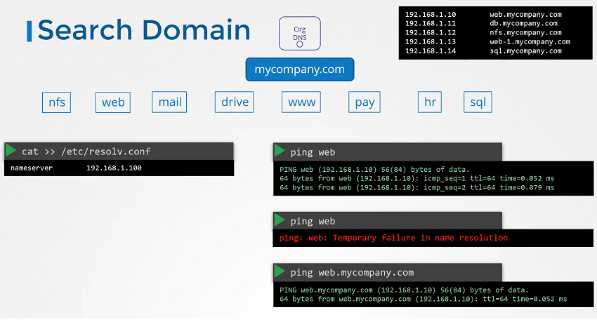
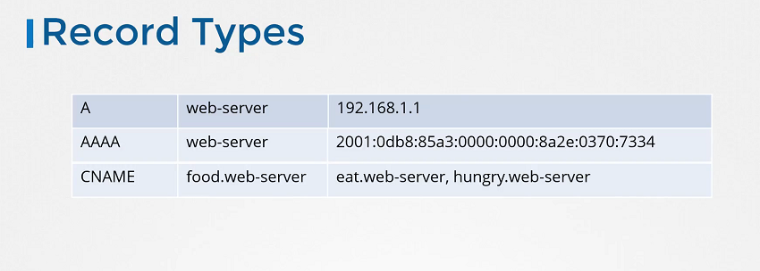

# Pre-requisite DNS

  - Take me to [Lecture](https://kodekloud.com/topic/prerequsite-dns/)

In this section, we will take a look at **DNS in the Linux**

## Name Resolution 

- With help of the `ping` command. Checking the reachability of the IP Addr on the Network.

```
$ ping 172.17.0.64
PING 172.17.0.64 (172.17.0.64) 56(84) bytes of data.
64 bytes from 172.17.0.64: icmp_seq=1 ttl=64 time=0.384 ms
64 bytes from 172.17.0.64: icmp_seq=2 ttl=64 time=0.415 ms

```
- Checking with their hostname

```
$ ping web
ping: unknown host web

```
- Adding entry in the `/etc/hosts` file to resolve by their hostname.

```
$ cat >> /etc/hosts
172.17.0.64  web


# Ctrl + c to exit
```
- It will look into the `/etc/hosts` file.

```
$ ping web
PING web (172.17.0.64) 56(84) bytes of data.
64 bytes from web (172.17.0.64): icmp_seq=1 ttl=64 time=0.491 ms
64 bytes from web (172.17.0.64): icmp_seq=2 ttl=64 time=0.636 ms

$ ssh web

$ curl http://web
```

## DNS

- Every host has a DNS resolution configuration file at `/etc/resolv.conf`.

```
$ cat /etc/resolv.conf
nameserver 127.0.0.53
options edns0
```

- To change the order of dns resolution, we need to do changes into the `/etc/nsswitch.conf` file.

```
$ cat /etc/nsswitch.conf

hosts:          files dns
networks:       files

```

- If it fails in some conditions.

```
$ ping wwww.github.com
ping: www.github.com: Temporary failure in name resolution

```

- Adding well known public nameserver in the `/etc/resolv.conf` file.

```
$ cat /etc/resolv.conf
nameserver   127.0.0.53
nameserver   8.8.8.8
options edns0
``` 
```
$ ping www.github.com
PING github.com (140.82.121.3) 56(84) bytes of data.
64 bytes from 140.82.121.3 (140.82.121.3): icmp_seq=1 ttl=57 time=7.07 ms
64 bytes from 140.82.121.3 (140.82.121.3): icmp_seq=2 ttl=57 time=5.42 ms

```

## Domain Names



## Search Domain



## Record Types



## Networking Tools

- Useful networking tools to test dns name resolution.

#### nslookup 

```
$ nslookup www.google.com
Server:         127.0.0.53
Address:        127.0.0.53#53

Non-authoritative answer:
Name:   www.google.com
Address: 172.217.18.4
Name:   www.google.com
```

#### dig

```
$ dig www.google.com

; <<>> DiG 9.11.3-1 ...
;; Got answer:
;; ->>HEADER<<- opcode: QUERY, status: NOERROR, id: 8738
;; flags: qr rd ra; QUERY: 1, ANSWER: 1, AUTHORITY: 0, ADDITIONAL: 1

;; OPT PSEUDOSECTION:
; EDNS: version: 0, flags:; udp: 65494
;; QUESTION SECTION:
;www.google.com.                        IN      A

;; ANSWER SECTION:
www.google.com.         63      IN      A       216.58.206.4

;; Query time: 6 msec
;; SERVER: 127.0.0.53#53(127.0.0.53)
```
