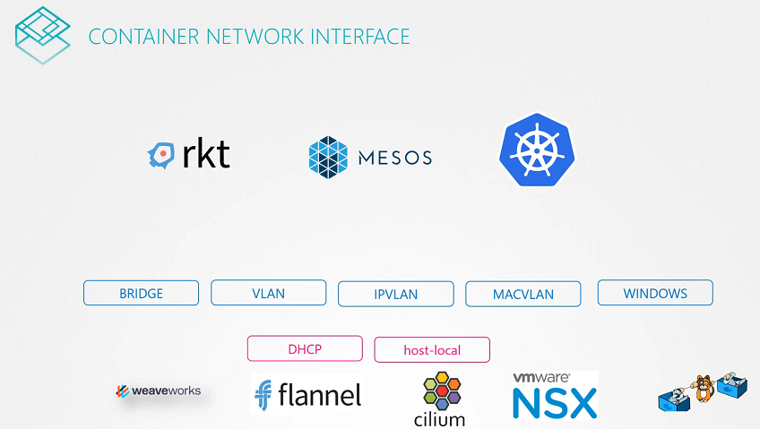

# Pre-requisite CNI

  - Take me to [Lecture](https://kodekloud.com/courses/539883/lectures/9808284)

In this section, we will take a look at **Pre-requisite Container Network Interface(CNI)**




## Third Party Network Plugin Providers

- [Weave](https://www.weave.works/docs/net/latest/kubernetes/kube-addon/#-installation)
- [Calico](https://docs.projectcalico.org/getting-started/kubernetes/quickstart)
- [Flannel](https://github.com/coreos/flannel/blob/master/Documentation/kubernetes.md)
- [Cilium](https://github.com/cilium/cilium)


## To view the CNI Network Plugins

- CNI comes with the set of supported network plugins. 

```
$ ls /opt/cni/bin/
bridge  dhcp  flannel  host-device  host-local  ipvlan  loopback  macvlan  portmap  ptp  sample  tuning  vlan
```


#### References Docs

- https://kubernetes.io/docs/concepts/extend-kubernetes/compute-storage-net/network-plugins/


