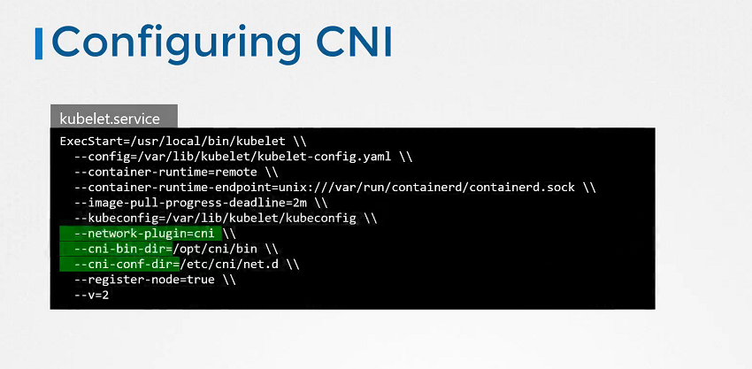
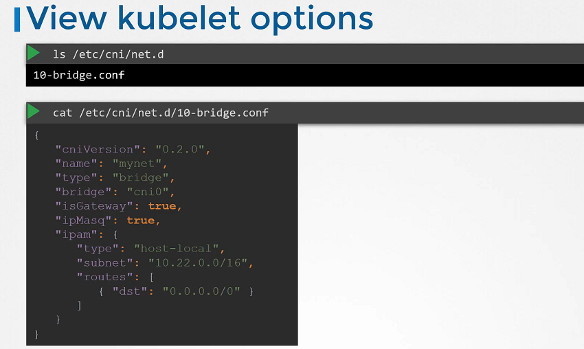

# CNI in Kubernetes

  - Take me to [Lecture](https://kodekloud.com/courses/certified-kubernetes-administrator-with-practice-tests/lectures/9808289)

In this section, we will take a look at **Container Networking Interface (CNI) in Kubernetes**

## Configuring CNI




- Check the status of the Kubelet Service

```
$ systemctl status kubelet.service
```

## View Kubelet Options

```
$ ps -aux | grep kubelet
```

## Check the Supportable Plugins 

- To check the all supportable plugins available in the `/opt/cni/bin` directory.

```
$ ls /opt/cni/bin

```

## Check the CNI Plugins

- To check the cni plugins which kubelet needs to be used.

```
ls /etc/cni/net.d

```

## Format of Configuration File  




#### References Docs

- https://kubernetes.io/docs/reference/command-line-tools-reference/kubelet/
- https://kubernetes.io/docs/concepts/extend-kubernetes/compute-storage-net/network-plugins/