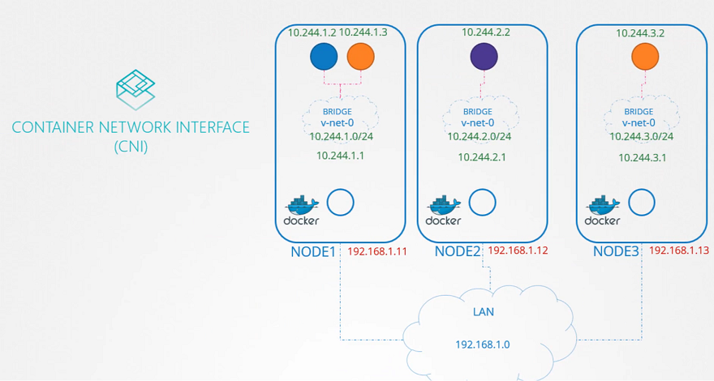
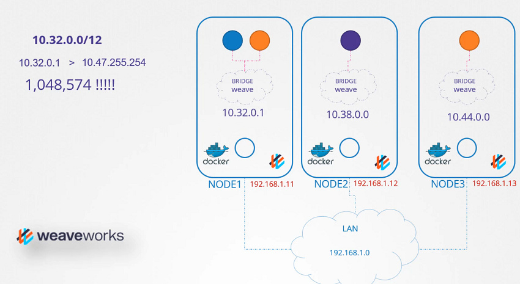

# IPAM weave

  - Take me to [Lecture](https://kodekloud.com/courses/certified-kubernetes-administrator-with-practice-tests/lectures/9808295)

- IP Address Management in the Kubernetes Cluster

- How weaveworks Manages IP addresses in the Kubernetes Cluster 

## References Docs

- https://www.weave.works/docs/net/latest/kubernetes/kube-addon/
- https://kubernetes.io/docs/concepts/cluster-administration/networking/ 